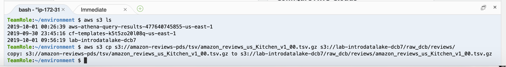

# Alternate Approach to Upload Sample Dataset

The instructions have you download a 888 MB sample dataset to your laptop and then upload it to S3.  This is to teach students one way this can be done.  However, if the student's network connectivity is slow, then this step might take longer than people want to wait.

Here is an alternate approach using a Cloud9 environment.  This approach assumes you are running in an environment that has been setup via the simple CloudFormation [template](../setup/simple.template) provided for this lab.

## Instructions

* Navigate to the Cloud9 console

* Click the "Open IDE" button for the "RedshiftEnv" Cloud9 environment 

* In the bottom of the Cloud9 IDE, there is a "bash" terminal open in a tab.

* Copy this command and paste it into the bash terminal, BUT DO NOT RUN IT YET

```
## REPLACE acme with your company name to match your S3 bucket name
## REPLACE initials with your initials to match your raw folder name 
aws s3 cp s3://amazon-reviews-pds/tsv/amazon_reviews_us_Kitchen_v1_00.tsv.gz s3://lab-introdatalake-acme/raw_initials/reviews/

```

* Replace "acme" and "initials" with the appropriate values and run the command.

Your output should look like...



* Return to the [Catalog our new dataset](lab1#catalog-our-new-dataset) section of Lab1.