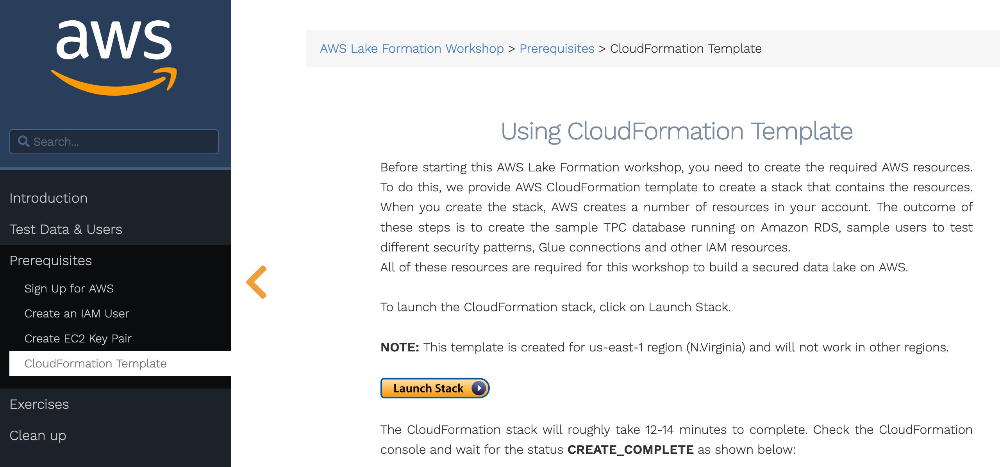
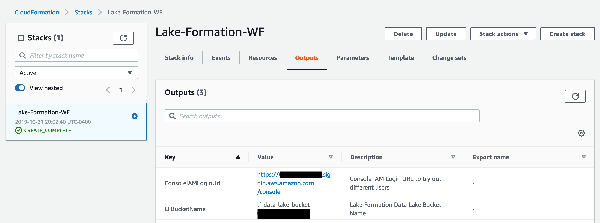
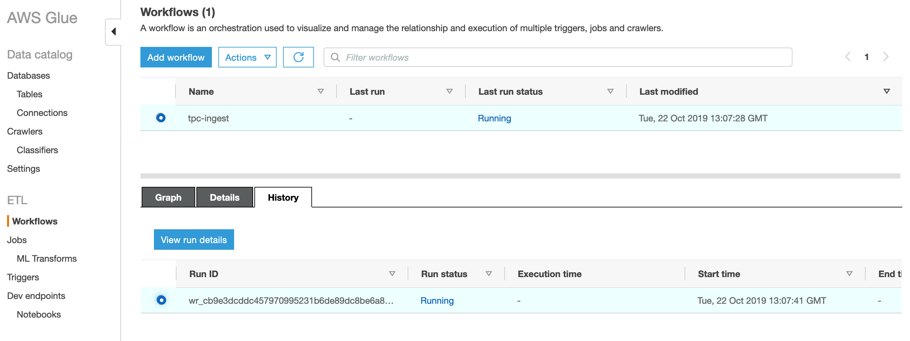
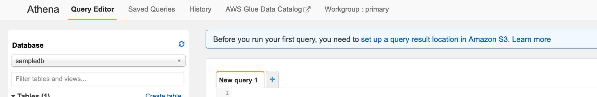
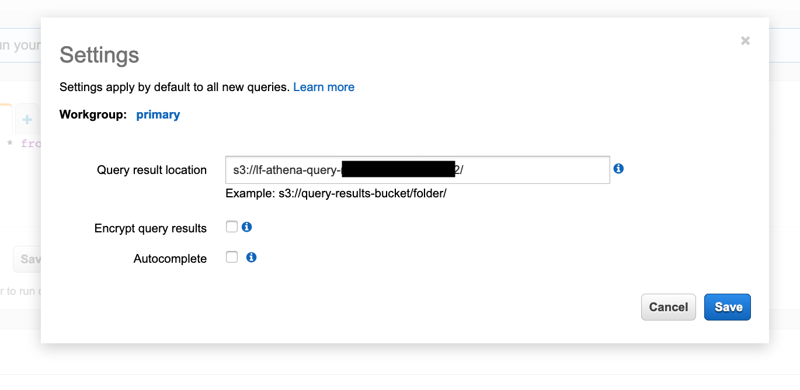

# Intro to Lake Formation and Data Lake Labs
These labs provide you an introduction to building a data lake on AWS.  You will start with exploring a lab showing the new Lake Formation capabilities.  Then you will extend your new data lake with an additional dataset.  Finally, you will connect a cloud data warehouse engine to your data lake.

## Complete the Lake Formation Lab if you have not already

* Open this page in a different browser tab and follow the lab instructions: https://lakeformation.aworkshop.io/

NOTE: We recommend you use a browser other than Internet Explorer.

* You will need to be sure to complete the "Create EC2 Key Pair" and "CloudFormation Template" steps in the "Prerequisites" section prior to starting the Exercise.




* Suggestion: Make a note of the ConsoleIAMLoginUrl on the Outputs tab of the Cloud Formation page.  You can use that URL to switch users during the Lake Formation lab (which you will need to do several times).




* Work through the end of the Intermediate Level exercises.   Do NOT clean up the lake formation lab environment, as we will build on top of it.


* Hint: During the Lake Formation lab, you will launch a Blueprint to import database data which takes a few minutes to run.  While waiting for the Blueprint to finish, you can open up another browser tab and view the status of the Glue Workflow that runs your Blueprint.  Use this link in a new browser tab: [https://console.aws.amazon.com/glue/home?region=us-east-1#etl:tab=workflows](https://console.aws.amazon.com/glue/home?region=us-east-1#etl:tab=workflows)



Using the "View run details" button on the history subtab, you can see a graph with progress indicators as shown below:


* Hint: When you first use Athena to query data, you may be asked to setup a query result location as shown below:



If you see this prompt, click on the "setup a query result location" link and enter this value for the query result location:

```
s3://lf-data-lake-bucket-[number]/
````

where you replace [number] with you account id (without using hyphens).  Your account id is shown on the top menu bar after the user name (which should currently be showing lf-admin).




## When you have finished the Lake Formation Intermediate Exercises, continue on to the next section


Click [here](NewLab1b.md) to advance to the next section