# Lake Formation and Data Lake Lab (under construction)

## Complete the Lake Formation Lab if you have not already

* Open this page in a browser: https://lakeformation.aworkshop.io/

* You will need to be sure to complete the "Create EC2 Key Pair" and "CloudFormation Template" steps in the "Prerequisites" section prior to starting the Exercise.


* Suggestion: Make a note of the ConsoleIAMLoginUrl on the Outputs tab of the Cloud Formation page.  You can use that URL to switch users during the Lake Formation lab (which you will need to do several times).


* Work through the end of the Intermediate Level exercises.   Do NOT clean up the lake formation lab environment, as we will build on top of it.

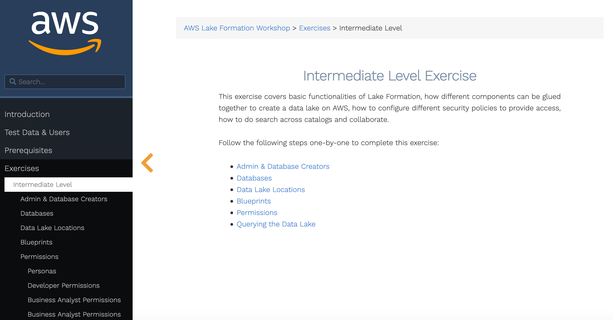

Hint: During the Lake Formation lab, you will launch a Blueprint to import database data which takes a few minutes to run.  While waiting for the Blueprint to finish, you can open up another browser tab and view the status of the Glue Workflow that runs your Blueprint.  Use this link in a new browser tab: [https://console.aws.amazon.com/glue/home?region=us-east-1#etl:tab=workflows](https://console.aws.amazon.com/glue/home?region=us-east-1#etl:tab=workflows)


Using the "View run details" button on the history subtab, you can see a graph with progress indicators as shown below:

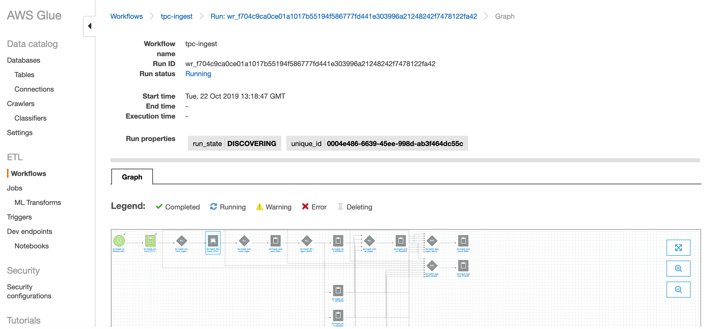


## Extend your Data Lake with additional datasets

Once you complete the Lake Formation Intermediate exercises, we will now extend the data lake by adding a new dataset based on the Amazon.com Product Reviews dataset.


## Contents
* [Setup additional prerequisites](#Setup-additional-prerequisites)
* [Setup the Data Lake on S3](#Setup-the-Data-Lake-on-S3)
* [Create a new database in Lake Formation](#Create-a-new-database-in-Lake-Formation)
* [Catalog our new dataset](#catalog-our-new-dataset)
* [Grant permissions on the reviews table to users](#Grant-permissions-on-the-reviews-table-to-users)
* [Query our new data](#query-our-new-data)
* [OPTIONAL Make our data faster](#optional-make-our-data-faster)
* [Before You Leave](#before-you-leave)

## Setup additional prerequisites

### Signin to the AWS Console as the Lake Formation Administrator

* Navigate to the AWS Console at https://console.aws.amazon.com/console/home?region=us-east-1

* Check if you are signed-in as the lf-admin user.  If not, sign-out and sign-back in as lf-admin.  By default, the password will be Password1!


### Launch a CloudFormation stack 

This CloudFormation stack will create a few additional items used in this section of today's lab.  Specifically, it will create an IAM policy to be used by Redshift and a Cloud9 browser-based development environment to be used to easily invoke the AWS CLI.

* Click on this link to launch a CloudFormation template.  XXXXXXX PUT simpleNoS3.template LINK HERE XXXXXXXX

* Name the stack "Data Lake Stack".  

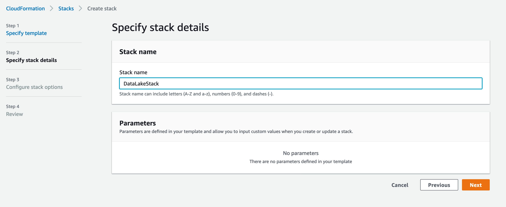

Leave the other parameters at their defaults as you advance through the steps and launch the stack.

* Wait for the stack to complete which should take about 2 minutes

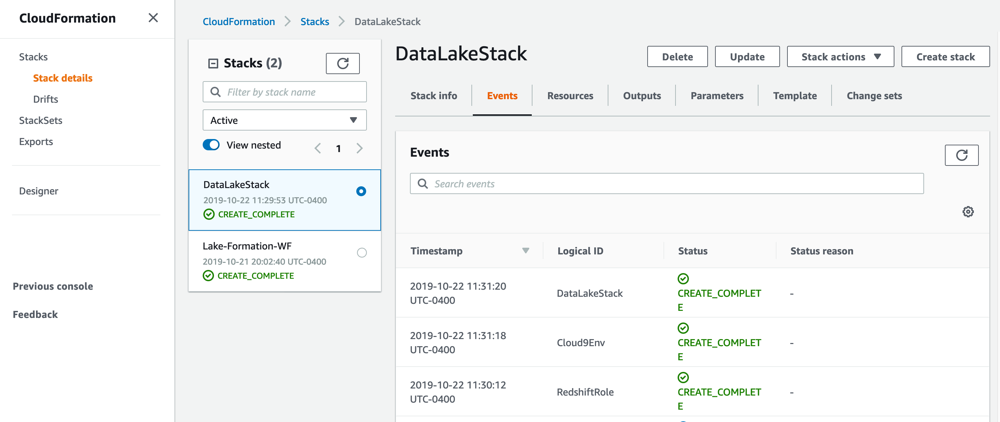

## Setup the Data Lake on S3
Amazon Simple Storage Service (S3) is the storage service of choice to build a data lake. With Amazon S3, you can cost-effectively build and scale a data lake of any size in a secure environment where data is protected by 99.999999999% (11 9s) of durability.

With a data lake built on Amazon S3, you can use native AWS services to run big data analytics, artificial intelligence (AI), machine learning (ML), high-performance computing (HPC) and media data processing applications to gain insights from your unstructured data sets. Because Amazon S3 supports a wide range of features, IT managers, storage administrators, and data scientists are empowered to enforce access policies, manage objects at scale and audit activities across their S3 data lakes.

Amazon S3 hosts more than 10,000 data lakes for household brands such as Netflix, Airbnb, Sysco, Expedia, GE, and FINRA, who are using them to securely scale with their needs and to discover business insights every minute.  Learn more [here](https://aws.amazon.com/products/storage/data-lake-storage/).


### Navigate to your S3 bucket
The S3 bucket that we will use in these labs should already exist.  It was created for you in the Lake Formation lab.

* In the AWS Console, use the Services menu and navigate to the S3 console.  One way to do so, is to expand the Services top menu and type "S3" in the service search field.

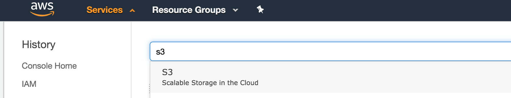

* In the S3 console, look for a bucket called "lf-data-lake-bucket-[number]".  
  * If you don't see a "lf-data-lake-bucket-[number]" bucket, then you may not have run the Lake Formation lab correctly.


* Click on the "lf-data-lake-bucket-[number]" bucket.


### Create folders in the S3 bucket to represent your data lake structure
For this lab, we will define a folder hierarchy for our data lake.  At the top-level, we will have separate folders for "raw" datasets and for "processed" datasets.  Within each of those folders, we will use sub-folders to indicate the dataset name.  In short, we are implementing a hierarchy structure of Lifecycle then Data Type for this example data lake.  If you are curious, you can read more about Data Lake hierarchy design at the [AWS Data Lake Reference Architecture site](https://github.com/aws-samples/aws-dbs-refarch-datalake/tree/master/src/storage-foundation).

Note: As multiple users may be using the same S3 bucket in the labs, please use your initials when creating/naming folders.

* Click on "Create folder"
* Enter the name "raw"


* Click Save to create the raw folder.
* Repeat the above process to create a 2nd folder called "processed".


## Navigate to your Cloud9 IDE Environment

[AWS Cloud9](https://aws.amazon.com/cloud9/) is is a cloud-based integrated development environment (IDE) that lets you write, run, and debug your code with just a browser.

AWS Cloud9 comes with a terminal that includes sudo privileges to the managed Amazon EC2 instance that is hosting your development environment and a preauthenticated AWS Command Line Interface. This makes it easy for you to directly access AWS services, install additional software, do a git push, or enter commands.

* In the AWS Console, navigate to the Cloud9 service

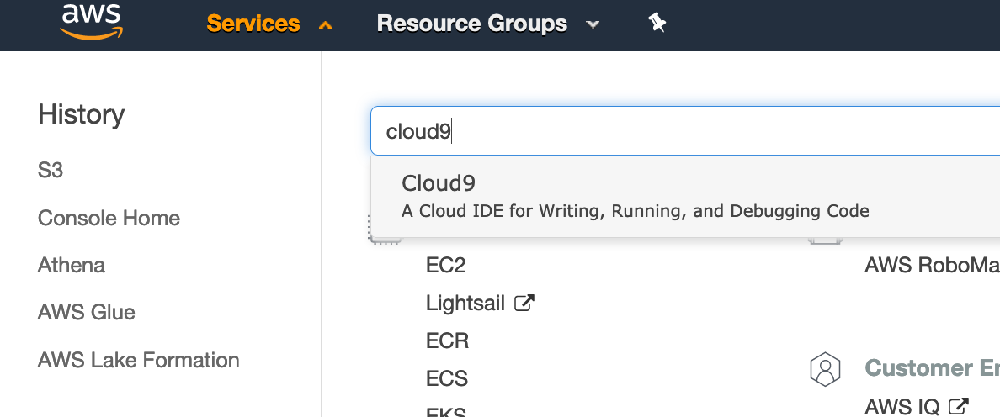


* Click the "Open IDE" button for the "IntroDataLakeEnv" Cloud9 environment 


### Get familiar with Cloud9
If you are new to Cloud9, you can review the IDE tutorial at [https://docs.aws.amazon.com/cloud9/latest/user-guide/tutorial-tour-ide.html](https://docs.aws.amazon.com/cloud9/latest/user-guide/tutorial-tour-ide.html)

### Copy a new dataset into your data lake

* In the bottom of the Cloud9 IDE, there is a "bash" terminal open in a tab.

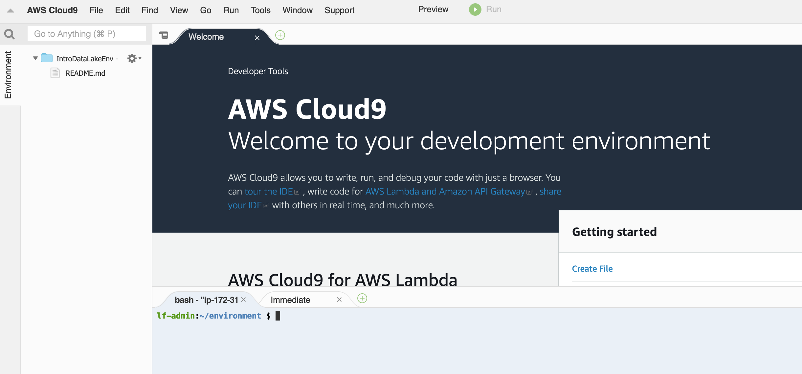

* Copy this command and paste it into the bash terminal and run it

```
## Try to determine BUCKET and FOLDER names automatically
export BUCKET=`aws s3 ls | grep lf-data-lake | cut -d " " -f 3`
echo S3 Bucket is $BUCKET
export S3FOLDER=`aws s3 ls $BUCKET/ | grep raw | cut -d " " -f 29`
echo S3 Folder is $S3FOLDER

aws s3 cp s3://amazon-reviews-pds/tsv/amazon_reviews_us_Kitchen_v1_00.tsv.gz s3://$BUCKET/${S3FOLDER}reviews/
aws s3 ls s3://$BUCKET/${S3FOLDER}reviews/


```

Your output should look like...

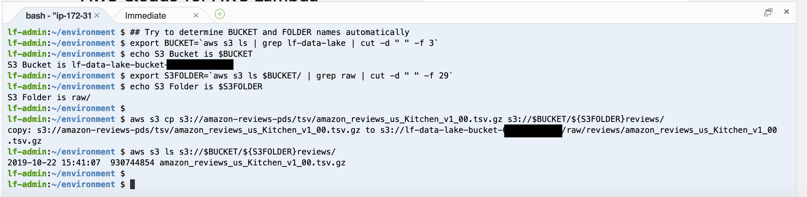

* Run this command to print out the ARN of the IAM Role created for use with Redshift:

```
aws iam list-roles | grep Lab-IntroDataLake-Redshift | grep arn

```

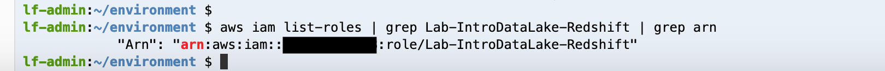

* Copy/paste the arn in a notepad/textpad document for later use.  Hint: you can open a new file in Cloud9 and paste it there.

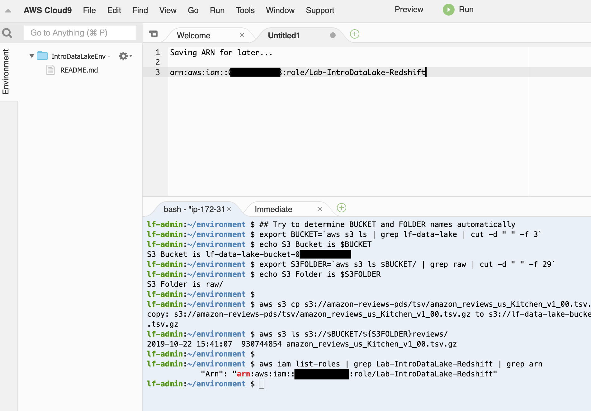

## Create a new database in Lake Formation

* In the AWS Console, navigate to the Lake Formation service. You should still be logged in as the lf-admin Lake Formation administrator user.


* If necessary, click on "Get started" on the initial Lake Formation web page

* From Lake Formation Dashboard, click on the "Create database" button under Stage 2


* Enter "reviews" for the name

* Click Browse next to Location and select the lf-data-lake-bucket-NUMBER/raw/reviews folder

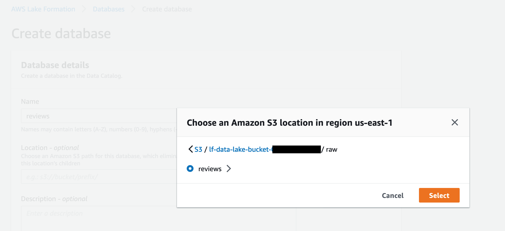

* Click "Create database"

This will create your database


* Now select the radio button for the reviews database

* With the "Actions" button, choose "Grant"

* With the IAM users and roles drop-down, type "glue" in the search area and then choose the "LF-GlueServiceRole".


* Under Database permisions, choose "Create table".

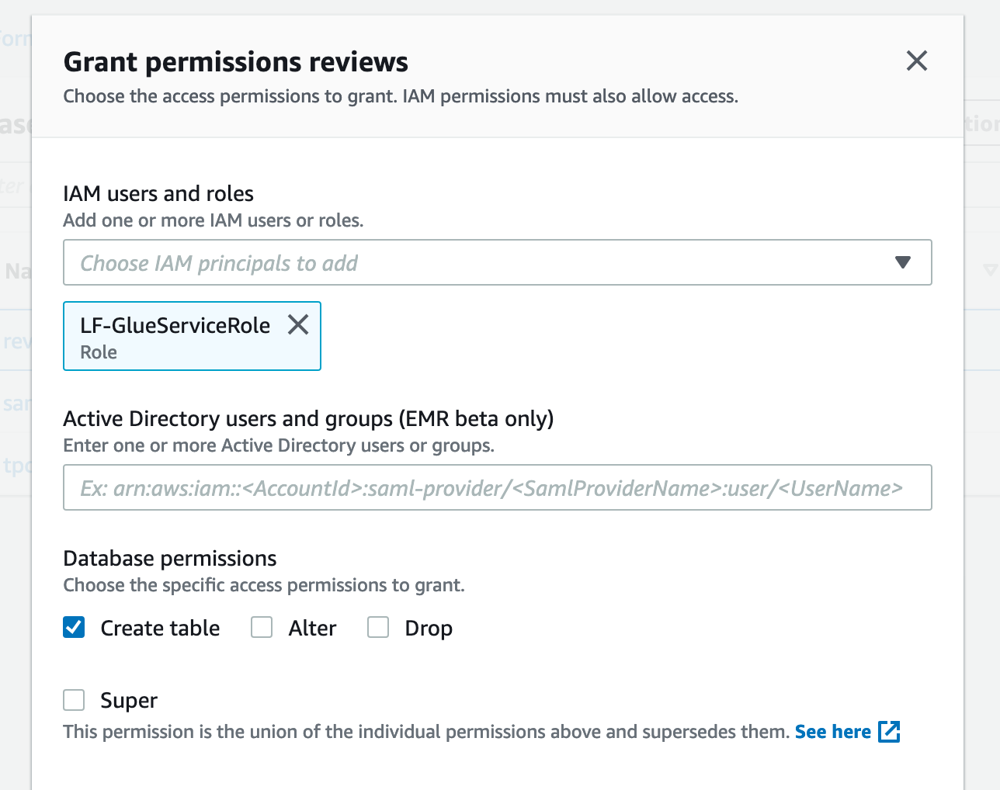

* Click "Grant"


## Catalog our new dataset
Keeping track of all of the raw assets that are loaded into your data lake, and then tracking all of the new data assets and versions that are created by data transformation, data processing, and analytics can be a major challenge. An essential component of an Amazon S3 based data lake is a Data Catalog. A data catalog is designed to provide a single source of truth about the contents of the data lake, and rather than end users reasoning about storage buckets and prefixes, a data catalog lets them interact with more familiar structures of databases, tables, and partitions.

AWS Glue Catalog is a fully managed data catalog whose contents are generated by running crawlers over S3 datasets. The Glue Data Catalog contains information about data assets that have been transformed into formats and table definitions that are usable by analytics tools like Amazon Athena, Amazon Redshift, and Amazon EMR.

At this point in our lab, we have uploaded a new dataset but we don't really know what the data is.  Our next activity will be to try to determine some more knowledge about the contents of the dataset.  We will use a Glue Crawler to investigate our new dataset's contents and to keep track of that metadata in the Glue Catalog for future use.  You can learn more about how Glue Crawlers work [here](https://docs.aws.amazon.com/glue/latest/dg/populate-data-catalog.html).

* On the left-hand column of the Lake Formation console, click on "Crawlers" under "Register and ingest"


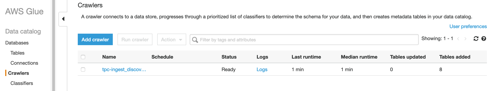

* Click the "Add crawler" button.  A Glue Crawler can inspect our new dataset and try to determine its contents and structure for us.

* Enter "Crawl_raw_reviews" for the Crawler name
* Click Next
* Select "Data Stores" as the crawler source type
* Click Next
* Choose S3 for the data store
* Choose crawl data in "specified path in my account"
* Click on the folder icon to pop open the Choose S3 path window.
* Expand the lf-data-lake-bucket-[NUMBER] bucket.  Expand the raw folder. Select the "reviews" folder.


BE SURE TO CHOOSE THE REVIEWS FOLDER, NOT THE FILE INSIDE THE FOLDER.

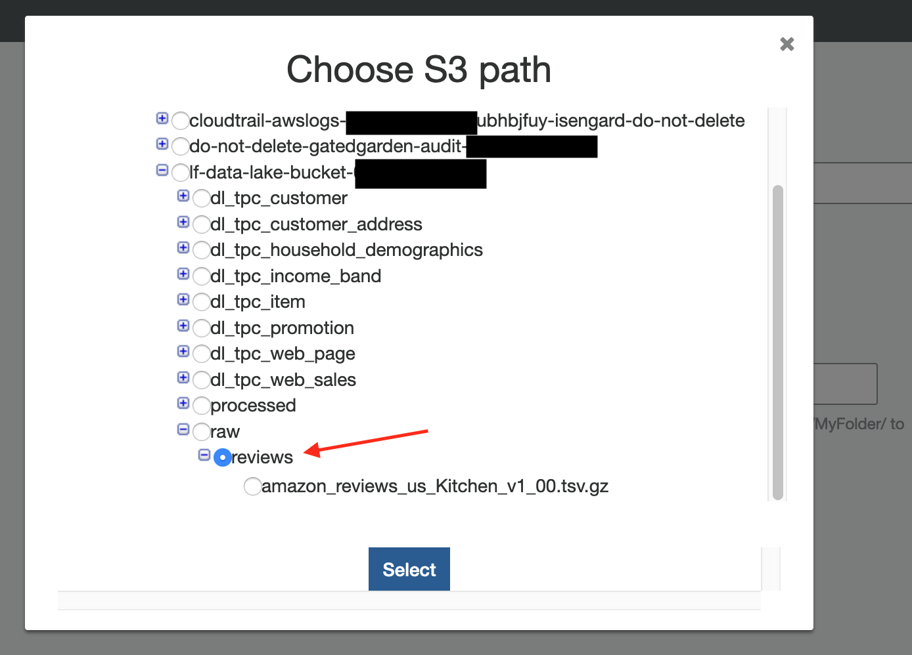

* Click the Select button to close the pop-up.  Your include path should look like "s3://lf-data-lake-bucket-[NUMBER]/raw/reviews"
* Click Next
* Choose No to add another data store
* Click Next
* Click "Choose an existing IAM role"
* Using the IAM role drop-down, select "LF-GlueServiceRole"


* Click Next
* Choose "Run on demand"
* Click Next


* In the database dropdown, choose the "reviews" database

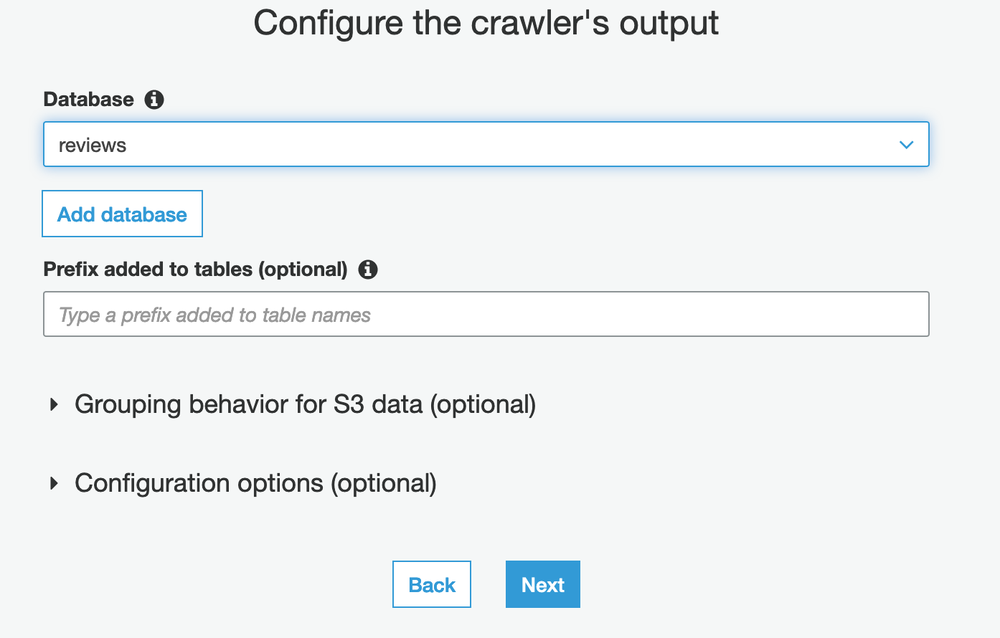

* Click Next
* Click Finish
* Click on the "Run it now?" link


* Wait for the Crawler to run and finish.  It will take about a minute.  There is a refresh icon on the right hand side of the page to refresh the page with the latest Status.


### View our new dataset structure

* Click on the Databases link on the left-column of the page.  You should see your new reviews database.


* Click on the reviews link.
* Click on the "Tables in reviews" link

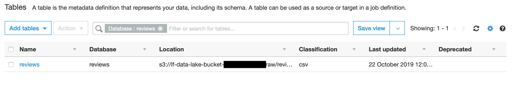

* Click on the "reviews" table


* Notice how the Glue crawler was able to identify the underlying structure and format (the metadata) of our new dataset.

## Grant permissions on the reviews table to users

* Navigate back to the Lake Formation console (which may already be open in a previous browser tab)

* Click on Tables under Data catalog


* Select the reviews table

* Using the Actions button, choose "Grant"

* With the IAM users and roles drop-down, select "lf-business-analyst"

* Use the IAM users and roles drop-down again and select "lf-admin" 

* Under Table permissions, choose "Select"

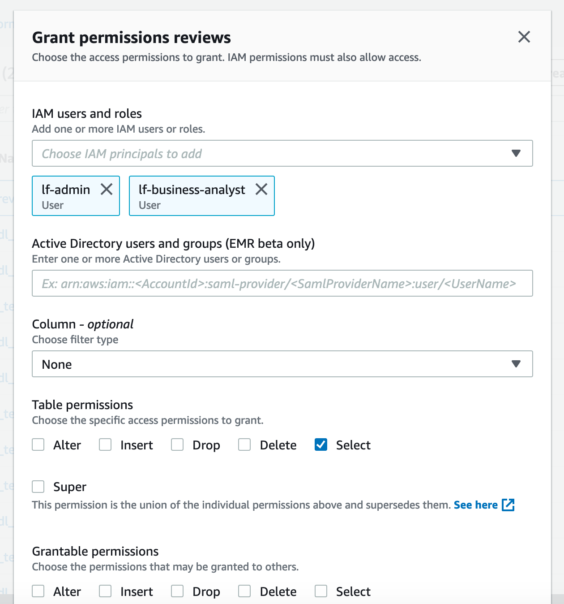

* Click "Grant"


## Query our new data
An S3 data lake efficiently decouples storage and compute, which makes it is easy to build analytics applications that scale out with increases in demand. To analyze data in your data lake easily and efficiently, AWS has developed several managed and serverless big data services. The most commonly used services to run analytics on S3 data are: Amazon Athena, Amazon Redshift, Amazon EMR, as well as other 3rd party and open source services.

In this section, we will demonstrate how to use Amazon Athena to query our data lake.

Amazon Athena is a serverless interactive query service that makes it easy to analyze data in Amazon S3 using standard SQL. Athena is out-of-the-box integrated with AWS Glue Data Catalog, which makes it very fast and easy to start running queries against your data lake.  Learn more [here](https://github.com/aws-samples/aws-dbs-refarch-datalake/tree/master/src/data-analytics/amazon-athena).


* With the reviews table selected in Lake Formation, use the Actions button and choose "View data"

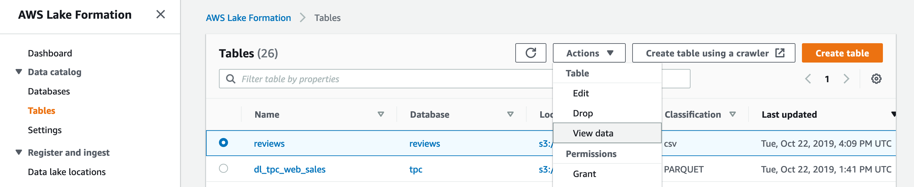

which after you click on an informational pop-up, will take you to the Amazon Athena console and show you sample data from the reviews dataset:

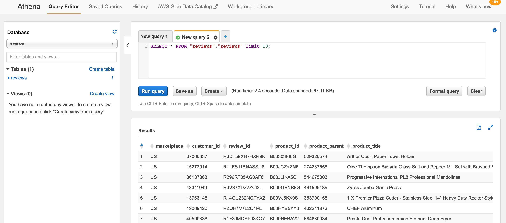


* Make sure the Database drop-down points to "reviews".  If not, change it.  You should see your reviews table.

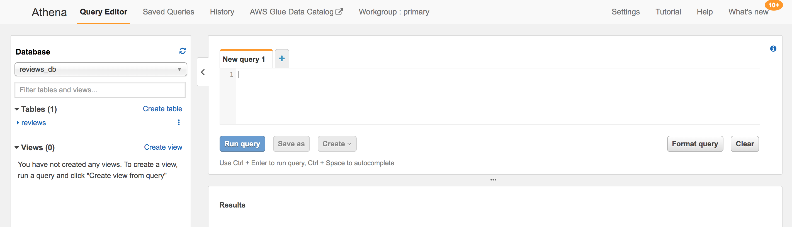

* In the "New query 1" tab, enter this query:
```
select count(*) from reviews;
```
* Click "Run query".  You should see that there are 4.8 million reviews in the Kitchen product category dataset that we uploaded to the data lake.


* Click the + sign to the right of New query 1 to open a new query tab.  Enter this query:
```
select product_title,
       sum(helpful_votes) helpful_votes,
       'https://www.amazon.com/dp/'||product_id url
  from reviews
 group by product_title, product_id
 order by 2 desc
 limit 20;
```
* Click "Run query"

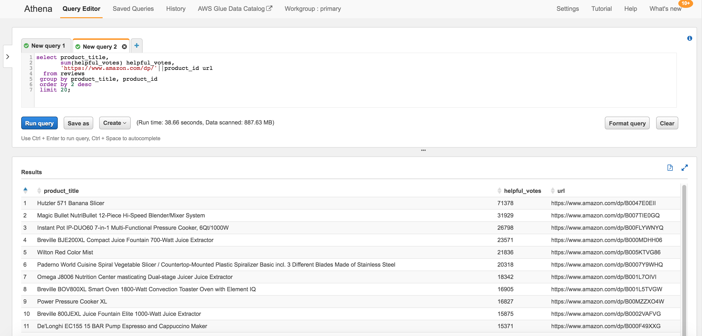

* Notice that the product with the most "helpful review" votes is the Hutzler 571 Banana Slicer.  If you want to view this product, check it out on [amazon.com](https://www.amazon.com/dp/B0047E0EII).  We'll explore some of these most helpful reviews more in Lab2.
  * Hint: To see all of the query output, there is a "See results in full screen" icon to the upper right of the Results table.  Or you can also minimize the left-column of the query edit.  Or reduce the your browser font size (which is the same as pressing the control/command key with the - key).

## Adding other data from the public dataset to your catalog
For later in the lab, we want to be able to query all of the public product reviews- not just the ones for products in Kitchen product category.  Amazon.com has made the full set reviews for all of the product categories available on S3 in parquet format.  Rather than downloading and uploading all of this data to our S3 bucket, we will simply point to where it is stored publicly.  We will define our all_reviews_parquet table via a SQL command (this could also be done with the Glue Crawler as we did for the Kitchen product category dataset).

* Click the + sign to open a new query tab.  Enter this query

```
CREATE EXTERNAL TABLE all_reviews_parquet(
  marketplace string, 
  customer_id string, 
  review_id string, 
  product_id string, 
  product_parent string, 
  product_title string, 
  star_rating int, 
  helpful_votes int, 
  total_votes int, 
  vine string, 
  verified_purchase string, 
  review_headline string, 
  review_body string, 
  review_date bigint, 
  year int)
PARTITIONED BY (product_category string)
ROW FORMAT SERDE 
  'org.apache.hadoop.hive.ql.io.parquet.serde.ParquetHiveSerDe' 
STORED AS INPUTFORMAT 
  'org.apache.hadoop.hive.ql.io.parquet.MapredParquetInputFormat' 
OUTPUTFORMAT 
  'org.apache.hadoop.hive.ql.io.parquet.MapredParquetOutputFormat'
LOCATION
  's3://amazon-reviews-pds/parquet/';
```  

* Click "Run query"

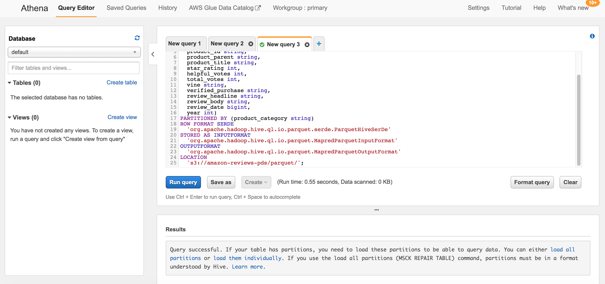

* Because the full public Customer Reviews is stored as a set of partition datasets, we have one extra step which is to run a command to re-scan the partition structure so that our Glue/Athena catalog is aware of it.  In the left-hand column, find the all_reviews_parquet table and click on the vertical ... to pop-up a menu.  

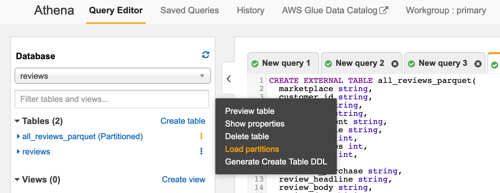

* Choose "Load partitions" from the pop-up menu.


* Now, let's run essentially the same query as before (looking for the products with the most helpful reviews in the Kitchen category).  Click the + sign to open a new query tab.  Enter this query:
```
select product_title,
       sum(helpful_votes) helpful_votes,
       'https://www.amazon.com/dp/'||product_id url
  from all_reviews_parquet
 where product_category='Kitchen'
 group by product_title, product_id
 order by 2 desc
 limit 20;
```
* Click "Run query"


* Notice that the query against the all_reviews_parquet table ran much faster than our earlier query against the reviews table.  This is because the all_reviews_parquet table points to a dataset in the optimized parquet format, while the reviews table points to a dataset in a less optimized format (text csv).


# todos...
## grant permissions on all_reviews_parquet ?
## merge in redshift lab
### but simplify-- avoid copy. start with spectrum.  then create local table.  then query across.
## split labs into steps in individual files
## add in DMS lab? (did I figure out which one?)
## test. make new images