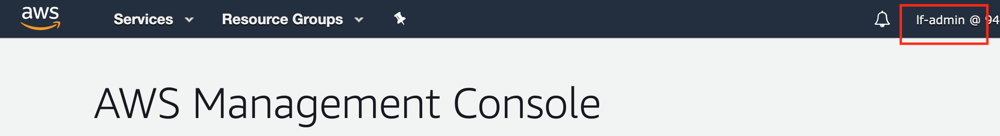
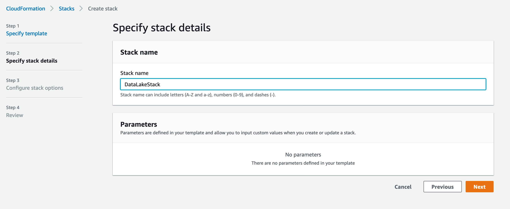
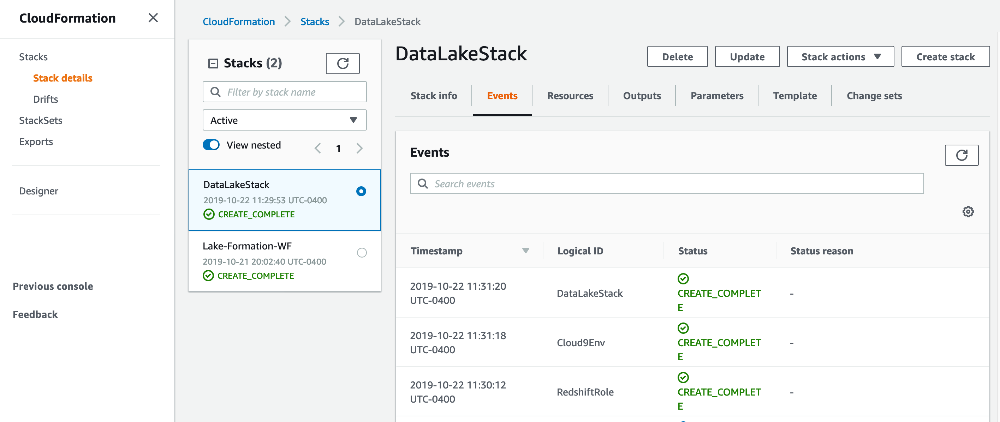
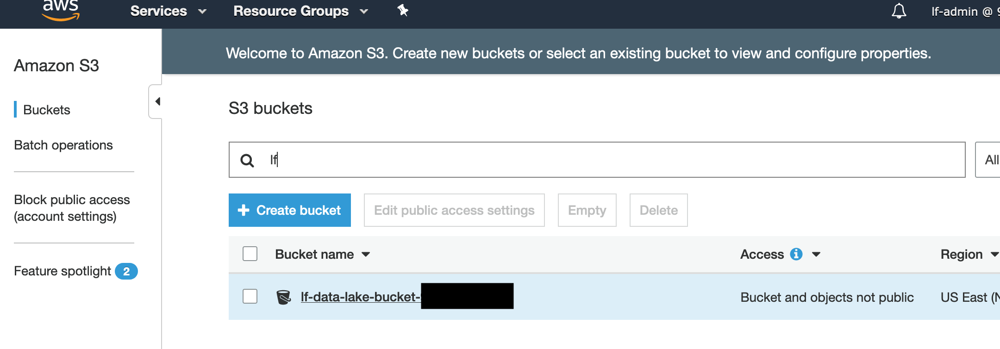
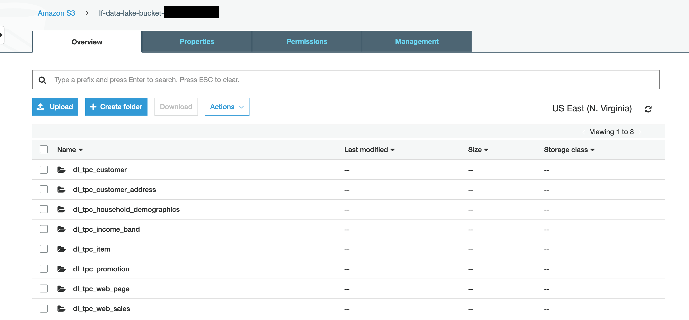
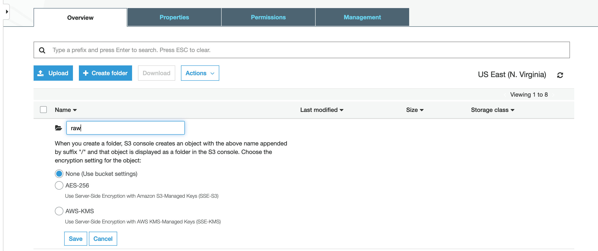
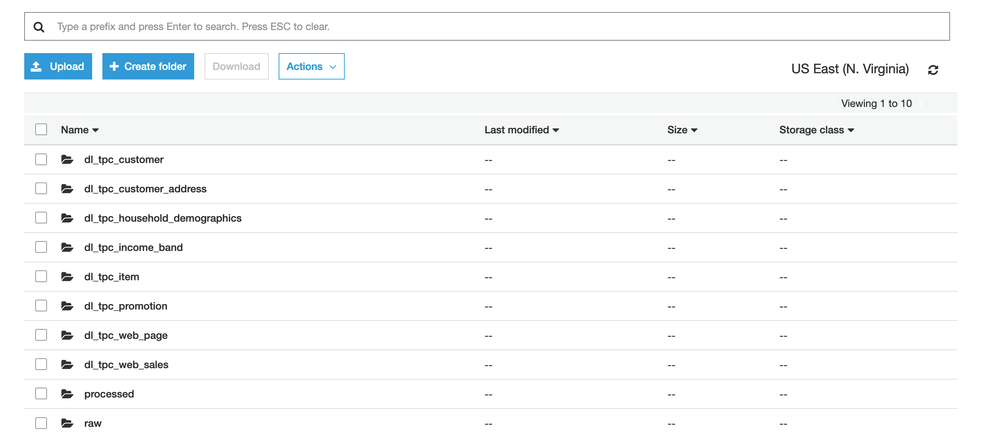

# Part 2- Extend your Data Lake with additional datasets (prerequisites)

Now that you have completed the Lake Formation Intermediate exercises, we will now extend the data lake by adding a new dataset based on the Amazon.com Product Reviews dataset.

## Setup additional prerequisites
This section of the lab has some additional prerequisites needed which we will now complete.

### Signin to the AWS Console as the Lake Formation Administrator

* Navigate to the AWS Console at https://console.aws.amazon.com/console/home?region=us-east-1

* Check if you are signed-in as the lf-admin user.  If not, sign-out and sign-back in as lf-admin.  By default, the password for lf-admin will be Password1!

### Launch a CloudFormation stack 

This CloudFormation stack will create a few additional items used in this section of today's lab.  Specifically, it will create an IAM policy to be used by Redshift and a Cloud9 browser-based development environment to be used to easily invoke the AWS CLI.

*	Right-click on this [link](https://console.aws.amazon.com/cloudformation/home#/stacks/new?stackName=kinesis-replay-infrastructure&templateURL=https://dave-kinesis-lab.s3.amazonaws.com/simpleNoS3.template) and open it in a new tab to launch the CloudFormation template for this part of our lab. 

* Name the stack "Data Lake Stack".  

Leave the other parameters at their defaults as you advance through the steps and launch the stack.

* Wait for the stack to complete which should take about 2 minutes

## Setup the Data Lake on S3
Amazon Simple Storage Service (S3) is the storage service of choice to build a data lake. With Amazon S3, you can cost-effectively build and scale a data lake of any size in a secure environment where data is protected by 99.999999999% (11 9s) of durability.

With a data lake built on Amazon S3, you can use native AWS services to run big data analytics, artificial intelligence (AI), machine learning (ML), high-performance computing (HPC) and media data processing applications to gain insights from your unstructured data sets. Because Amazon S3 supports a wide range of features, IT managers, storage administrators, and data scientists are empowered to enforce access policies, manage objects at scale and audit activities across their S3 data lakes.

Amazon S3 hosts more than 10,000 data lakes for household brands such as Netflix, Airbnb, Sysco, Expedia, GE, and FINRA, who are using them to securely scale with their needs and to discover business insights every minute.  Learn more [here](https://aws.amazon.com/products/storage/data-lake-storage/).

### Navigate to your S3 bucket
The S3 bucket that we will use in these labs should already exist.  It was created for you in the Lake Formation lab.

* In the AWS Console, use the Services menu and navigate to the S3 console.  One way to do so, is to expand the Services top menu and type "S3" in the service search field.

* In the S3 console, look for a bucket called "lf-data-lake-bucket-[number]".  
  * If you don't see a "lf-data-lake-bucket-[number]" bucket, then you may not have run the Lake Formation lab correctly.

* Click on the "lf-data-lake-bucket-[number]" bucket.

### Create folders in the S3 bucket to represent your data lake structure
For this lab, we will define a folder hierarchy for our data lake.  At the top-level, we will have separate folders for "raw" datasets and for "processed" datasets.  Within each of those folders, we will use sub-folders to indicate the dataset name.  In short, we are implementing a hierarchy structure of Lifecycle then Data Type for this example data lake.  If you are curious, you can read more about Data Lake hierarchy design at the [AWS Data Lake Reference Architecture site](https://github.com/aws-samples/aws-dbs-refarch-datalake/tree/master/src/storage-foundation).

Note: As multiple users may be using the same S3 bucket in the labs, please use your initials when creating/naming folders.

* Click on "Create folder"
* Enter the name "raw"

* Click Save to create the raw folder.
* Repeat the above process to create a 2nd folder called "processed".

## Congratulations- you have finished the prerequisites for this section of the labs.

Click [here](NewLab1c.md) to advance to the next section