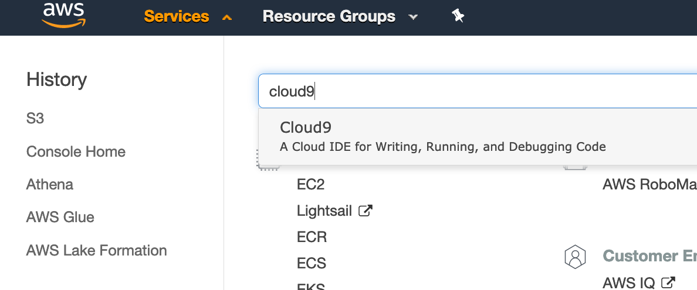
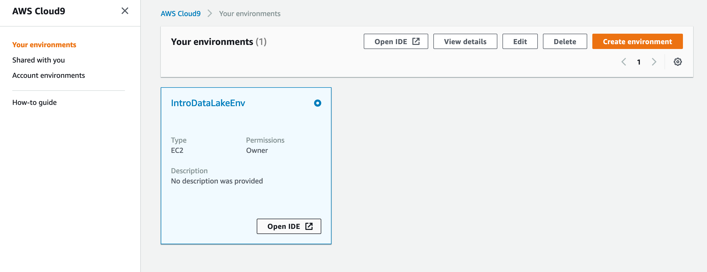
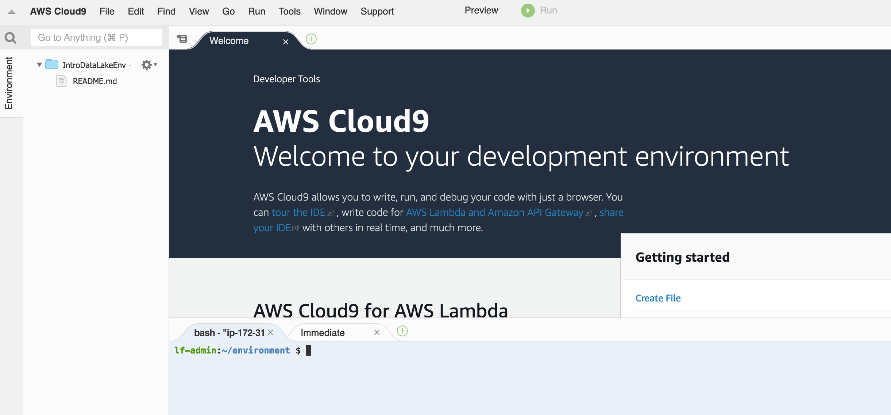
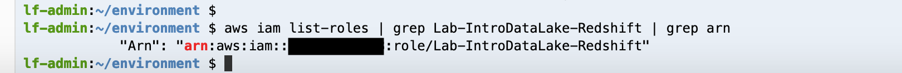
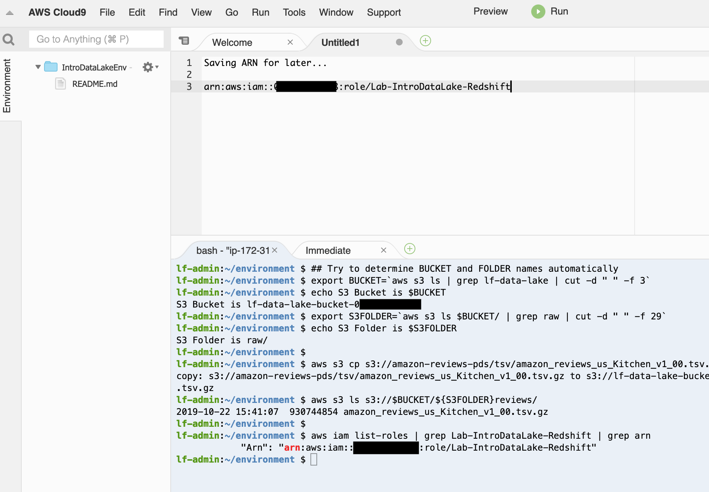

# Part 2- Extend your Data Lake with additional datasets (ingest new data)
In this section, we will copy the new dataset into the S3 bucket/folder that represents the "raw" incoming data for your data lake.  We will use a terminal session run by the browser-based Cloud9 environment to do so.


## Navigate to your Cloud9 IDE Environment

[AWS Cloud9](https://aws.amazon.com/cloud9/) is is a cloud-based integrated development environment (IDE) that lets you write, run, and debug your code with just a browser.

AWS Cloud9 comes with a terminal that includes sudo privileges to the managed Amazon EC2 instance that is hosting your development environment and a preauthenticated AWS Command Line Interface. This makes it easy for you to directly access AWS services, install additional software, do a git push, or enter commands.

* In the AWS Console, navigate to the Cloud9 service




* Click the "Open IDE" button for the "IntroDataLakeEnv" Cloud9 environment 



### Get familiar with Cloud9
If you are new to Cloud9, you can review the IDE tutorial at [https://docs.aws.amazon.com/cloud9/latest/user-guide/tutorial-tour-ide.html](https://docs.aws.amazon.com/cloud9/latest/user-guide/tutorial-tour-ide.html)

### Copy a new dataset into your data lake

* In the bottom of the Cloud9 IDE, there is a "bash" terminal open in a tab.



* Copy these commands and paste them into the bash terminal and run it

```
## Try to determine BUCKET and FOLDER names automatically
export BUCKET=`aws s3 ls | grep lf-data-lake | cut -d " " -f 3`
echo S3 Bucket is $BUCKET
export S3PROCFOLDER=`aws s3 ls $BUCKET/ | grep process | cut -d " " -f 29`
export S3FOLDER=`aws s3 ls $BUCKET/ | grep raw | cut -d " " -f 29`
echo S3 Folder is $S3FOLDER

aws s3 md s3://$BUCKET/${S3PROCFOLDER}reviews/
aws s3 cp s3://amazon-reviews-pds/tsv/amazon_reviews_us_Kitchen_v1_00.tsv.gz s3://$BUCKET/${S3FOLDER}reviews/
aws s3 ls s3://$BUCKET/${S3FOLDER}reviews/


```

Your output should look like...


* Run this command to print out the ARN of the IAM Role created for use with Redshift:

```
aws iam list-roles | grep Lab-IntroDataLake-Redshift | grep arn

```



* Copy/paste the arn in a notepad/textpad document for later use.  Hint: you can open a new file in Cloud9 and paste it there.



## Congratulations- you have finished ingesting the new dataset into S3

Click [here](NewLab1d.md) to advance to the next section