# Part 2- Extend your Data Lake with additional datasets (catalog data)
In this section, we define a new database for our Product Reviews dataset and use the Glue Crawler to identify the table schema.

## Create a new database in Lake Formation

* In the AWS Console, navigate to the Lake Formation service. You should still be logged in as the lf-admin Lake Formation administrator user.

* If necessary, click on "Get started" on the initial Lake Formation web page

* Click on the "Dashboard" link on the left hand column of the Lake Formation Console.  Then click on the "Create database" button under Stage 2

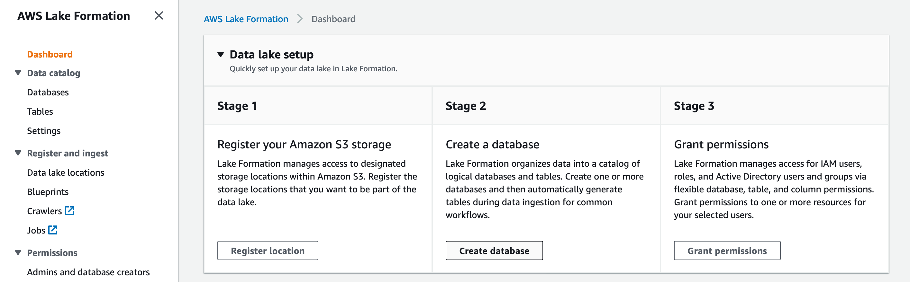

* Enter "reviews" for the name

* Click Browse next to Location and select the lf-data-lake-bucket-NUMBER/raw/reviews folder

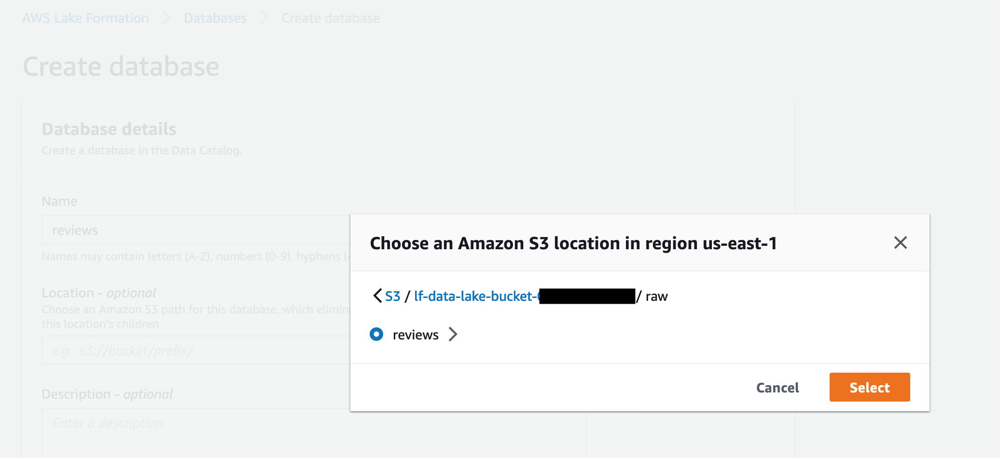

* Unselect the "Use only IAM access control" box.

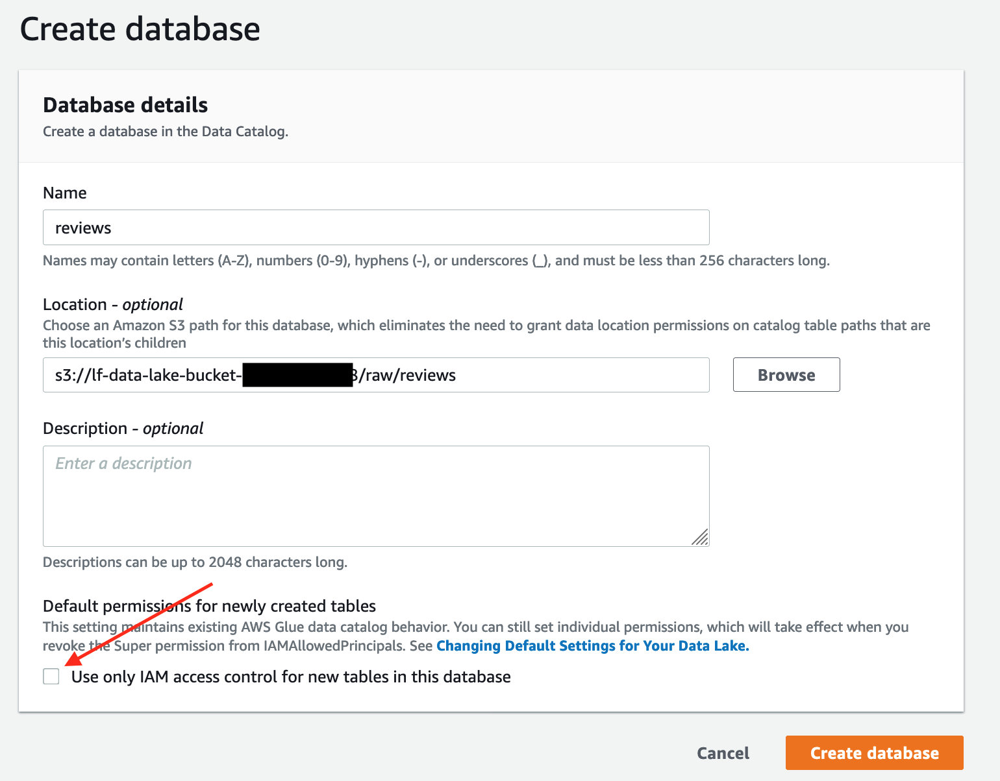

* Click "Create database"

This will create your database

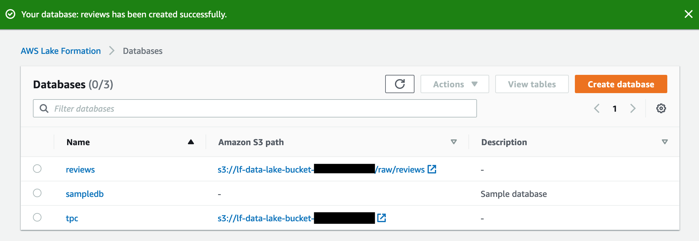

* Now select the radio button for the reviews database

* With the "Actions" button, choose "Grant"

* With the IAM users and roles drop-down, type "glue" in the search area and then choose the "LF-GlueServiceRole".

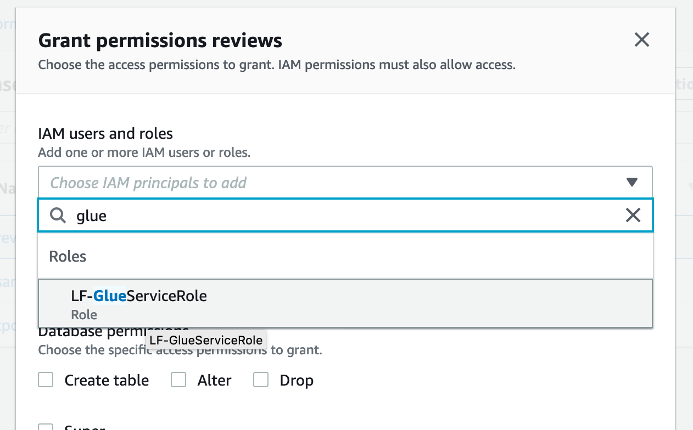

* Under Database permisions, choose "Create table".

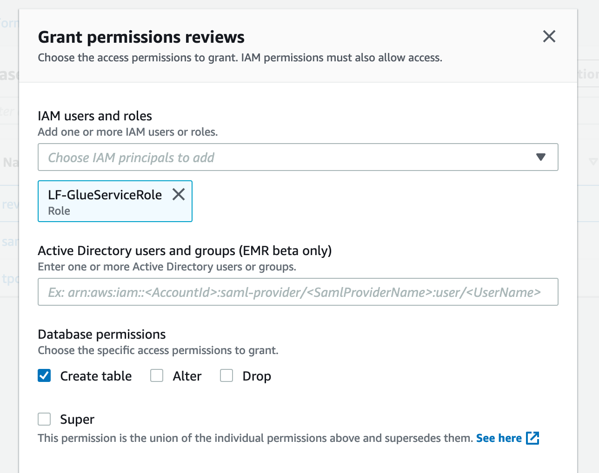

* Click "Grant"

## Catalog our new dataset
Keeping track of all of the raw assets that are loaded into your data lake, and then tracking all of the new data assets and versions that are created by data transformation, data processing, and analytics can be a major challenge. An essential component of an Amazon S3 based data lake is a Data Catalog. A data catalog is designed to provide a single source of truth about the contents of the data lake, and rather than end users reasoning about storage buckets and prefixes, a data catalog lets them interact with more familiar structures of databases, tables, and partitions.

AWS Glue Catalog is a fully managed data catalog whose contents are generated by running crawlers over S3 datasets. The Glue Data Catalog contains information about data assets that have been transformed into formats and table definitions that are usable by analytics tools like Amazon Athena, Amazon Redshift, and Amazon EMR.

At this point in our lab, we have uploaded a new dataset but we don't really know what the data is.  Our next activity will be to try to determine some more knowledge about the contents of the dataset.  We will use a Glue Crawler to investigate our new dataset's contents and to keep track of that metadata in the Glue Catalog for future use.  You can learn more about how Glue Crawlers work [here](https://docs.aws.amazon.com/glue/latest/dg/populate-data-catalog.html).

* On the left-hand column of the Lake Formation console, click on "Crawlers" under "Register and ingest"

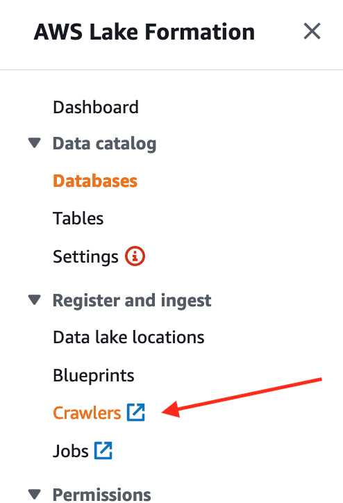

* Click the "Add crawler" button.  A Glue Crawler can inspect our new dataset and try to determine its contents and structure for us.

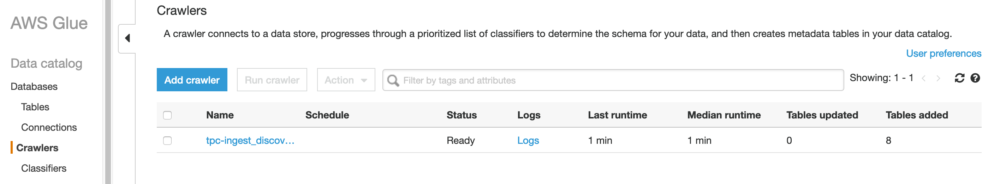

* Enter "Crawl_raw_reviews" for the Crawler name
* Click Next
* Select "Data Stores" as the crawler source type
* Click Next
* Choose S3 for the data store
* Choose crawl data in "specified path in my account"
* Click on the folder icon to pop open the Choose S3 path window.
* Expand the lf-data-lake-bucket-[NUMBER] bucket.  Expand the raw folder. Select the "reviews" folder.

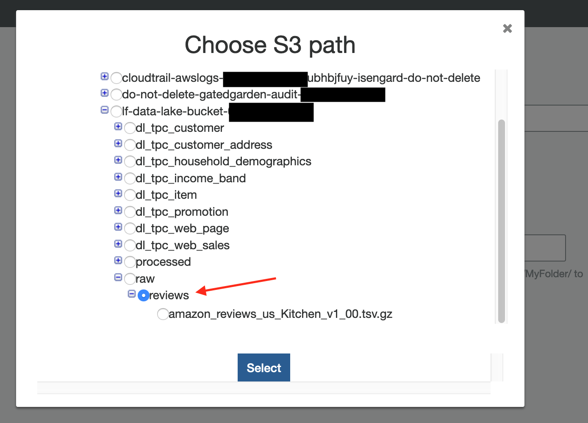

BE SURE TO CHOOSE THE REVIEWS FOLDER, NOT THE FILE INSIDE THE FOLDER.

* Click the Select button to close the pop-up.  Your include path should look like "s3://lf-data-lake-bucket-[NUMBER]/raw/reviews"
* Click Next
* Choose No to add another data store
* Click Next
* Click "Choose an existing IAM role"
* Using the IAM role drop-down, select "LF-GlueServiceRole"

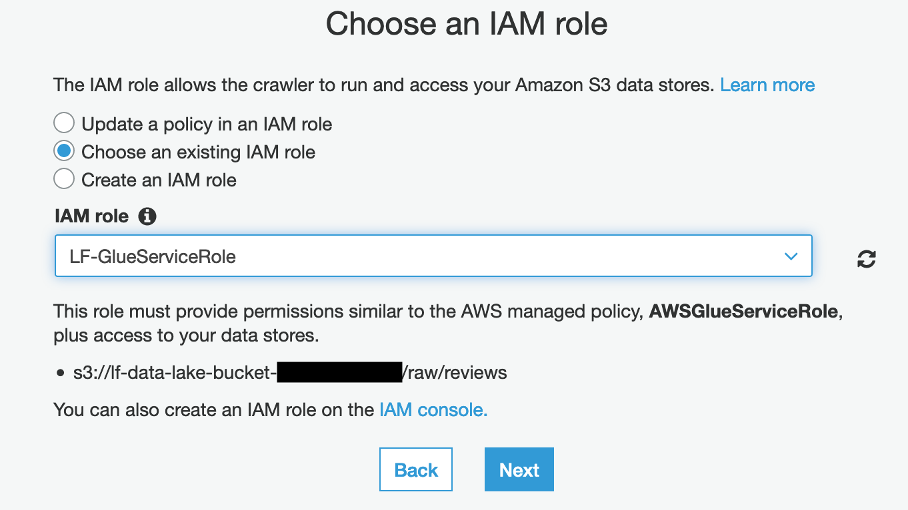

* Click Next
* Choose "Run on demand"
* Click Next

* In the database dropdown, choose the "reviews" database

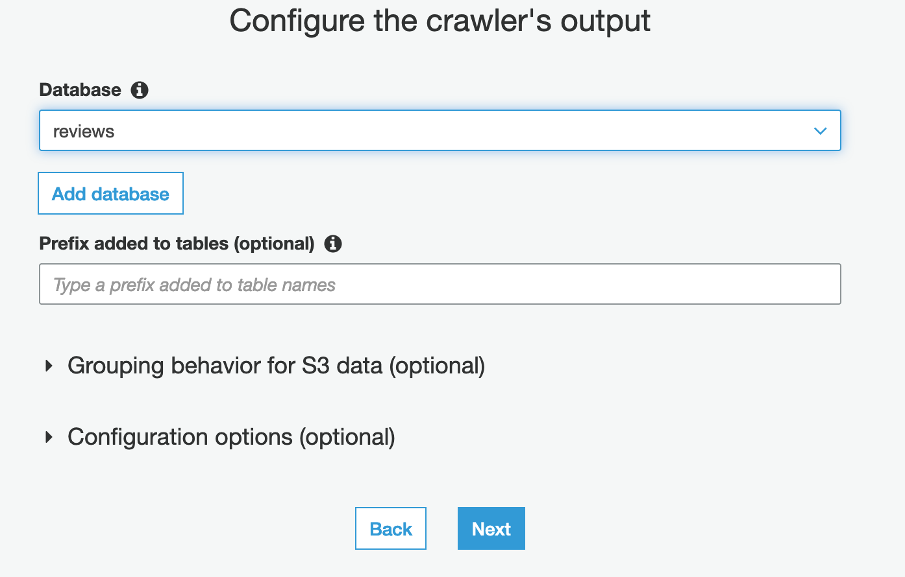

* Click Next
* Click Finish
* Click on the "Run it now?" link

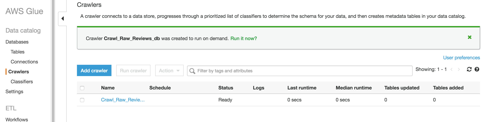

* Wait for the Crawler to run and finish.  It will take about a minute.  There is a refresh icon on the right hand side of the page to refresh the page with the latest Status.

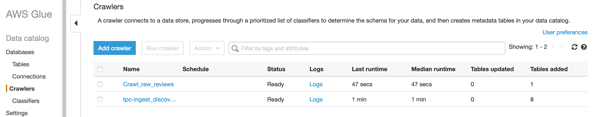

### View our new dataset structure

* Click on the Databases link on the left-column of the page.  You should see your new reviews database.

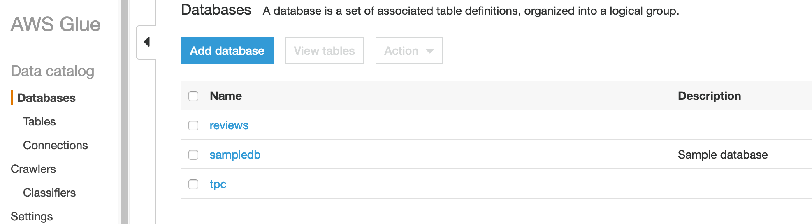

* Click on the reviews link.
* Click on the "Tables in reviews" link

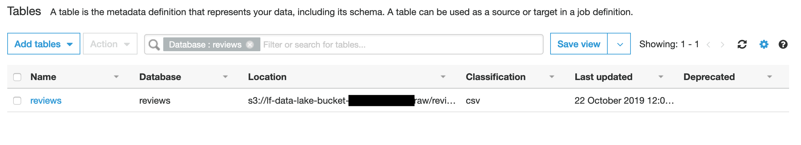

* Click on the "reviews" table

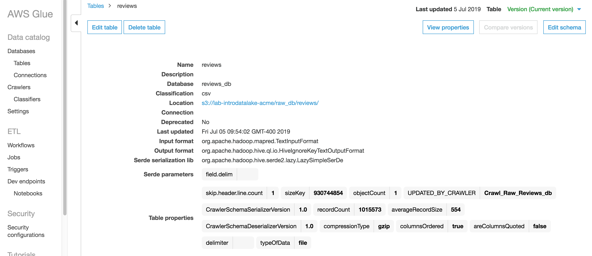
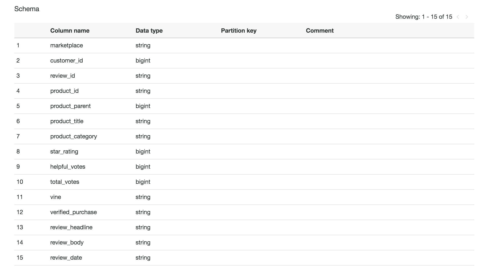

* Notice how the Glue crawler was able to identify the underlying structure and format (the metadata) of our new dataset.

## Congratulations- you have finished the cataloging the new dataset

Click [here](NewLab1e.md) to advance to the next section