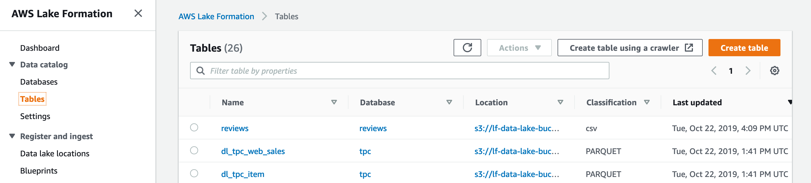
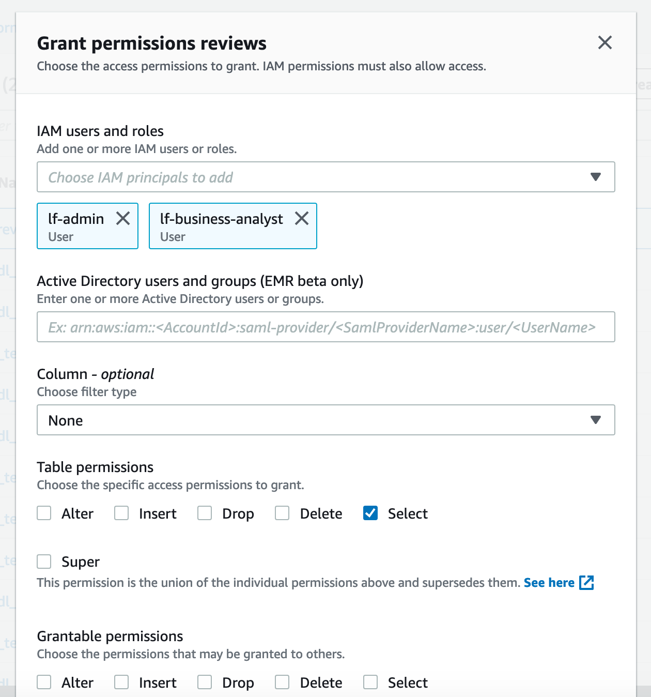

# Part 2- Extend your Data Lake with additional datasets (permission data)
In this section, we will grant Lake Formation permissions for users (and ourselves) for our new dataset.

## Grant permissions on the reviews table to users

* Navigate back to the Lake Formation console (which may already be open in a previous browser tab)

* Click on Tables under Data catalog

* Select the reviews table

* Using the Actions button, choose "Grant"

* With the IAM users and roles drop-down, select "lf-business-analyst"

* Use the IAM users and roles drop-down again and select "lf-admin" 

* Under Table permissions, choose "Select"

* Click "Grant"

## Congratulations- you have finished the permissioning the new dataset

Click [here](../NewLab1f.md) to advance to the next section