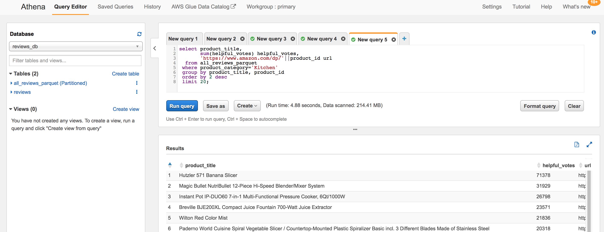

# Part 2- Extend your Data Lake with additional datasets (query data)

## Query our new data
An S3 data lake efficiently decouples storage and compute, which makes it is easy to build analytics applications that scale out with increases in demand. To analyze data in your data lake easily and efficiently, AWS has developed several managed and serverless big data services. The most commonly used services to run analytics on S3 data are: Amazon Athena, Amazon Redshift, Amazon EMR, as well as other 3rd party and open source services.

In this section, we will demonstrate how to use Amazon Athena to query our data lake.

Amazon Athena is a serverless interactive query service that makes it easy to analyze data in Amazon S3 using standard SQL. Athena is out-of-the-box integrated with AWS Glue Data Catalog, which makes it very fast and easy to start running queries against your data lake.  Learn more [here](https://github.com/aws-samples/aws-dbs-refarch-datalake/tree/master/src/data-analytics/amazon-athena).


* With the reviews table selected in Lake Formation, use the Actions button and choose "View data"


which after you click on an informational pop-up, will take you to the Amazon Athena console and show you sample data from the reviews dataset:


* Make sure the Database drop-down points to "reviews".  If not, change it.  You should see your reviews table.


* In the "New query 1" tab, enter this query:
```
select count(*) from reviews;
```
* Click "Run query".  You should see that there are 4.8 million reviews in the Kitchen product category dataset that we uploaded to the data lake.


* Click the + sign to the right of the New query tabs to open a new query tab.  Enter this query:
```
select product_title,
       sum(helpful_votes) helpful_votes,
       'https://www.amazon.com/dp/'||product_id url
  from reviews
 group by product_title, product_id
 order by 2 desc
 limit 20;
```
* Click "Run query"


* Notice that the product with the most "helpful review" votes is the Hutzler 571 Banana Slicer.  If you want to view this product, check it out on [amazon.com](https://www.amazon.com/dp/B0047E0EII).  We'll explore some of these most helpful reviews shortly.
  * Hint: To see all of the query output, there is a "See results in full screen" icon to the upper right of the Results table.  Or you can also minimize the left-column of the query edit.  Or reduce the your browser font size (which is the same as pressing the control/command key with the - key).

## Adding more data from the public Product Reviews dataset to your catalog
For later in the lab, we want to be able to query all of the public product reviews- not just the ones for products in Kitchen product category.  Amazon.com has made the full set reviews for all of the product categories available on S3 in parquet format.  Rather than downloading and uploading all of this data to our S3 bucket, we will simply point to where it is stored publicly.  We will define our all_reviews_parquet table via a SQL command (this could also be done with the Glue Crawler as we did for the Kitchen product category dataset).

* Click the + sign to open a new query tab.  Enter this query

```
CREATE EXTERNAL TABLE all_reviews_parquet(
  marketplace string, 
  customer_id string, 
  review_id string, 
  product_id string, 
  product_parent string, 
  product_title string, 
  star_rating int, 
  helpful_votes int, 
  total_votes int, 
  vine string, 
  verified_purchase string, 
  review_headline string, 
  review_body string, 
  review_date bigint, 
  year int)
PARTITIONED BY (product_category string)
ROW FORMAT SERDE 
  'org.apache.hadoop.hive.ql.io.parquet.serde.ParquetHiveSerDe' 
STORED AS INPUTFORMAT 
  'org.apache.hadoop.hive.ql.io.parquet.MapredParquetInputFormat' 
OUTPUTFORMAT 
  'org.apache.hadoop.hive.ql.io.parquet.MapredParquetOutputFormat'
LOCATION
  's3://amazon-reviews-pds/parquet/';
```  

* Click "Run query"


* Because the full public Customer Reviews is stored as a set of partition datasets, we have one extra step which is to run a command to re-scan the partition structure so that our Glue/Athena catalog is aware of it.  In the left-hand column, find the all_reviews_parquet table and click on the vertical ... to pop-up a menu.  


* Choose "Load partitions" from the pop-up menu.


* Now, let's run essentially the same query as before (looking for the products with the most helpful reviews in the Kitchen category).  Click the + sign to open a new query tab.  Enter this query:
```
select product_title,
       sum(helpful_votes) helpful_votes,
       'https://www.amazon.com/dp/'||product_id url
  from all_reviews_parquet
 where product_category='Kitchen'
 group by product_title, product_id
 order by 2 desc
 limit 20;
```
* Click "Run query"



* Notice that the query against the all_reviews_parquet table ran much faster than our earlier query against the reviews table.  This is because the all_reviews_parquet table points to a dataset in the optimized parquet format, while the reviews table points to a dataset in a less optimized format (text csv).

## Congratulations- you have finished the querying the new dataset with Amazon Athena

Click [here](../Lab2/README.md) to advance to the next section


