# LAB 1 - Working with the Data Lake
In this lab you will setup a basic data lake environment, load some data, and begin to us it.


## Contents
* [Before You Begin](#before-you-begin)
* [Setup your initial Data Lake on S3](#setup-your-initial-data-lake-on-s3)
* [Catalog our new dataset](#catalog-our-new-dataset)
* [Query our new data](#query-our-new-data)
* [OPTIONAL Make our data faster](#optional-make-our-data-faster)
* [Before You Leave](#before-you-leave)

## Before You Begin
* Determine and capture the following information.
  * [Your_AWS_Account_Id]
  * [Your_AWS_User_Name]
  * [Your_AWS_Password]
  * [AWS_Region_to_be_used_for_Lab]
* Login to the [AWS Console](https://console.aws.amazon.com/). 
* Switch your console to the assigned [AWS Region](https://docs.aws.amazon.com/AmazonRDS/latest/UserGuide/Concepts.RegionsAndAvailabilityZones.html).  

## Setup your initial Data Lake on S3

### Navigate to your S3 bucket
The S3 bucket that we will use in these labs should already exist.  It was created for you in the setup instructions run by your administrator.

* In the AWS Console, use the Services menu and navigate to the S3 console.  One way to do so, is to expand the Services menu and type "S3" in the find a service search field.
* In the S3 console, look for a bucket called "lab-introdatalake-[your_company]".  Click on that bucket.
  * If you don't see a "lab-introdatalake-[your_company]" bucket, then your site administrator should re-visit the Lab Setup instructions.

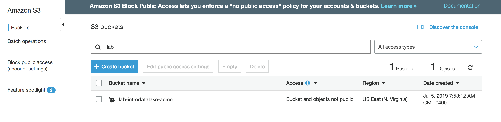

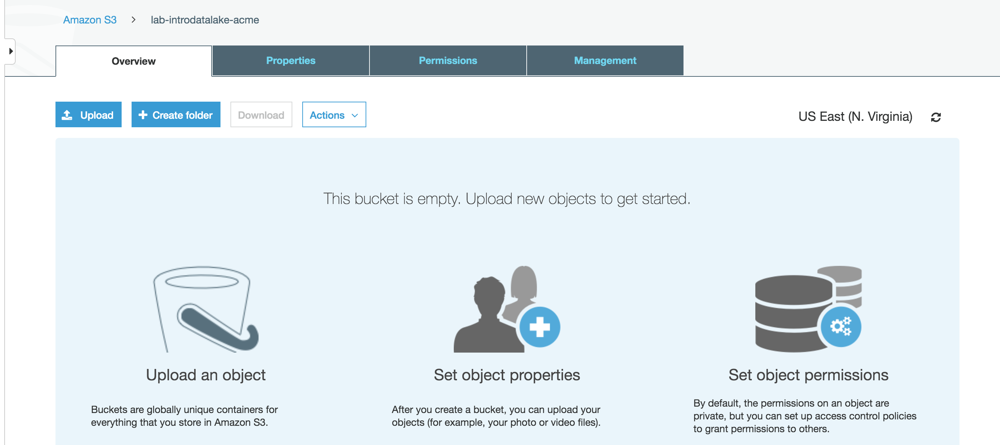

### Create folders in the S3 bucket to capture your data lake structure

* Click on "Create folder"
* Enter the name "raw_[initials]", where [initials] is your initials.

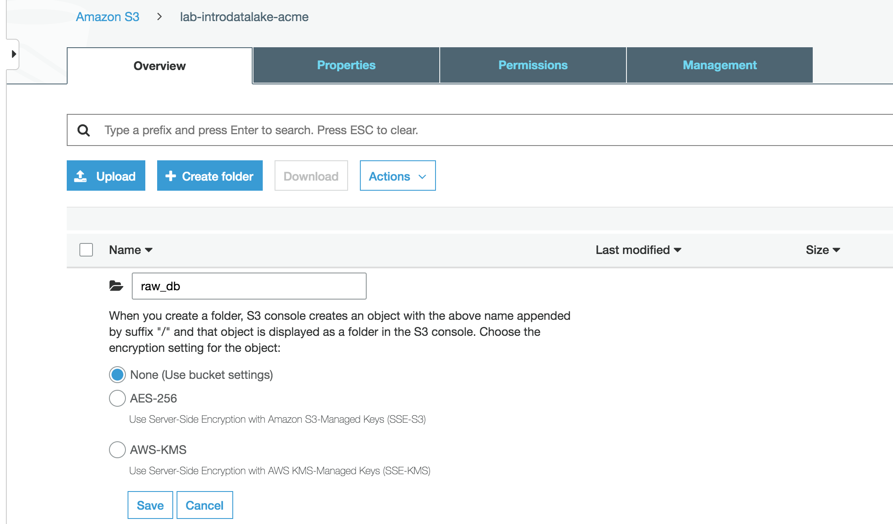

* Click Save to create the raw_db folder/prefix.
* Repeat the above process to create a 2nd folder called "processed_[initials]".

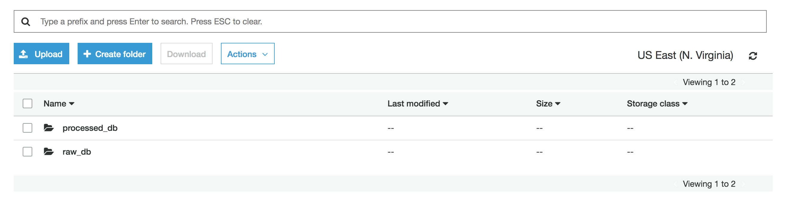

### Download sample dataset
These labs will use the public Amazon Customer Reviews dataset. Amazon Customer Reviews (a.k.a. Product Reviews) is one of Amazon’s iconic products. In a period of over two decades since the first review in 1995, millions of Amazon customers have contributed over a hundred million reviews to express opinions and describe their experiences regarding products on the Amazon.com website.  Find out more about the dataset [here](https://s3.amazonaws.com/amazon-reviews-pds/readme.html).


* Download the sample dataset to your local computer from [https://s3.amazonaws.com/amazon-reviews-pds/tsv/amazon_reviews_us_Kitchen_v1_00.tsv.gz](https://s3.amazonaws.com/amazon-reviews-pds/tsv/amazon_reviews_us_Kitchen_v1_00.tsv.gz).  Save the dataset file somewhere where you can easily find it later.

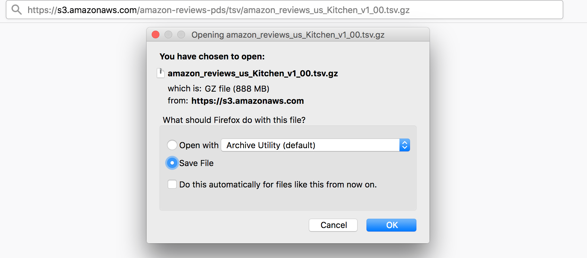

### Upload the sample dataset

* In your S3 console, navigate into the raw_[your-initials] folder.
* Click on Create Folder to create a sub-folder under your raw folder.
* Enter the name "reviews"
* Click on Save to create the reviews folder
* Click on the new reviews folder to open it
* Click the Upload button
* Click the Add files button
* Choose the dataset file you just downloaded.  It should be named amazon_reviews_us_Kitchen_v1_00.tsv.gz

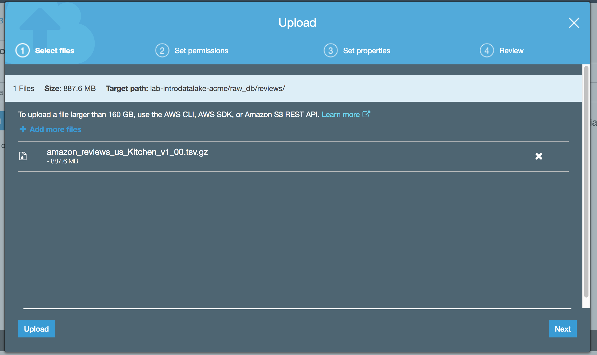

* Click Upload


## Catalog our new dataset
At this point, we have uploaded a new dataset but we don't really know what the data is.  Our next activity will be to try to determine some more knowledge about the contents of the dataset.  We will use Glue to investigate our new dataset's contents and to keep track of that metadata for future use.

* Navigate to the Glue console.
  * Hint: You can use the Services menu to navigate.
* If this is your first time using Glue, click the Get started button

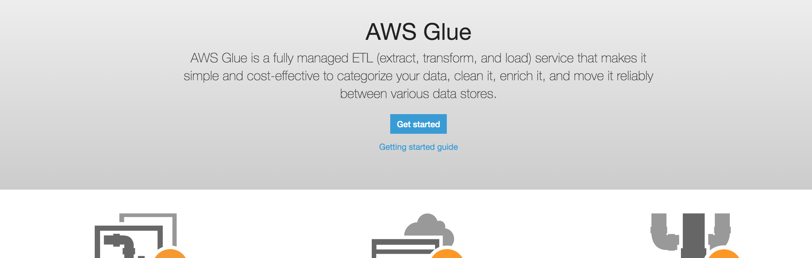

* Click the "Add tables using a crawler" button

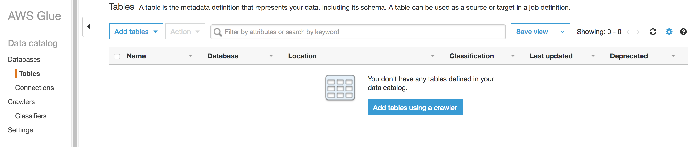

* Enter "Crawl_Raw_Reviews_[your-initials]" for the Crawler name
* Click Next
* Select "Data Stores" as the crawler source type
* Click Next
* Choose S3 for the data store
* Choose crawl data in "specified path in my account"
* Click on the folder icon to pop open the Choose S3 path window.
* Expand the lab-introdatalake-[company] bucket.  Expand the raw_[initials] folder. Select the "reviews" folder.


* Click the Select button to close the pop-up.  Your include path should look like "s3://lab-introdatalake-[company]/raw_[initials]/reviews"
* Click Next
* Choose No to add another data store
* Click Next
* Click "Choose an existing IAM role"
* Using the IAM role drop-down, select "Lab-IntroDataLake-Glue"

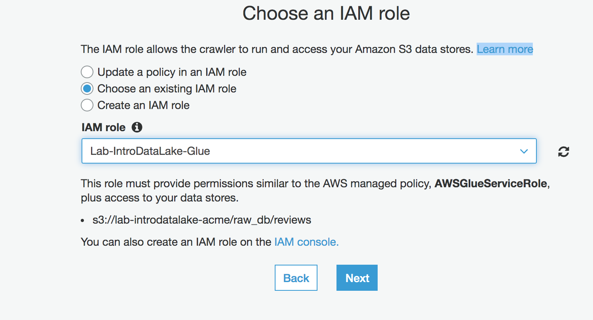

* Click Next
* Choose "Run on demand"
* Click Next
* Click the "Add database" button
* Name the database "Reviews_[initials]"

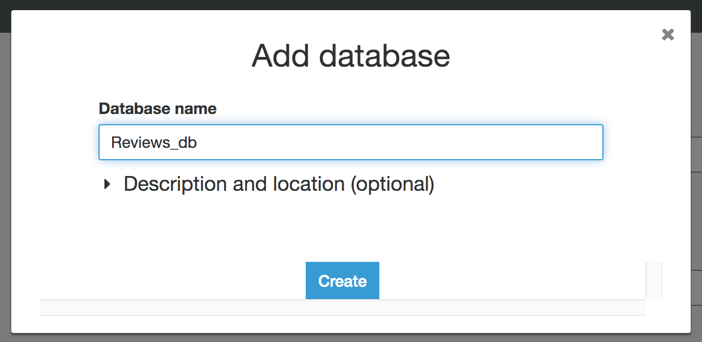

* Click Create
* Click Next
* Click Finish
* Click on the "Run it now?" link


* Wait for the Crawler to run and finish.  It will take about a minute.  There is a refresh icon on the right hand side of the page to refresh the page with the latest Status.

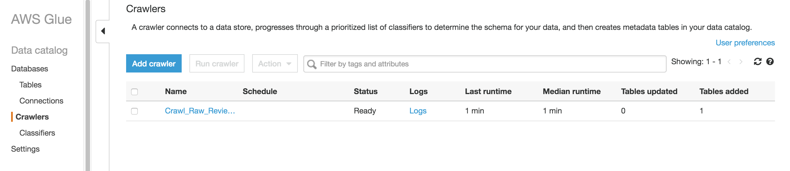

### View our new dataset structure

* Click on the Databases link on the left-column of the page.  You should see your new reviews_[initials] database.

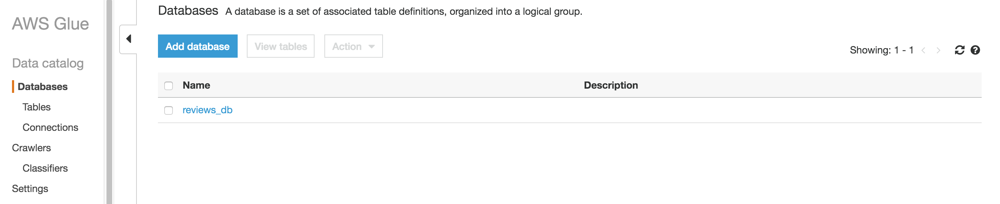

* Click on the reviews_[initials] link.
* Click on the "Tables in reviews_[initials]" link

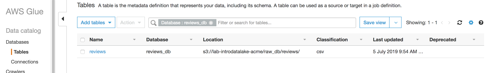

* Click on the "reviews" table


* Notice how the Glue crawler was able to identify the underlying structure and format (the metadata) of our new dataset.

## Query our new data

* Navigate to the Athena console.
  * Hint: You can use the Services menu to navigate.
* If this is your first time using Athena, click the Get started button

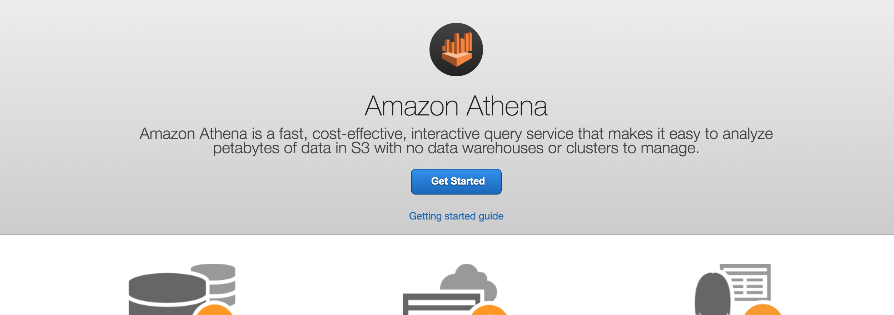

* If the Tutorial window pops-up, then close it by clicking the X in the upper right.
* Make sure the Database drop-down points to "reviews_[initials]".  If not, change it.  You should see your reviews table.


* In the "New query 1" box, enter this query:
```
select count(*) from reviews;
```
* Click "Run query"


* Click the + sign to the right of New query 1 to open a new query tab.  Enter this query:
```
select product_title,
       sum(helpful_votes) helpful_votes,
       'https://www.amazon.com/dp/'||product_id url
  from reviews
 group by product_title, product_id
 order by 2 desc
 limit 20;
```
* Click "Run query"


* Notice that the product with the most "helpful review" votes is the Hutzler 571 Banana Slicer.  If you want to view it, check it out on [amazon.com](https://www.amazon.com/dp/B0047E0EII)

## Adding other data from the public dataset to your catalog
For later in the lab, we will add some additional customer reviews.  In this case, we will do so via DDL.

* Click the + sign to open a new query tab.  Enter this query

```
CREATE EXTERNAL TABLE all_reviews_parquet(
  marketplace string, 
  customer_id string, 
  review_id string, 
  product_id string, 
  product_parent string, 
  product_title string, 
  star_rating int, 
  helpful_votes int, 
  total_votes int, 
  vine string, 
  verified_purchase string, 
  review_headline string, 
  review_body string, 
  review_date bigint, 
  year int)
PARTITIONED BY (product_category string)
ROW FORMAT SERDE 
  'org.apache.hadoop.hive.ql.io.parquet.serde.ParquetHiveSerDe' 
STORED AS INPUTFORMAT 
  'org.apache.hadoop.hive.ql.io.parquet.MapredParquetInputFormat' 
OUTPUTFORMAT 
  'org.apache.hadoop.hive.ql.io.parquet.MapredParquetOutputFormat'
LOCATION
  's3://amazon-reviews-pds/parquet/';
```  

* Click "Run query"


* Click the + sign to open a new query tab.  Enter this query

```
MSCK REPAIR TABLE all_reviews_parquet;
```  

* Click "Run query"


* Click the + sign to open a new query tab.  Enter this query:
```
select product_title,
       sum(helpful_votes) helpful_votes,
       'https://www.amazon.com/dp/'||product_id url
  from all_reviews_parquet
 where product_category='Kitchen'
 group by product_title, product_id
 order by 2 desc
 limit 20;
```
* Click "Run query"


* Notice that the query against the all_reviews_parquet table ran much faster than the query against the reviews table.  This is because the all_reviews_parquet table points to a dataset in the optimized parquet format, while the reviews table points to a dataset in a less optimized format (text csv).


## OPTIONAL Make our data faster
In this section, we will process our raw dataset into a more optimized format.  Specifically, we will transform it from a text csv format into the columnar parquet format using Glue.

* Navigate to the Glue console
* Click on Jobs in the left-hand column
* Click on the Add job button
* Enter "ETL_Raw_Reviews_[initials]" for the Name
* Choose Lab-IntroDataLake-Glue for the IAM role
* Choose Spark for the type
* Choose "A proposed script generated by AWS Glue"
* Choose Python
* Leave other fields at their defaults

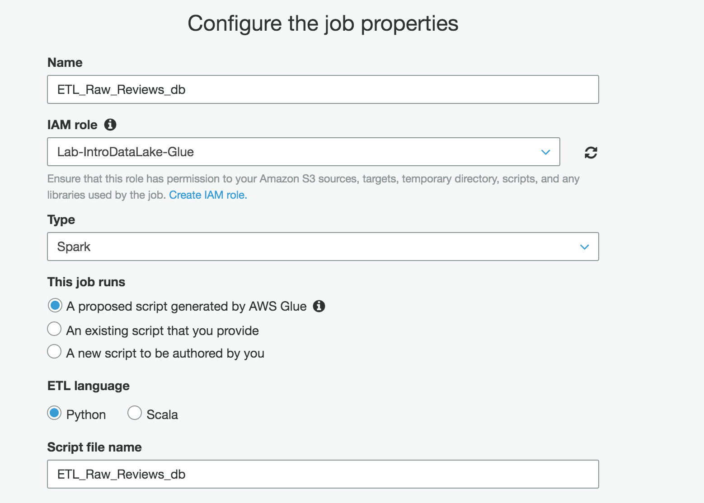

* Click Next
* Choose "reviews" from the "reviews_[initials]" database as the data source
* Click Next
* Choose "Create tables in your data target"
* Choose Amazon S3
* Choose Parquet
* Click the folder icon. Select the "processed_[initials]" folder.


* Append "/reviews" to the end of the S3 target path

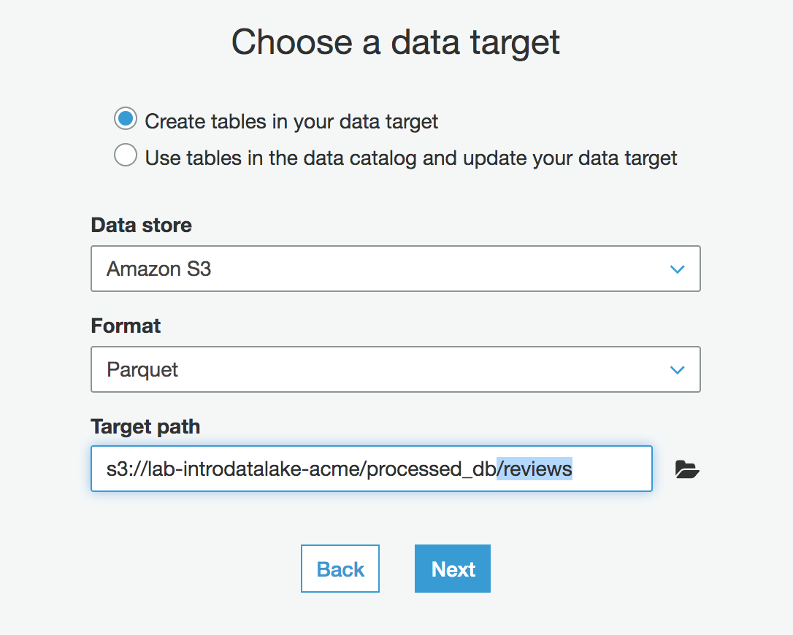

* Click Next
* Review the column mappings (you don't need to change anything).  Then click the "Save job and edit script" button
* If the script editor tips pop-up appears, close it by clicking the X in the upper right
* Review the job script editor as desired.  Then click the "Run job" button.
* Click "Run job" in the pop-up window.
* Wait for the job to run.  Note: this can take 10 minutes or so.

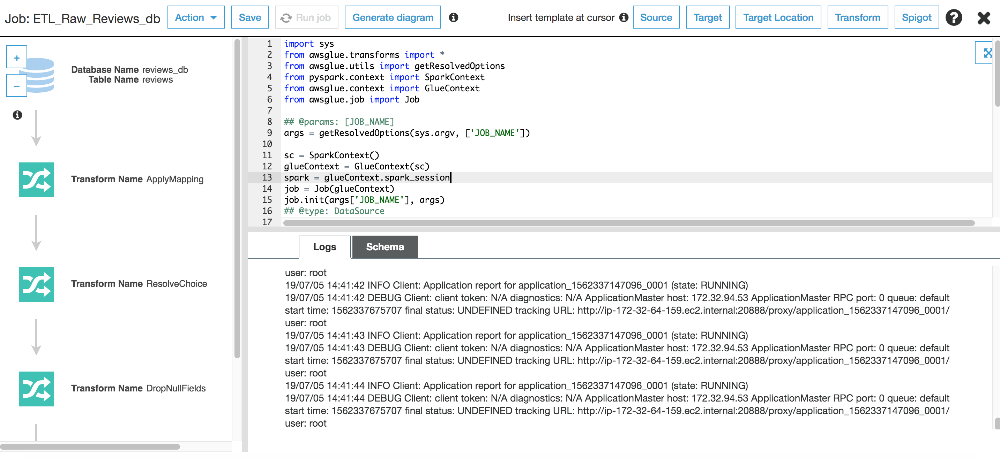

* Navigate to the S3 console, then look at the "processed_[initials]/reviews" folder in your "lab-introdatalake-[company]" bucket.  You will see a number of parquet files that were created by your glue ETL job.


## Before You Leave
If you are done with the lab, please follow the cleanup instructions to avoid having to pay for unused resources.
