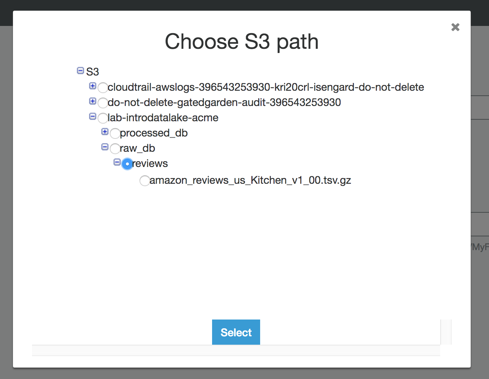
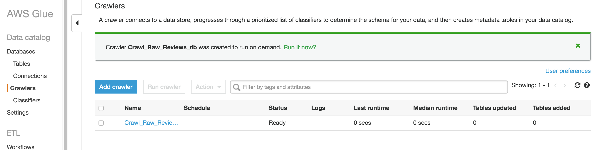
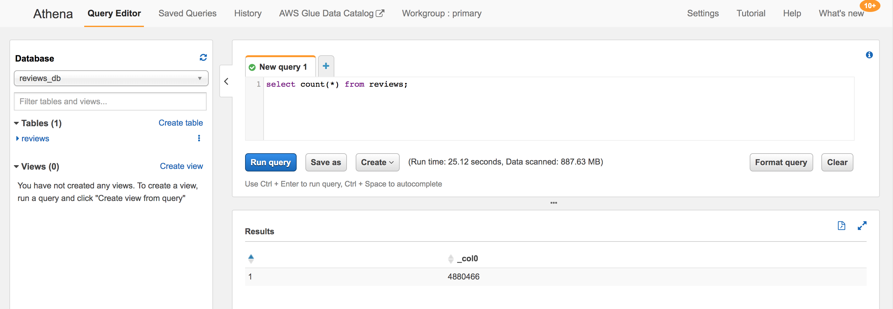
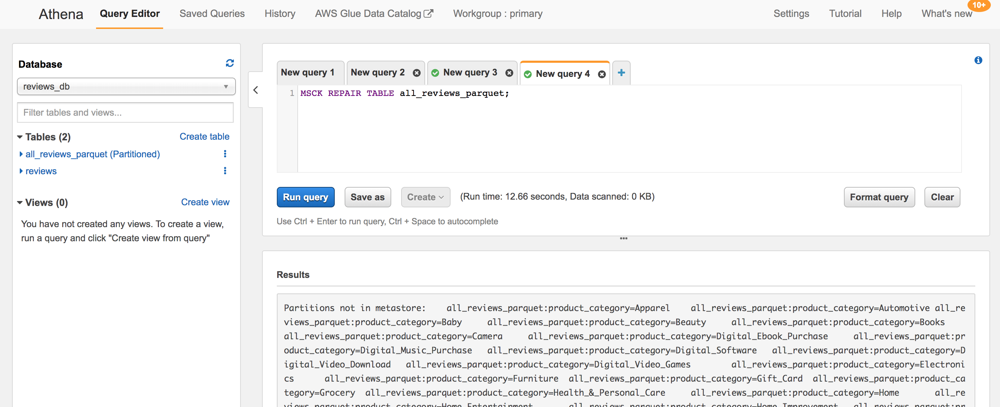
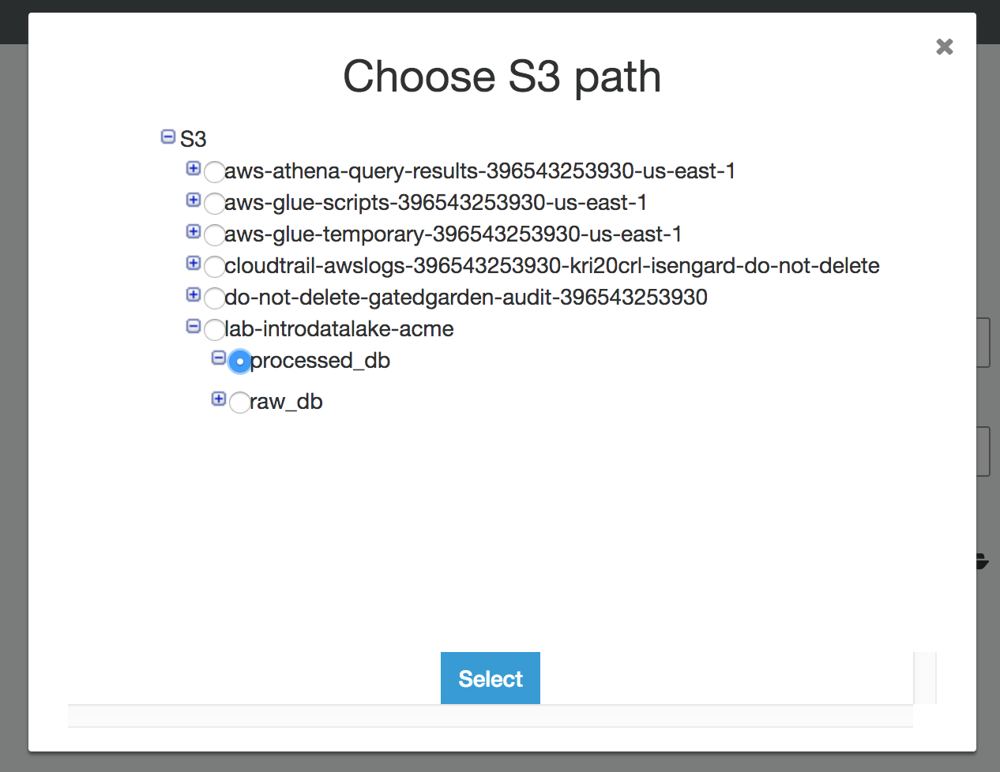
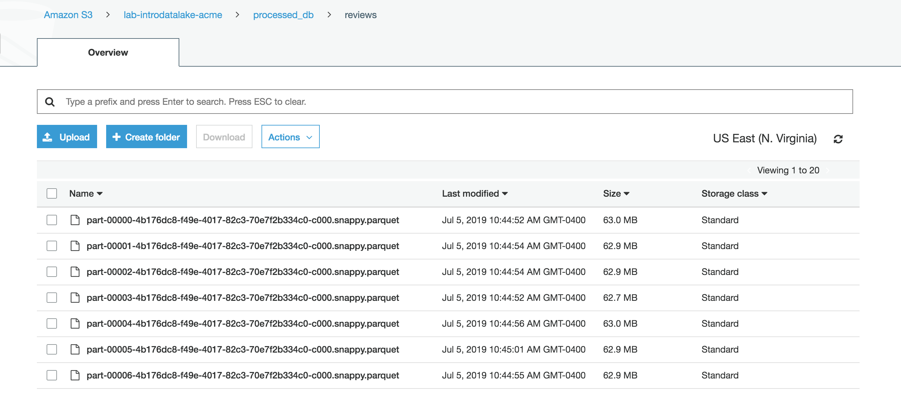

# LAB 1 - Building the Data Lake
In this lab you will setup a basic data lake environment, load some data, and begin to use it.


## Contents
* [Before You Begin](#before-you-begin)
* [Setup your initial Data Lake on S3](#setup-your-initial-data-lake-on-s3)
* [Catalog our new dataset](#catalog-our-new-dataset)
* [Query our new data](#query-our-new-data)
* [OPTIONAL Make our data faster](#optional-make-our-data-faster)
* [Before You Leave](#before-you-leave)

## Before You Begin
* Determine and capture the following information.
  * [Your_AWS_Account_Id]
  * [Your_AWS_User_Name]
  * [Your_AWS_Password]
  * [AWS_Region_to_be_used_for_Lab]
* Login to the [AWS Console](https://console.aws.amazon.com/). 
* Switch your console to the assigned [AWS Region](https://docs.aws.amazon.com/AmazonRDS/latest/UserGuide/Concepts.RegionsAndAvailabilityZones.html).  

## Setup your initial Data Lake on S3
Amazon Simple Storage Service (S3) is the storage service of choice to build a data lake. With Amazon S3, you can cost-effectively build and scale a data lake of any size in a secure environment where data is protected by 99.999999999% (11 9s) of durability.

With a data lake built on Amazon S3, you can use native AWS services to run big data analytics, artificial intelligence (AI), machine learning (ML), high-performance computing (HPC) and media data processing applications to gain insights from your unstructured data sets. Because Amazon S3 supports a wide range of features, IT managers, storage administrators, and data scientists are empowered to enforce access policies, manage objects at scale and audit activities across their S3 data lakes.

Amazon S3 hosts more than 10,000 data lakes for household brands such as Netflix, Airbnb, Sysco, Expedia, GE, and FINRA, who are using them to securely scale with their needs and to discover business insights every minute.  Learn more [here](https://aws.amazon.com/products/storage/data-lake-storage/).

### Navigate to your S3 bucket
The S3 bucket that we will use in these labs should already exist.  It was created for you in the setup instructions run by your administrator.

* In the AWS Console, use the Services menu and navigate to the S3 console.  One way to do so, is to expand the Services top menu and type "S3" in the service search field.


* In the S3 console, look for a bucket called "lab-introdatalake-[your_company]".  
  * If you don't see a "lab-introdatalake-[your_company]" bucket, then your site administrator should re-visit the Lab Setup instructions.


* Click on the "lab-introdatalake-[your_company]" bucket.


### Create folders in the S3 bucket to capture your data lake structure
For this lab, we will define a folder hierarchy for our data lake.  At the top-level, we will have separate folders for "raw" datasets and for "processed" datasets.  Within each of those folders, we will use sub-folders to indicate the dataset name.  In short, we are implementing a hierarchy structure of Lifecycle then Data Type for this example data lake.  If you are curious, you can read more about Data Lake hierarchy design at the [AWS Data Lake Reference Architecture site](https://github.com/aws-samples/aws-dbs-refarch-datalake/tree/master/src/storage-foundation).

Note: As multiple users may be using the same S3 bucket in the labs, please use your initials when creating/naming folders.

* Click on "Create folder"
* Enter the name "raw_[initials]", where [initials] is your initials.


* Click Save to create the raw_db folder.
* Repeat the above process to create a 2nd folder called "processed_[initials]".


### Download sample dataset
These labs will use the public Amazon Customer Reviews dataset. Amazon Customer Reviews (a.k.a. Product Reviews) is one of Amazon’s iconic products. In a period of over two decades since the first review in 1995, millions of Amazon customers have contributed over a hundred million reviews to express opinions and describe their experiences regarding products on the Amazon.com website.  Find out more about the dataset [here](https://s3.amazonaws.com/amazon-reviews-pds/readme.html).


* Download a portion of the dataset to your local computer from [https://s3.amazonaws.com/amazon-reviews-pds/tsv/amazon_reviews_us_Kitchen_v1_00.tsv.gz](https://s3.amazonaws.com/amazon-reviews-pds/tsv/amazon_reviews_us_Kitchen_v1_00.tsv.gz).  This dataset contains reviews for products in the Kitchen product category.  Save the dataset file somewhere where you can easily find it later.


### Upload the sample dataset to the Data Lake
There are many ways to get new datasets into S3.  In this lab, we will use the S3 console to upload a dataset via the web browser.

* In your S3 console, navigate into the raw_[your-initials] folder by clicking on the name of the folder.
* Click on Create Folder to create a sub-folder under your raw folder.
* Enter the name "reviews"
* Click on Save to create the reviews folder
* Click on the new reviews folder to navigate into it
* Click the Upload button
* Click the Add files button
* Choose the dataset file you just downloaded.  It should be named amazon_reviews_us_Kitchen_v1_00.tsv.gz


* Click Upload and wait for the upload to finish.  Depending on your network, this may take a few minutes.


## Catalog our new dataset
Keeping track of all of the raw assets that are loaded into your data lake, and then tracking all of the new data assets and versions that are created by data transformation, data processing, and analytics can be a major challenge. An essential component of an Amazon S3 based data lake is a Data Catalog. A data catalog is designed to provide a single source of truth about the contents of the data lake, and rather than end users reasoning about storage buckets and prefixes, a data catalog lets them interact with more familiar structures of databases, tables, and partitions.

AWS Glue Catalog is a fully managed data catalog whose contents are generated by running crawlers over S3 datasets. The Glue Data Catalog contains information about data assets that have been transformed into formats and table definitions that are usable by analytics tools like Amazon Athena, Amazon Redshift, and Amazon EMR.

At this point in our lab, we have uploaded a new dataset but we don't really know what the data is.  Our next activity will be to try to determine some more knowledge about the contents of the dataset.  We will use a Glue Crawler to investigate our new dataset's contents and to keep track of that metadata in the Glue Catalog for future use.  You can learn more about how Glue Crawlers work [here](https://docs.aws.amazon.com/glue/latest/dg/populate-data-catalog.html).

* Navigate to the Glue console.
  * Hint: You can use the Services menu to navigate to Glue.
* If this is your first time using Glue, click the Get started button


* Click the "Add tables using a crawler" button.  A Glue Crawler can inspect our new dataset and try to determine its contents and structure for us.


* Enter "Crawl_Raw_Reviews_[your-initials]" for the Crawler name
* Click Next
* Select "Data Stores" as the crawler source type
* Click Next
* Choose S3 for the data store
* Choose crawl data in "specified path in my account"
* Click on the folder icon to pop open the Choose S3 path window.
* Expand the lab-introdatalake-[company] bucket.  Expand the raw_[initials] folder. Select the "reviews" folder.



* Click the Select button to close the pop-up.  Your include path should look like "s3://lab-introdatalake-[company]/raw_[initials]/reviews"
* Click Next
* Choose No to add another data store
* Click Next
* Click "Choose an existing IAM role"
* Using the IAM role drop-down, select "Lab-IntroDataLake-Glue"


* Click Next
* Choose "Run on demand"
* Click Next
* Click the "Add database" button
* Name the database "Reviews_[initials]"


* Click Create
* Click Next
* Click Finish
* Click on the "Run it now?" link



* Wait for the Crawler to run and finish.  It will take about a minute.  There is a refresh icon on the right hand side of the page to refresh the page with the latest Status.


### View our new dataset structure

* Click on the Databases link on the left-column of the page.  You should see your new reviews_[initials] database.


* Click on the reviews_[initials] link.
* Click on the "Tables in reviews_[initials]" link


* Click on the "reviews" table


* Notice how the Glue crawler was able to identify the underlying structure and format (the metadata) of our new dataset.

## Query our new data
An S3 data lake efficiently decouples storage and compute, which makes it is easy to build analytics applications that scale out with increases in demand. To analyze data in your data lake easily and efficiently, AWS has developed several managed and serverless big data services. The most commonly used services to run analytics on S3 data are: Amazon Athena, Amazon Redshift, Amazon EMR, as well as other 3rd party and open source services.

In this section, we will demonstrate how to use Amazon Athena to query our data lake.

Amazon Athena is a serverless interactive query service that makes it easy to analyze data in Amazon S3 using standard SQL. Athena is out-of-the-box integrated with AWS Glue Data Catalog, which makes it very fast and easy to start running queries against your data lake.  Learn more [here](https://github.com/aws-samples/aws-dbs-refarch-datalake/tree/master/src/data-analytics/amazon-athena).

* Navigate to the Athena console.
  * Hint: You can use the Services menu to navigate.
* If this is your first time using Athena, click the Get started button


* If the Tutorial window pops-up, then close it by clicking the X in the upper right.
* Make sure the Database drop-down points to "reviews_[initials]".  If not, change it.  You should see your reviews table.


* In the "New query 1" box, enter this query:
```
select count(*) from reviews;
```
* Click "Run query".  You should see that there are 4.8 million reviews in the Kitchen product category dataset that we uploaded to the data lake.



* Click the + sign to the right of New query 1 to open a new query tab.  Enter this query:
```
select product_title,
       sum(helpful_votes) helpful_votes,
       'https://www.amazon.com/dp/'||product_id url
  from reviews
 group by product_title, product_id
 order by 2 desc
 limit 20;
```
* Click "Run query"


* Notice that the product with the most "helpful review" votes is the Hutzler 571 Banana Slicer.  If you want to view this product, check it out on [amazon.com](https://www.amazon.com/dp/B0047E0EII).  We'll explore some of these most helpful reviews more in Lab2.
  * Hint: To see all of the query output, there is a "See results in full screen" icon to the upper right of the Results table.  Or you can also minimize the left-column of the query edit.  Or reduce the your browser font size (which is the same as pressing the control/command key with the - key).

## Adding other data from the public dataset to your catalog
For later in the lab, we want to be able to query all of the public product reviews- not just the ones for products in Kitchen product category.  Amazon.com has made the full set reviews for all of the product categories available on S3 in parquet format.  Rather than downloading and uploading all of this data to our S3 bucket, we will simply point to where it is stored publicly.  We will define our all_reviews_parquet table via a SQL command (this could also be done with the Glue Crawler as we did for the Kitchen product category dataset).

* Click the + sign to open a new query tab.  Enter this query

```
CREATE EXTERNAL TABLE all_reviews_parquet(
  marketplace string, 
  customer_id string, 
  review_id string, 
  product_id string, 
  product_parent string, 
  product_title string, 
  star_rating int, 
  helpful_votes int, 
  total_votes int, 
  vine string, 
  verified_purchase string, 
  review_headline string, 
  review_body string, 
  review_date bigint, 
  year int)
PARTITIONED BY (product_category string)
ROW FORMAT SERDE 
  'org.apache.hadoop.hive.ql.io.parquet.serde.ParquetHiveSerDe' 
STORED AS INPUTFORMAT 
  'org.apache.hadoop.hive.ql.io.parquet.MapredParquetInputFormat' 
OUTPUTFORMAT 
  'org.apache.hadoop.hive.ql.io.parquet.MapredParquetOutputFormat'
LOCATION
  's3://amazon-reviews-pds/parquet/';
```  

* Click "Run query"


* Because the full public Customer Reviews is stored as a set of partition datasets, we have one extra step which is to run a command to re-scan the partition structure so that our Glue/Athena catalog is aware of it.  Click the + sign to open a new query tab.  Enter this query

```
MSCK REPAIR TABLE all_reviews_parquet;
```  

* Click "Run query"



* Now, let's run essentially the same query as before (looking for the products with the most helpful reviews in the Kitchen category).  Click the + sign to open a new query tab.  Enter this query:
```
select product_title,
       sum(helpful_votes) helpful_votes,
       'https://www.amazon.com/dp/'||product_id url
  from all_reviews_parquet
 where product_category='Kitchen'
 group by product_title, product_id
 order by 2 desc
 limit 20;
```
* Click "Run query"


* Notice that the query against the all_reviews_parquet table ran much faster than our earlier query against the reviews table.  This is because the all_reviews_parquet table points to a dataset in the optimized parquet format, while the reviews table points to a dataset in a less optimized format (text csv).


## OPTIONAL Make our data faster
In this optional lab section, we will transform our raw Kitchen reviews dataset into a more optimized format.  Specifically, we will transform it from a text csv format into the columnar parquet format using a Glue ETL job.

Note: This optional section will take approximately 15 minutes to complete.

Specifically, in this section we will author and run a Glue ETL job that uses the Apache Spark framework.  Our job will be a simple job that reads our dataset in its original format and simply writes it back out to a new location in a different, more optimized format (parquet).

You can find more about Glue ETL jobs in the [Glue documentation](https://docs.aws.amazon.com/glue/latest/dg/author-job.html).


* Navigate to the Glue console
* Click on Jobs in the left-hand column
* Click on the Add job button
* Enter "ETL_Raw_Reviews_[initials]" for the Name
* Choose Lab-IntroDataLake-Glue for the IAM role
* Choose Spark for the type (this is the default)
* Choose "A proposed script generated by AWS Glue" (this is the default)
* Choose Python (this is the default)
* Leave other fields at their defaults


* Click Next
* Choose "reviews" from the "reviews_[initials]" database as the data source
* Click Next
* Choose "Create tables in your data target"
* Choose Amazon S3
* Choose Parquet
* Click the folder icon. Select the "processed_[initials]" folder.



* Append "/reviews" to the end of the S3 target path


* Click Next
* Review the column mappings (you don't need to change anything).  Then click the "Save job and edit script" button
* If the script editor tips pop-up appears, close it by clicking the X in the upper right
* Review the job script editor as desired.  Then click the "Run job" button.
* Click "Run job" in the pop-up window.
* Wait for the job to finish running.  At first, you won't see much activity in the Logs window (this is while the job is waiting for the temporary Spark environment to be provisioned).  Then, you'll start to see the typical Apache Spark verbose logging messages begin to appear.  Finally, you'll see the SUCEEDED messages in the Logs area and the Run Job button will return to enabled.  Note: the entire process can take 10 minutes or so.


* Now the Glue Job is finished, navigate to the S3 console, then look at the "processed_[initials]/reviews" folder in your "lab-introdatalake-[company]" bucket.  You will see a number of parquet files that were created by your glue ETL job.




## Before You Leave
If you are done with all of the labs, please follow the cleanup instructions to avoid having to pay for unused resources.

Note: you will use the datasets created in this lab in the next lab, so don't delete them until you are finished with all of the labs.
