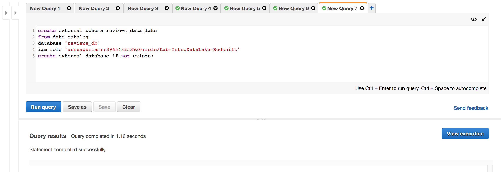
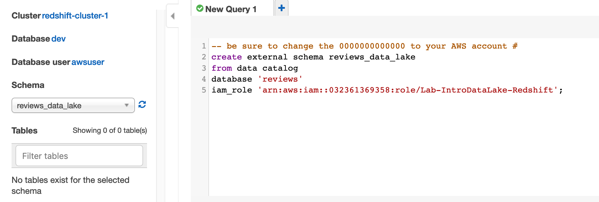
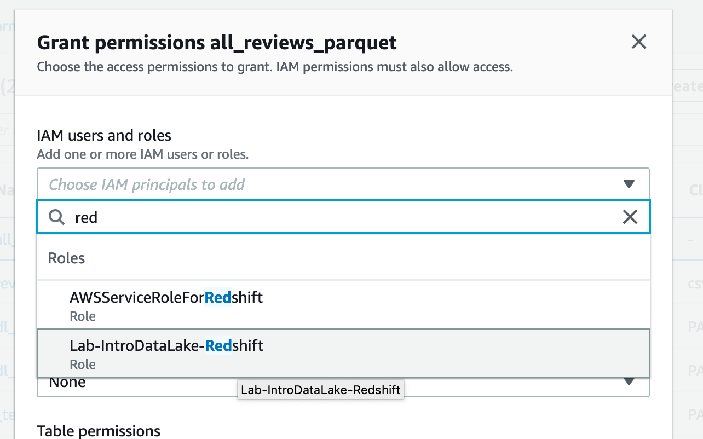
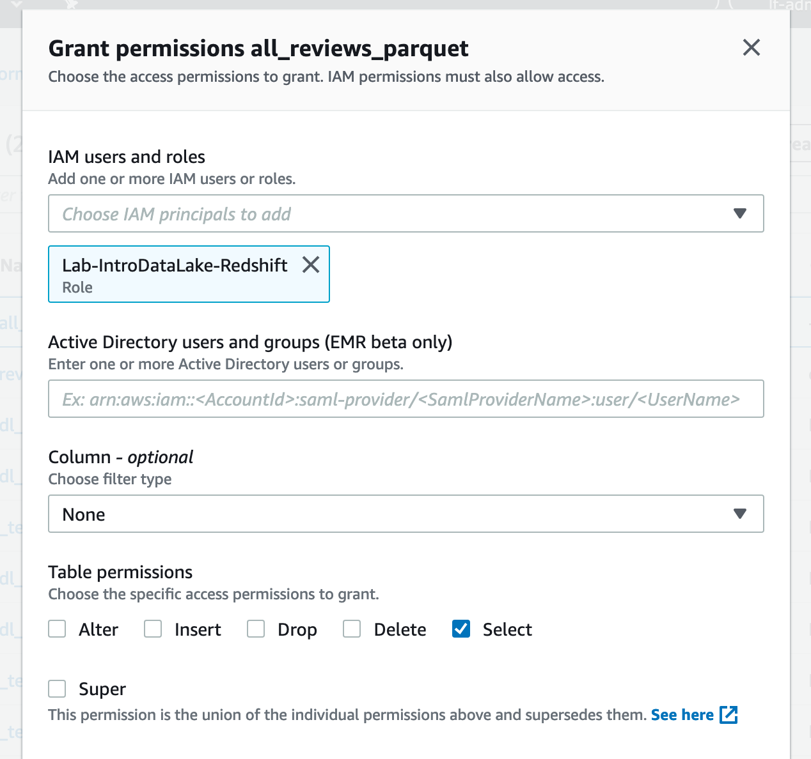
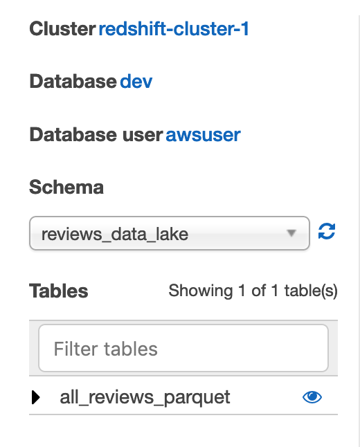
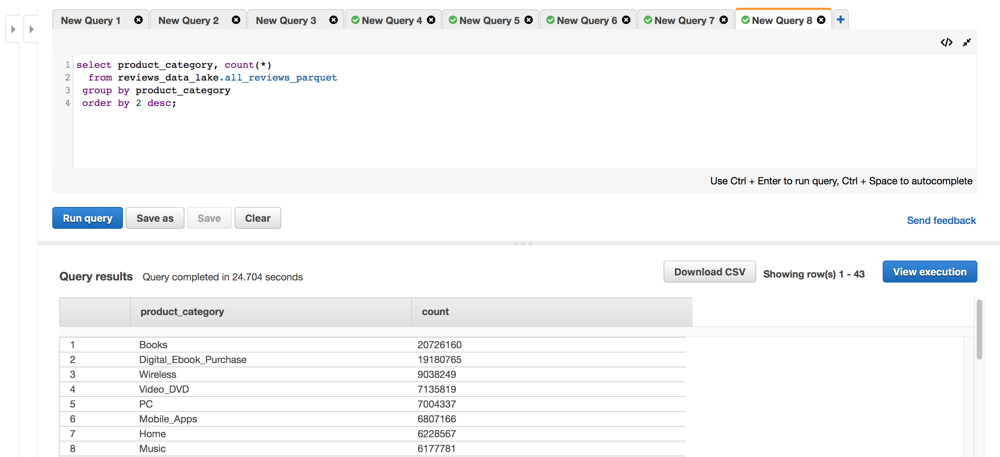

# Part 3- Extend the lake with Data Warehousing (query)

## Query data in our data lake from Redshift without loading it
In this section, we will now show you the features of Redshift known as Redshift Spectrum.  This lets you query data on S3 without copying it into Redshift.

Amazon Redshift is the only data warehouse that extends your queries to your Amazon S3 data lake without loading data. You can query open file formats you already use, such as Avro, CSV, Grok, JSON, ORC, Parquet, and more, directly in S3. This gives you the flexibility to store highly structured, frequently accessed data on Redshift local disks, keep exabytes of structured and unstructured data in S3, and query seamlessly across both to provide unique insights that you would not be able to obtain by querying independent datasets.

Redshift Spectrum is integrated with the Glue Data Catalog, so all we need to do is to define an "external schema" in Redshift that points to our reviews database in the Glue Data Catalog.  At this point, we can then reference any of the data lake tables in our review database, such as all_reviews_parquet.

* Click the + sign to open a new query tab, and enter this query (but do not run it yet):
```
-- be sure to change the 0000000000000 to your AWS account #
create external schema reviews_data_lake 
from data catalog 
database 'reviews' 
iam_role 'arn:aws:iam::00000000000000:role/Lab-IntroDataLake-Redshift';
```

* Replace the "0000000000000" with your AWS Account #.  

Hint: you can find the account number by clicking on your username on the top menu bar in the AWS console.  Enter the account# but do not enter the hyphens.  Alternatively, you can copy the iam_role arn value from your cloud9 environment (where an earlier lab had you paste it for later).

* Click "Run query". 



* Using the Schema drop-down, change the schema to "reviews_data_lake" and click the refresh button beside the drop.down.

You should see no tables listed (because the IAM Role you specified in your Redshift external schema command does not have Lake Formation permissions on any tables yet).



## Grant Lake Formation permissions to Redshift

* In another browser tab (leaving the Redshift query editor tab open for later), navigate to the Lake Formation console.

* Click on "Tables" under "Data catalog" on the left hand column of the Lake Formation console.

* Select the "all_reviews_parquet" table and use the "Actions" button and choose "Grant"

* Using the IAM Users and Roles drop-down, enter "red" in the search area.  Then click on the Lab-IntroDataLake-Redshift role.



* Choose Select under Table Permissions.



* Click Grant

## Query data with permissions

* Return to your Redshift Query Editor

* Click the refresh icon next to the Schema drop-down to refresh the list of tables.

You should now see the all_reviews_parquet table



* Click the + sign to open a new query tab, and enter this query:
```
select product_category, count(*)
  from reviews_data_lake.all_reviews_parquet
 group by product_category
 order by 2 desc;
```

* Click "Run query".  Note that you can see the reviews from all of the product categories as we are querying the full product reviews dataset from the data lake directly.



## Congratulations- you have used Redshift's Spectrum functionality to query your data lake

Click [here](NewLab2c.md) to advance to the next section


