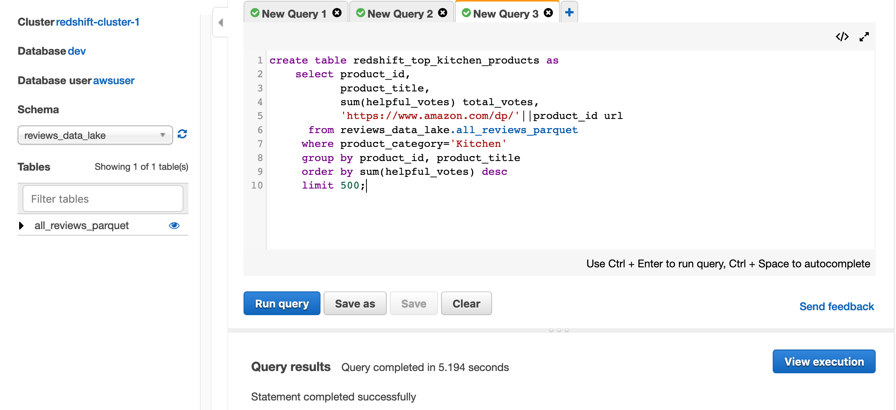
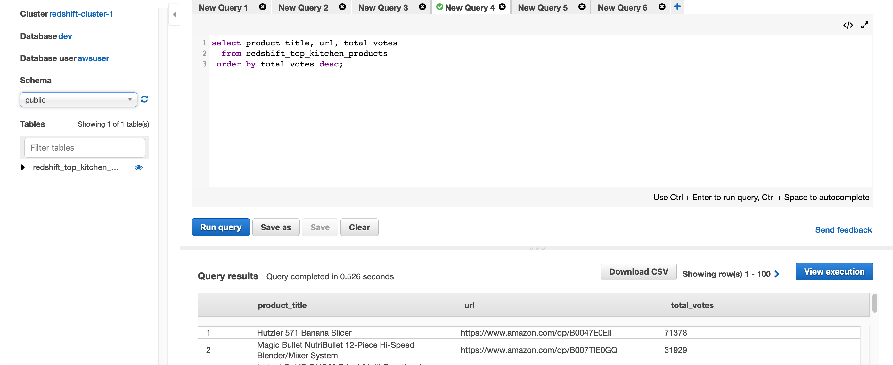
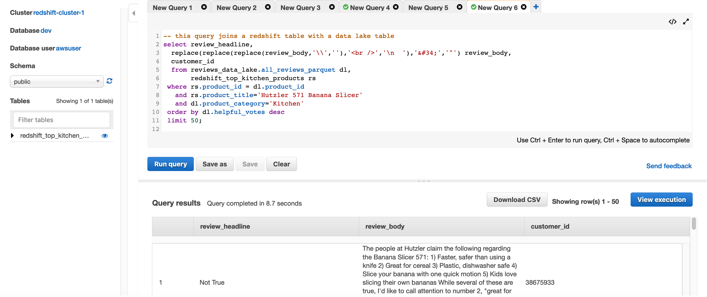
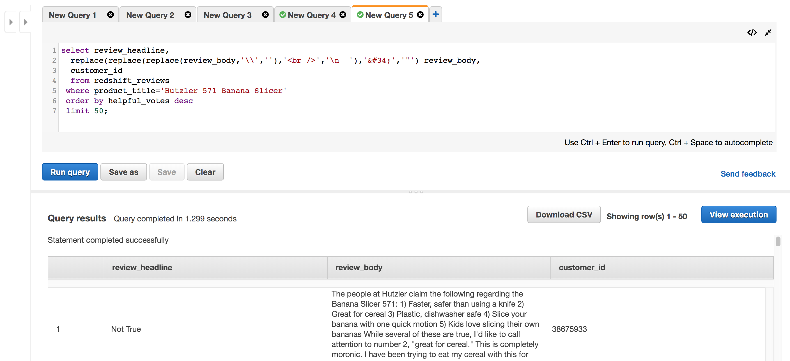
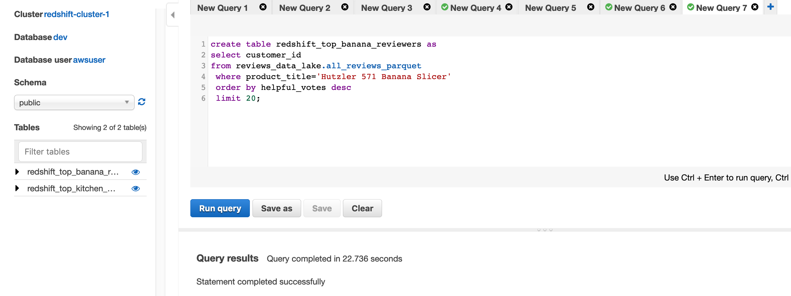
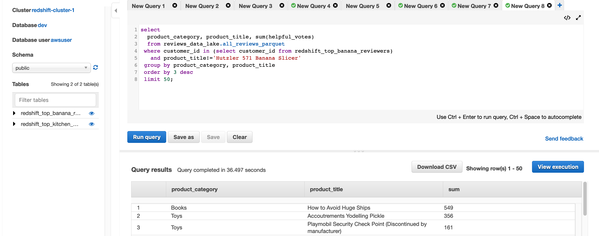

# Part 3- Extend the lake with Data Warehousing (more query)
In this section, we will show some additional queries including queries which combine native Redshift tables with external data lake datasets.


## Load data from our data lake into Redshift
In this example, we will load some top reviews from the Kitchen category into our Redshift cluster's native storage for highly optimized Redshift performance and full Redshift read-write capabilities.  

* In a New Query tab, enter and run this query:

```
create table redshift_top_kitchen_products as
    select product_id,
           product_title,
           sum(helpful_votes) total_votes, 
           'https://www.amazon.com/dp/'||product_id url
      from reviews_data_lake.all_reviews_parquet
     where product_category='Kitchen'
     group by product_id, product_title
     order by sum(helpful_votes) desc
     limit 500;

```



* Click the + sign next the New Query tab and run this query:

```
select product_title, url, total_votes
  from redshift_top_kitchen_products
 order by total_votes desc;

 ```




The [Hutzler 571 Banana Slicer](https://www.amazon.com/dp/B0047E0EII) has the most votes for helpful reviews.  Let's explore some of those reviews next.


* Click the + sign to open a new query tab, and enter this query:
```
-- this query joins a redshift table with a data lake table
select review_headline, 
  replace(replace(replace(review_body,'\\',''),'<br />','\n  '),'&#34;','"') review_body,
  customer_id
  from reviews_data_lake.all_reviews_parquet dl,
       redshift_top_kitchen_products rs
 where rs.product_id = dl.product_id
   and rs.product_title='Hutzler 571 Banana Slicer'
   and dl.product_category='Kitchen'
 order by dl.helpful_votes desc
 limit 50;

```
* Click "Run query".  



Read some of the reviews.  My favorite is #7 "Right Hand/Left Hand Problem Solved".



> Right Hand/Left Hand Problem Solved

>> For those that have complained about this only being for right-hand curved bananas, I've discovered a solution. Like you, for months I was frustrated about this problem. I found myself eating all the right-handed bananas in my cereal while the lefties sat and browned. I'd eventually cut them up with a regular old knife and throw them in some banana bread or make some pudding. I know this is going to sound a little crazy, but my solution came through an accident. One day, while I was washing the dishes, I wasn't paying attention and my arm brushed against the Hutzler 571. I knocked it to the ground below. (THANKFULLY IT FELL ON A PADDED RUG AND DIDN'T BREAK. I MEAN, THEY ARE DURABLE, BUT WHAT A MOMENT OF PANIC!) I still can't explain it, but after it hit the ground, somehow the jarring motion switched it over. All of a sudden, I had a left-handed slicer. I immediately called my wife and when she got home, we each had 2 bowls of cereal, all with perfectly cut slices of our LEFT-HANDED bananas. Of course, then I had the same problem with all my right-handed bananas. I decided to try it again. (This time making sure it landed on the rug.) It didn't work. I was crushed, but something inside me said try again. I did. Still nothing. I tossed and turned all night. The next morning, this voice kept telling me to try the rug one more time. It was relentless. I couldn't give up. That third time, I still can't believe it, the slicer switched back to right-handed. I wondered if something supernatural had happened. But all my friends and family that I've bought these for have tried the same thing and IT WORKS! Some have used carpet in their living room, others have used bathroom rugs. My mother-in-law, who told me she'd never risk breaking it, later told my wife on the phone that she had tried it with a pillow and it worked. It isn't perfect, I'd say 50% - 60% of the time this method works. Ican't explain how, and honestly I don't even care anymore. The fact is, I can buy any kind of banana I want now and experience perfectly-spaced deliciousness.


* Let's save the top 20 reviewers for the Banana Slicer to a new Redshift table for later use.  Click the + sign to open a new query tab, and enter this query:
```
create table redshift_top_banana_reviewers as
select customer_id
from reviews_data_lake.all_reviews_parquet
 where product_title='Hutzler 571 Banana Slicer'
 order by helpful_votes desc
 limit 20;
```

* Click "Run query".



## Query data across both Redshift and the data lake
Amazon Redshift can query internal tables using Redshift native storage and external tables using S3 storage in the same query. This gives you the flexibility to store highly structured, frequently accessed data on Redshift native storage, keep exabytes of structured and unstructured data in S3, and query seamlessly across both to provide unique insights that you would not be able to obtain by querying independent datasets.

Let's see what other reviews our top Hutlzer 571 Banana Slicer reviewers also wrote.  We will take our internal top_banana_reviewers table stored inside Redshift and join it to our external all_reviews_parquet table stored in S3 on the data lake.

* Click the + sign to open a new query tab, and enter this query:
```
select 
  product_category, product_title, sum(helpful_votes)
  from reviews_data_lake.all_reviews_parquet
 where customer_id in (select customer_id from redshift_top_banana_reviewers)
   and product_title!='Hutzler 571 Banana Slicer'
 group by product_category, product_title  
 order by 3 desc
 limit 50;
```

* Click "Run query".  Here you can see the power of Redshift with Spectrum to be able to easily combine Data Warehouse data with Data Lake data.  Seems like some of the clever reviewers of the Banana Slicer also had thoughts on [How to Avoid Huge Ships](https://www.amazon.com/dp/0870334336) and the "Accoutrements Yodelling Pickle"...




## Congratulations- you are done.

You have ingested a new dataset to your data lake, cataloged it, granted permissions on it, and queried it directly from the data lake (Athena) and via a cloud-native data warehouse (Redshift).

