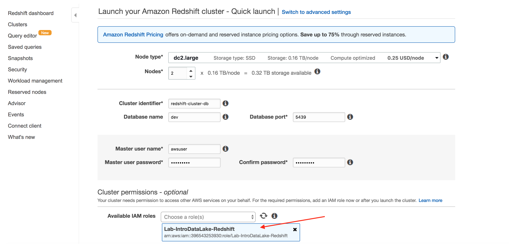
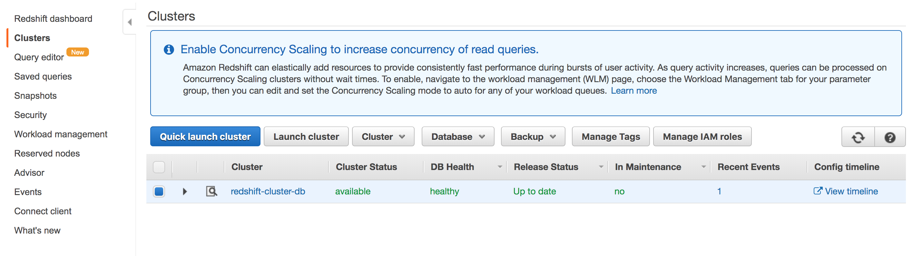
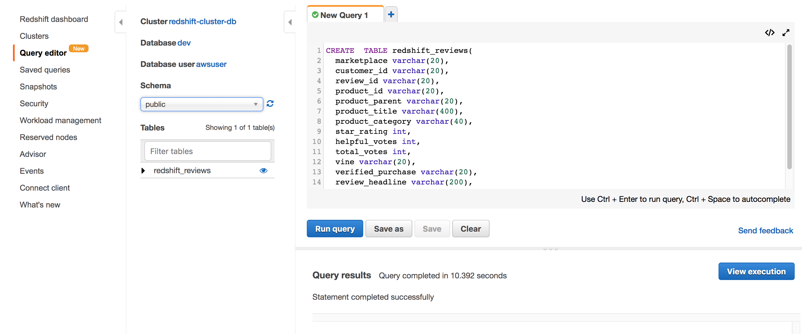
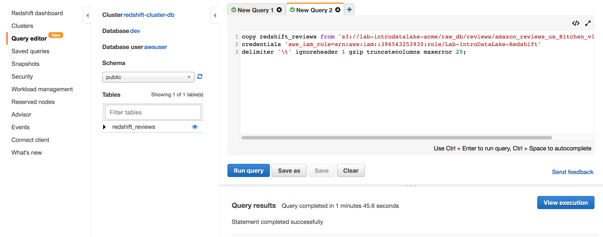
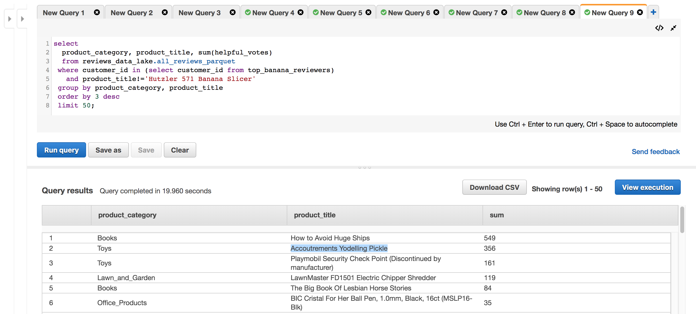

# LAB 2 - Extending the lake with Data Warehousing
In this lab you will integrate Amazon Redshift to your data lake.

Amazon Redshift is a fully managed, petabyte-scale data warehouse service in the cloud. You can start with just a few dozen gigabytes of data and scale to a petabyte or more. The Amazon Redshift service manages all of the work of setting up, operating, and scaling a data warehouse. These tasks include provisioning capacity, monitoring and backing up the cluster, and applying patches and upgrades to the Amazon Redshift engine.

Learn more about Amazon Redshift [here](https://aws.amazon.com/redshift/).

## Contents
* [Before You Begin](#before-you-begin)
* [Provision a new Redshift Cluster](#Provision-a-new-Redshift-Cluster)
* [Connect to your Redshift Cluster](#Connect-to-your-Redshift-Cluster)
* [Load data from our data lake into Redshift](#Load-data-from-our-data-lake-into-Redshift)
* [Query data in Redshift](#Query-data-in-Redshift)
* [Query data in our data lake from Redshift without loading it](#Query-data-in-our-data-lake-from-Redshift-without-loading-it)
* [Query data across both Redshift and the data lake](#Query-data-across-both-Redshift-and-the-data-lake)
* [Before You Leave](#before-you-leave)

## Before You Begin
* Complete Lab1 (although you do not need to complete the final optional Glue ETL Job activity).  This lab will reference some of the Data Lake objects created in Lab1.

## Provision a new Redshift Cluster

* In the AWS Console, use the Services menu and navigate to the Redshift console.  One way to do so, is to expand the Services menu and type "Redshift" in the service search field.

* In the Redshift console, scroll down to the "Find the best cluster configuration" section.


* In the cluster configuration section, you can experiment with the cluster size settings. When you are done, restore the settings to their defaults (20 GB) and click the "Launch this cluster" button
* In the cluster identifier field, change the field to be "redshift-cluster-[initials]".
* Enter a value for the master user password that you will remember.  If you want a suggestion, you can use "AWSuser1!"
* In the Available IAM roles drop-down, choose "Lab-IntroDataLake-Redshift" role.



* Click the Launch cluster button, which will start creating your new Redshift cluster.
* Click the "View all clusters" button and wait for your cluster to be created (the Cluster Status will change to "available").  This can take 15 minutes or so.



## Connect to your Redshift Cluster
There are multiple ways to connect to your new Redshift cluster, including via JDBC and ODBC.  For this lab, we will use the Query editor that is part of the Redshift console.

* Once your Redshift cluster is created, click on "Query editor" on the left-hand column.
* In the Credentials pop-up, choose "redshift-cluster-[initials]" as the Cluster.
* Enter "dev" as the Database.
* Enter "awsuser" as the Database user.
* Enter the password you used earlier.  If you followed the lab's suggestion, that password would be "AWSuser1!".


* Click Connect


## Load data from our data lake into Redshift
For our first example, we will load the Kitchen reviews dataset from our data lake into our Redshift cluster's native storage for highly optimized Redshift performance and full Redshift read-write capabilities.  We will do this load using the Redshift S3 [COPY command](https://docs.aws.amazon.com/redshift/latest/dg/t_Loading_tables_with_the_COPY_command.html).

* In the New Query 1 tab, enter this query:
```
CREATE  TABLE redshift_reviews(
  marketplace varchar(20), 
  customer_id varchar(20), 
  review_id varchar(20), 
  product_id varchar(20), 
  product_parent varchar(20), 
  product_title varchar(400), 
  product_category varchar(40), 
  star_rating int, 
  helpful_votes int, 
  total_votes int, 
  vine varchar(20), 
  verified_purchase varchar(20), 
  review_headline varchar(200), 
  review_body varchar(5000), 
  review_date date);
```
* Click "Run query"



* Now let's load this redshift_reviews table with reviews from the Kitchen product category.  Click the + sign next to the New Query 1 tab, then enter this query (but do not run it yet):
```
-- be sure to change the acme in lab-introdatalake-acme to your company name
-- be sure to change the db in raw_db to your initials
-- be sure to change the 0000000000000 to your AWS account #
copy redshift_reviews from
 's3://lab-introdatalake-acme/raw_db/reviews/amazon_reviews_us_Kitchen_v1_00.tsv.gz'
  credentials 'aws_iam_role=arn:aws:iam::0000000000000:role/Lab-IntroDataLake-Redshift'
  delimiter '\t' ignoreheader 1 gzip truncatecolumns maxerror 20;
```
* Replace the "acme" part of the s3 bucket name with your company name so that it matches the bucket you are using in this lab.
* Replace the "db" part of the "raw_db" s3 folder with your initials so that it matches the folder name you used in lab1.
* Replace the "0000000000000" with your AWS Account #.  Hint: you can find the account number by clicking on your username on the top menu bar in the AWS console.  Enter the account# but do not enter the hyphens.
* Click "Run query".  The Copy command should take 1-2 minutes to finish.



## Query data in Redshift
In this section, we are demonstrating querying a table using our Redshift cluster's native storage.

* Click the + sign to open a new query tab, and enter this query:
```
select count(*) from redshift_reviews;
```
* Click "Run query".  There are 4.8 million reviews in the Kitchen product category (we have only loaded the Kitchen category into the redshift_reviews table at this point).


* Let's see what products have the most helpful reviews, based on votes from other users.  Click the + sign to open a new query tab, and enter this query:
```
select product_title,
       sum(helpful_votes) helpful_votes,
       'https://www.amazon.com/dp/'||product_id url
  from redshift_reviews
 group by product_title, product_id
 order by 2 desc
 limit 20;
```
* Click "Run query".  The [Hutzler 571 Banana Slicer](https://www.amazon.com/dp/B0047E0EII) has the most votes for helpful reviews.  Let's explore some of those reviews next.


* Click the + sign to open a new query tab, and enter this query:
```
select review_headline, 
  replace(replace(replace(review_body,'\\',''),'<br />','\n  '),'&#34;','"') review_body,
  customer_id
  from redshift_reviews
 where product_title='Hutzler 571 Banana Slicer'
 order by helpful_votes desc
 limit 50;
```
* Click "Run query".  Read some of the reviews.  My favorite is #7 "Right Hand/Left Hand Problem Solved".


> Right Hand/Left Hand Problem Solved

>> For those that have complained about this only being for right-hand curved bananas, I've discovered a solution. Like you, for months I was frustrated about this problem. I found myself eating all the right-handed bananas in my cereal while the lefties sat and browned. I'd eventually cut them up with a regular old knife and throw them in some banana bread or make some pudding. I know this is going to sound a little crazy, but my solution came through an accident. One day, while I was washing the dishes, I wasn't paying attention and my arm brushed against the Hutzler 571. I knocked it to the ground below. (THANKFULLY IT FELL ON A PADDED RUG AND DIDN'T BREAK. I MEAN, THEY ARE DURABLE, BUT WHAT A MOMENT OF PANIC!) I still can't explain it, but after it hit the ground, somehow the jarring motion switched it over. All of a sudden, I had a left-handed slicer. I immediately called my wife and when she got home, we each had 2 bowls of cereal, all with perfectly cut slices of our LEFT-HANDED bananas. Of course, then I had the same problem with all my right-handed bananas. I decided to try it again. (This time making sure it landed on the rug.) It didn't work. I was crushed, but something inside me said try again. I did. Still nothing. I tossed and turned all night. The next morning, this voice kept telling me to try the rug one more time. It was relentless. I couldn't give up. That third time, I still can't believe it, the slicer switched back to right-handed. I wondered if something supernatural had happened. But all my friends and family that I've bought these for have tried the same thing and IT WORKS! Some have used carpet in their living room, others have used bathroom rugs. My mother-in-law, who told me she'd never risk breaking it, later told my wife on the phone that she had tried it with a pillow and it worked. It isn't perfect, I'd say 50% - 60% of the time this method works. Ican't explain how, and honestly I don't even care anymore. The fact is, I can buy any kind of banana I want now and experience perfectly-spaced deliciousness.


* Let's save the top 20 reviewers for the Banana Slicer to a new Redshift table for later use.  Click the + sign to open a new query tab, and enter this query:
```
create table top_banana_reviewers as
select customer_id
from redshift_reviews
 where product_title='Hutzler 571 Banana Slicer'
 order by helpful_votes desc
 limit 20;
```

* Click "Run query".


 

## Query data in our data lake from Redshift without loading it
In this section, we will now show you the features of Redshift known as Redshift Spectrum.  This lets you query data on S3 without copying it into Redshift.

Amazon Redshift is the only data warehouse that extends your queries to your Amazon S3 data lake without loading data. You can query open file formats you already use, such as Avro, CSV, Grok, JSON, ORC, Parquet, and more, directly in S3. This gives you the flexibility to store highly structured, frequently accessed data on Redshift local disks, keep exabytes of structured and unstructured data in S3, and query seamlessly across both to provide unique insights that you would not be able to obtain by querying independent datasets.

Redshift Spectrum is integrated with the Glue Data Catalog, so all we need to do is to define an "external schema" in Redshift that points to our Reviews_[initials] database in the Glue Data Catalog.  At this point, we can then reference any of the data lake tables in our Reviews_[initials] database, such as all_reviews_parquet.

* Click the + sign to open a new query tab, and enter this query (but do not run it yet):
```
-- be sure to change the db in reviews_db to your initials
-- be sure to change the 0000000000000 to your AWS account #
create external schema reviews_data_lake 
from data catalog 
database 'reviews_db' 
iam_role 'arn:aws:iam::00000000000000:role/Lab-IntroDataLake-Redshift'
create external database if not exists;
```
* Replace the "db" part of the "reviews_db" database name with your initials so that it matches the Glue/Athena catalog database name you used in lab1.
* Replace the "0000000000000" with your AWS Account #.  Hint: you can find the account number by clicking on your username on the top menu bar in the AWS console.  Enter the account# but do not enter the hyphens.
* Click "Run query". 


* Click the + sign to open a new query tab, and enter this query:
```
select product_category, count(*)
  from reviews_data_lake.all_reviews_parquet
 group by product_category
 order by 2 desc;
```

* Click "Run query".  Note that you can see the reviews from all of the product categories as we are querying the data lake directly (recall that we only loaded Kitchen reviews into Redshift earlier).


## Query data across both Redshift and the data lake
Amazon Redshift can query internal tables using Redshift native storage and external tables using S3 storage in the same query. This gives you the flexibility to store highly structured, frequently accessed data on Redshift native storage, keep exabytes of structured and unstructured data in S3, and query seamlessly across both to provide unique insights that you would not be able to obtain by querying independent datasets.

Let's see what other reviews our top Hutlzer 571 Banana Slicer reviewers also wrote.  We will take our internal top_banana_reviewers table stored inside Redshift and join it to our external all_reviews_parquet table stored in S3 on the data lake.

* Click the + sign to open a new query tab, and enter this query:
```
select 
  product_category, product_title, sum(helpful_votes)
  from reviews_data_lake.all_reviews_parquet
 where customer_id in (select customer_id from top_banana_reviewers)
   and product_title!='Hutzler 571 Banana Slicer'
 group by product_category, product_title  
 order by 3 desc
 limit 50;
```

* Click "Run query".  Here you can see the power of Redshift with Spectrum to be able to easily combine Data Warehouse data with Data Lake data.  Seems like some of the clever reviewers of the Banana Slicer also had thoughts on [How to Avoid Huge Ships](https://www.amazon.com/dp/0870334336) and the "Accoutrements Yodelling Pickle"...




## Before You Leave
If you are done with the lab, please follow the cleanup instructions to avoid having to pay for unused resources.
