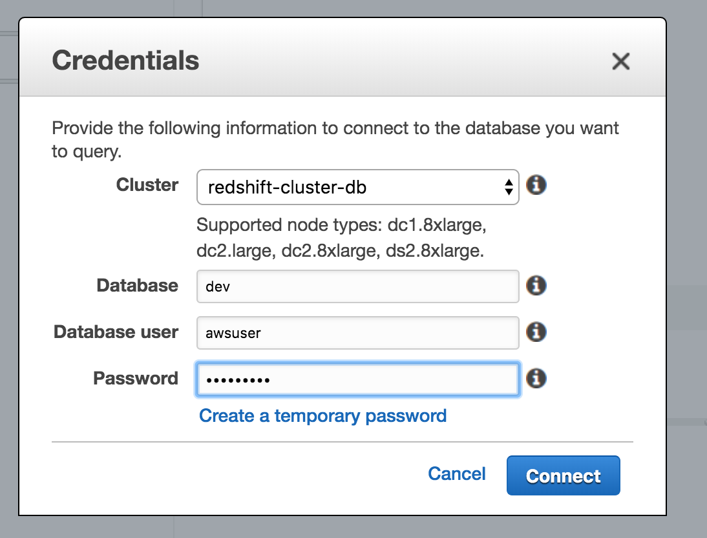
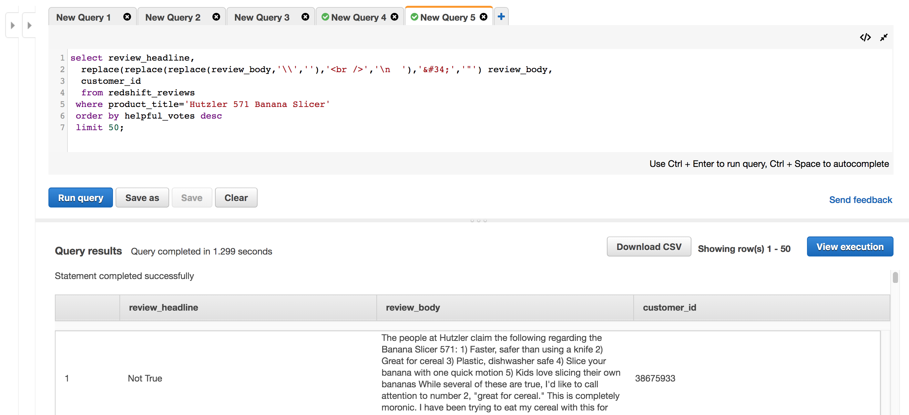
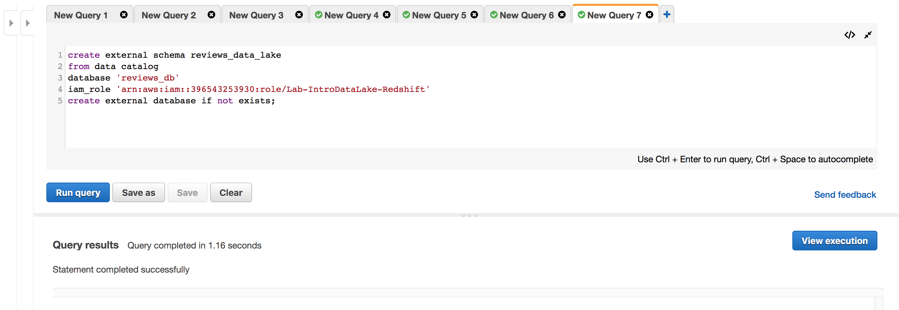

# LAB 2 - Extending the lake with Data Warehousing
In this lab you will integrate Amazon Redshift to your data lake.


## Contents
* [Before You Begin](#before-you-begin)
* [Before You Leave](#before-you-leave)

## Before You Begin
* Complete Lab1 (although you do not need to the optional Glue ETL activity).  This lab will reference some of the Data Lake objects created in Lab1.

## Provision a new Redshift Cluster

* In the AWS Console, use the Services menu and navigate to the Redshift console.  One way to do so, is to expand the Services menu and type "Redshift" in the find a service search field.

* In the Redshift console, scroll down to the "Find the best cluster configuration" section.


* Leave the settings at their defaults (20 GB) and click the "Launch this cluster" button
* In the cluster identified field, change the field to be "redshift-cluster-[initials]".
* Enter a value for the master user password that you will remember.  If you want a suggestion, you can use "AWSuser1!"
* In the Available IAM roles drop-down, choose "Lab-IntroDataLake-Redshift" role.


* Click the Launch cluster button
* Click the "View all clusters" button and wait for your cluster to be created (the Cluster Status will say "available").  This can take 15 minutes or so.


## Connect to your Redshift Cluster
There are multiple ways to connect to your new Redshift cluster, including via JDBC and ODBC.  For this lab, we will use the Query editor that is part of the Redshift console.

* Once your Redshift cluster is created, click on "Query editor" on the left-hand column.
* In the Credentials pop-up, choose "redshift-cluster-[initials]" as the Cluster.
* Enter "dev" as the Database.
* Enter "awsuser" as the Database user.
* Enter the password you used earlier.  If you followed the lab's suggestion, that password would be "AWSuser1!".



* Click Connect


## Load data from our data lake into Redshift

* In the New Query 1 tab, enter this query:
```
CREATE  TABLE redshift_reviews(
  marketplace varchar(20), 
  customer_id varchar(20), 
  review_id varchar(20), 
  product_id varchar(20), 
  product_parent varchar(20), 
  product_title varchar(400), 
  product_category varchar(40), 
  star_rating int, 
  helpful_votes int, 
  total_votes int, 
  vine varchar(20), 
  verified_purchase varchar(20), 
  review_headline varchar(200), 
  review_body varchar(5000), 
  review_date date);
```
* Click "Run query"


* Click the + sign next to the New Query 1 tab, then enter this query (but do not run it yet):
```
copy redshift_reviews from
 's3://lab-introdatalake-acme/raw_db/reviews/amazon_reviews_us_Kitchen_v1_00.tsv.gz'
  credentials 'aws_iam_role=arn:aws:iam::0000000000000:role/Lab-IntroDataLake-Redshift'
  delimiter '\t' ignoreheader 1 gzip truncatecolumns maxerror 20;
```
* Replace the "acme" part of the s3 bucket name with your company name so that it matches the bucket you are using in this lab.
* Replace the "db" part of the "raw_db" s3 folder with your initials so that it matches the folder name you used in lab1.
* Replace the "0000000000000" with your AWS Account #.  Hint: you can find the account number by clicking on your username on the top menu bar in the AWS console.  Enter the account# but do not enter the hyphens.
* Click "Run query".  The Copy command should take 1-2 minutes to finish.


* Note: if you run into an error during the copy, please run this query and speak to your instructor: select * from stl_load_errors order by starttime desc;


* Click the + sign to open a new query tab, and enter this query:
```
select count(*) from redshift_reviews;
```
* Click "Run query"


* Click the + sign to open a new query tab, and enter this query:
```
select product_title,
       sum(helpful_votes) helpful_votes,
       'https://www.amazon.com/dp/'||product_id url
  from redshift_reviews
 group by product_title, product_id
 order by 2 desc
 limit 20;
```
* Click "Run query"


* Click the + sign to open a new query tab, and enter this query:
```
select review_headline, 
  replace(replace(replace(review_body,'\\',''),'<br />','\n  '),'&#34;','"') review_body,
  customer_id
  from redshift_reviews
 where product_title='Hutzler 571 Banana Slicer'
 order by helpful_votes desc
 limit 50;
```
* Click "Run query".  Read some of the reviews.  My favorite is #7 "Right Hand/Left Hand Problem Solved".



* Click the + sign to open a new query tab, and enter this query:
```
create table top_banana_reviewers as
select customer_id
from redshift_reviews
 where product_title='Hutzler 571 Banana Slicer'
 order by helpful_votes desc
 limit 20;
```

* Click "Run query".


 

## Query data in our data lake from Redshift (without loading it)
In this section, we will now show you the features of Redshift known as Redshift Spectrum.  This lets you query data on S3 without copying it into Redshift.

* Click the + sign to open a new query tab, and enter this query (but do not run it yet):
```
create external schema reviews_data_lake 
from data catalog 
database 'reviews_db' 
iam_role 'arn:aws:iam::00000000000000:role/Lab-IntroDataLake-Redshift'
create external database if not exists;
```
* Replace the "db" part of the "reviews_db" database name with your initials so that it matches the Glue/Athena catalog database name you used in lab1.
* Replace the "0000000000000" with your AWS Account #.  Hint: you can find the account number by clicking on your username on the top menu bar in the AWS console.  Enter the account# but do not enter the hyphens.
* Click "Run query". 



* Click the + sign to open a new query tab, and enter this query:
```
select product_category, count(*)
  from reviews_data_lake.all_reviews_parquet
 group by product_category
 order by 2 desc;
```

* Click "Run query".  Note that you can see the reviews from all of the product categories as we are querying the data lake directly (recall that we only loaded Kitchen reviews into Redshift earlier).


## Query data across both Redshift and the data lake
Let's see what other reviews our top Hutlzer 571 Banana Slicer reviewers also wrote.  We will take our top_banana_reviewers table stored inside Redshift and join it to our external all_reviews_parquet table stored in S3 on the data lake.

* Click the + sign to open a new query tab, and enter this query:
```
select 
  product_category, product_title, sum(helpful_votes)
  from reviews_data_lake.all_reviews_parquet
 where customer_id in (select customer_id from top_banana_reviewers)
   and product_title!='Hutzler 571 Banana Slicer'
 group by product_category, product_title  
 order by 3 desc
 limit 50;
```

* Click "Run query".  Here you can see the power of Redshift with Spectrum to be able to easily combine Data Warehouse data with Data Lake data.  And the "Accoutrements Yodelling Pickle" certainly seems like it may be worth further exploration...


## Before You Leave
If you are done with the lab, please follow the cleanup instructions to avoid having to pay for unused resources.
