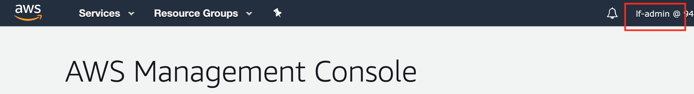
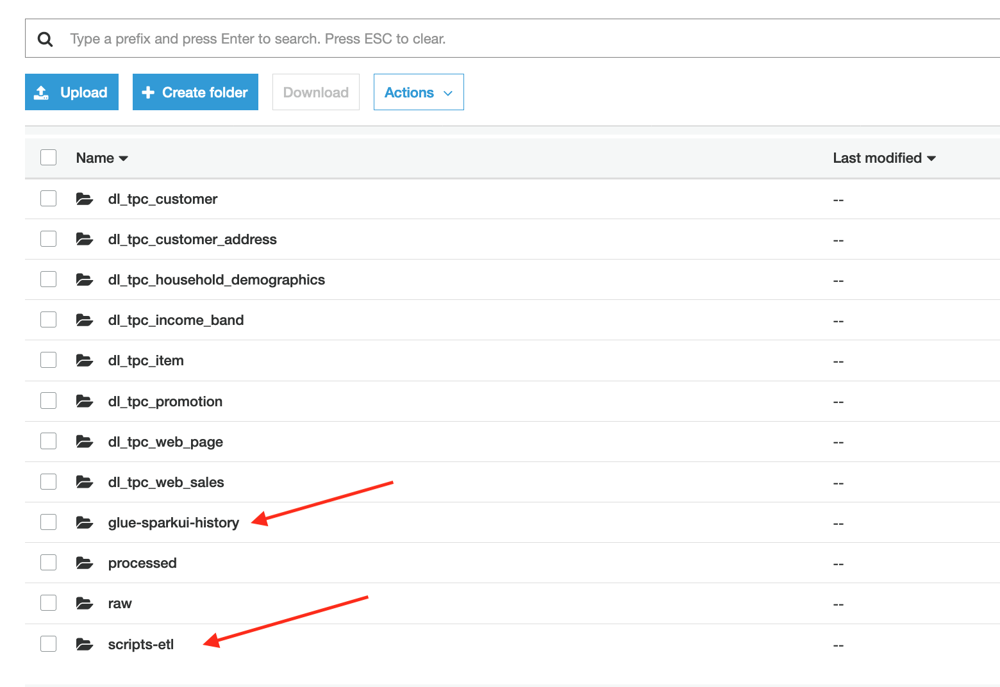
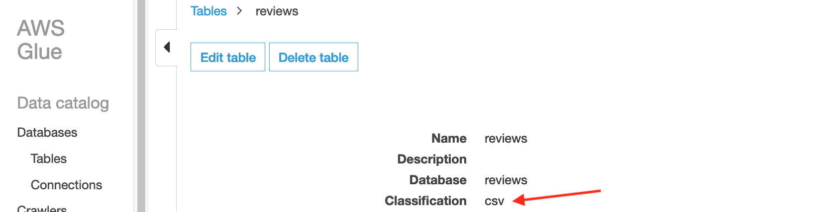
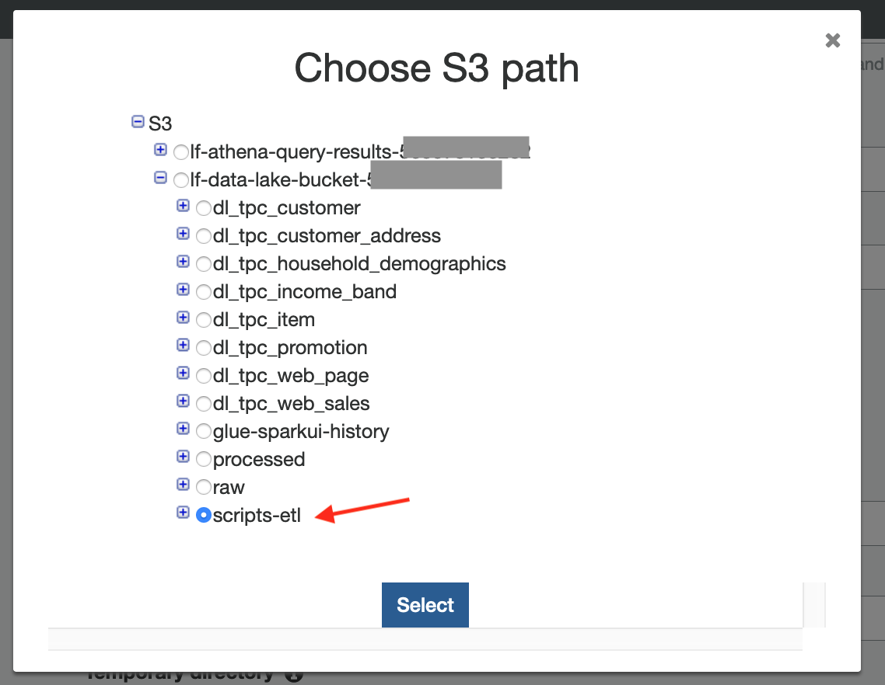
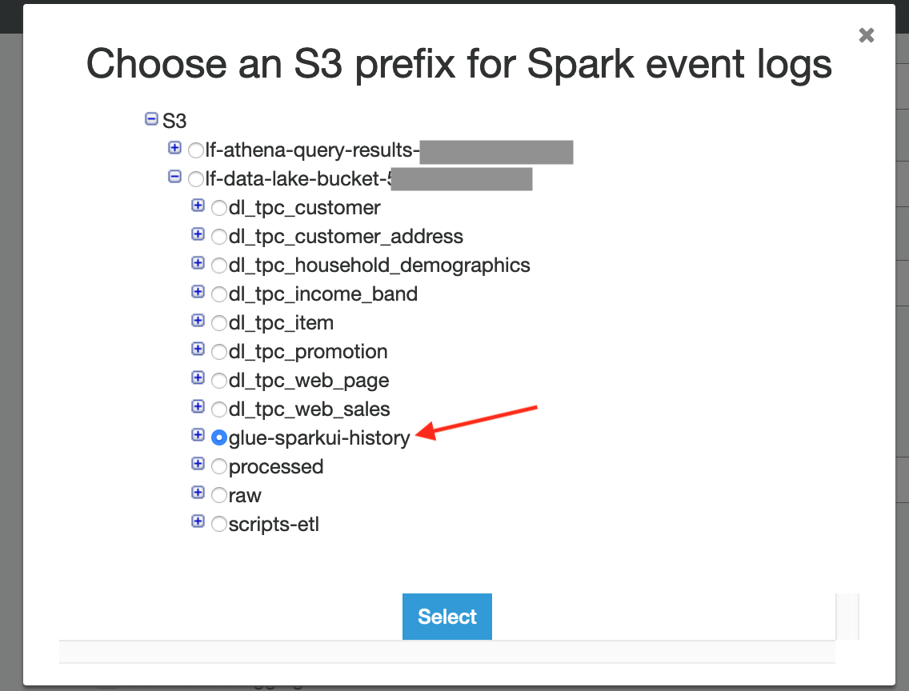
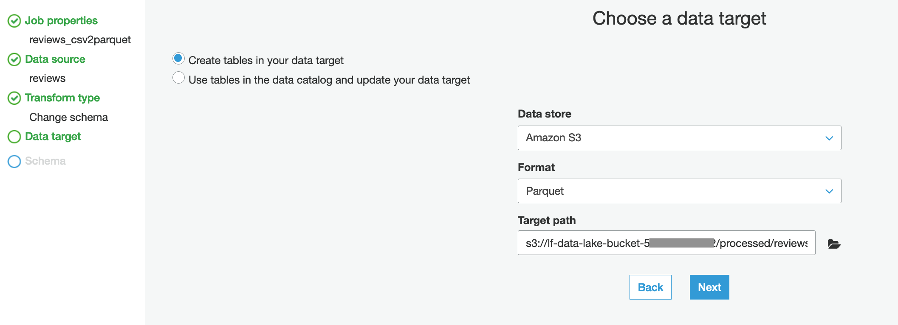
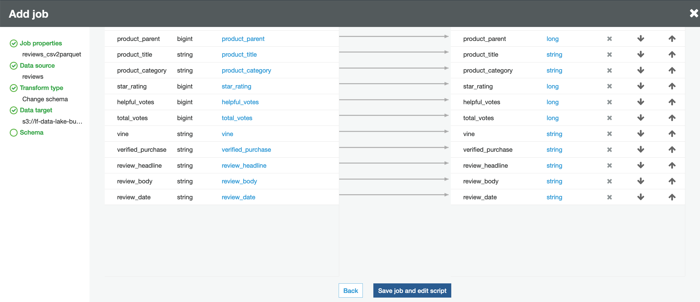
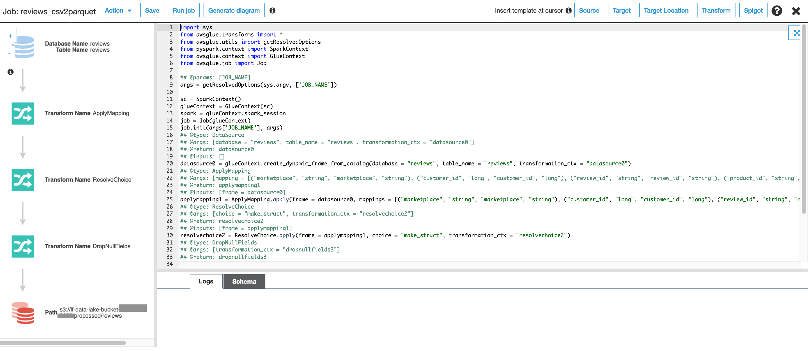
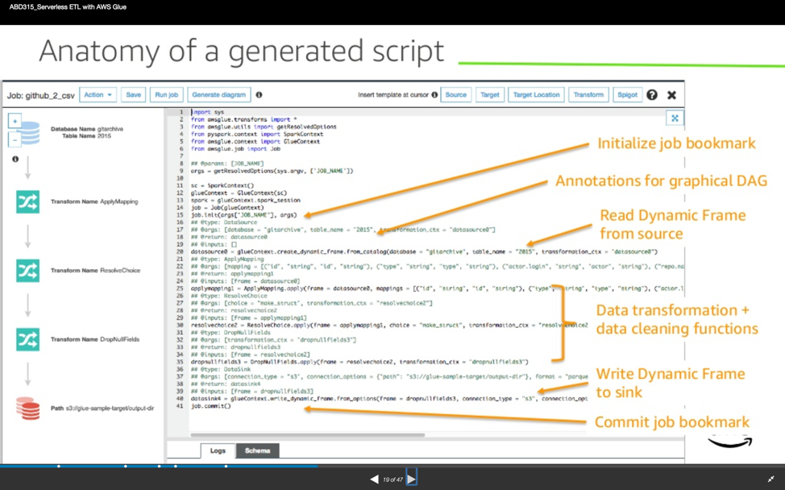

# Intro to Data Lakes - More Glue
This section of the lab goes deeper into Glue ETL.  Specifically, you will create, edit, and monitor a Glue ETL job.

Credit: This lab is based on the Glue ETL lab from the Serverless Data Lake Immersion Day by @akirmak, with modifications made to fit with the setup of the other Intro to Data Lake labs.

Note: Be sure to have completed [Part2](../../README.md) as this will use the amazon_reviews_us_Kitchen_v1_00.tsv.gz dataset you uploaded to your S3 bucket.

## AWS Glue ETL
AWS Glue is a fully managed ETL (extract, transform, and load) service that makes it simple and cost-effective to categorize your data, clean it, enrich it, and move it reliably between various data stores. 

Glue concepts used in the lab: 

•	ETL Operations: Using the metadata in the Data Catalog, AWS Glue can autogenerate Scala or PySpark (the Python API for Apache Spark) scripts with AWS Glue extensions that you can use and modify to perform various ETL operations. For example, you can extract, clean, and transform raw data, and then store the result in a different repository, where it can be queried and analyzed. Such a script might convert a CSV file into a relational form and save it in Amazon Redshift.

•	Jobs: The AWS Glue Jobs system provides managed infrastructure to execute your ETL workflow. You can create jobs in AWS Glue that automate the scripts you use to extract, transform, and transfer data to different locations. Jobs can be scheduled and chained, or they can be triggered by events such as the arrival of new data.
*	AWS Glue runs your ETL jobs in an Apache Spark serverless environment. 
*	AWS Glue can generate a script to transform your data. Or, you can provide the script in the AWS Glue console or API.
*	You can run your job on demand, or you can set it up to start when a specified trigger occurs. The trigger can be a time-based schedule or an event.
*	When your job runs, a script extracts data from your data source, transforms the data, and loads it to your data target. The script runs in an Apache Spark serverless environment in AWS Glue.

## Prepare for our lab by creating some new S3 folders
This lab will require 2 new folders in our S3 bucket: one to hold our ETL script and one to hold our SparkUI event files.

### Signin to the AWS Console as the Lake Formation Administrator

* Navigate to the AWS Console at https://console.aws.amazon.com/console/home?region=us-east-1

* Check if you are signed-in as the lf-admin user.  If not, sign-out and sign-back in as lf-admin.  By default, the password for lf-admin will be Password1!

* Once you are logged into AWS as lf-admin, now navigate to the S3 console

* Click on your “lf-data-lake-bucket-[number]” bucket

* Create a new folder called  “scripts-etl”

* Then, also create a folder called "glue-sparkui-history"

## Review our current reviews table definition

* Navigate to the Glue console

* Click on Tables on the left-hand column

* Find the "reviews" table and click on it

* Note that it is correctly identified as CSV

## Create a Glue ETL Job to convert our reviews table from CSV to Parquet
We will create a new Glue job to convert our raw CSV data from the raw folder and save the converted parquet data into our processed folder.

* In the Glue console, click on Jobs under ETL on the left-hand column

* Click Add Job

* Enter these details:

  *	Job name: reviews_csv2parquet
  * IAM Role: Choose Lab-IntroDataLake-Glue
  * Type: Spark (this is the default)
  * Glue version: Spark 2.4, Python 3 (this is the default)
  * This job runs: Select “A proposed script generated by AWS Glue” (this is the default) 
  * Script name: leave at as default
  * S3 path where the script is stored: Click on the folder icon to browse for the scripts-etl folder in your lf-data-lake-bucket bucket

  

  * S3 path for temp files: Do not change as we can use the default glue location

* Expand the Advanced Properties section and enable Job Bookmarks

* Expand the Monitoring options section, then

  * Check the box in front of job metrics
  * Check the box in front of SparkUI
  * Select the glue-sparkui-history folder from your lf-data-lake-bucket bucket

  

* Click Next

* For the data source, scroll down and select the reviews table

* Click next

* On the Choose a Transform Type page, choose Change Schema

* Click next

* On the Choose a Data Target page, select Create Tables in your data target.

* Then select S3 as the data store, and Parquet as the format. Browse and choose s3://lf-data-lake-bucket-[number]/processed/reviews for the target path

  

* Click next

* On the Map the Source Columns to the Target Columns page, click "save job and edit script".  

  

This will result in a screen that looks like this:

  
 
Below is an image (from another Project) that provides a graphical explanation of the several sections in the code. If you don’t have previous experience with PySpark, Data Frames or Python development, don’t worry. You won’t be making any coding here. The code simply implements the field mapping transformations you specified in the GUI (a field is dropped out, other fields have been renamed etc.). The data engineering team will likely write code for transformations in your data source. Simple transformations can be done from the GUI.
  

Save the job and close the edit script window (click the X in the upper left)

# Congratulations.  You've created a Glue ETL Job to convert a dataset from CSV format in one location to Parquet format in a different location.
We have not run the job yet.  We will make and test some script changes first.  Click [here](glue2.md) to advance to the next section.

