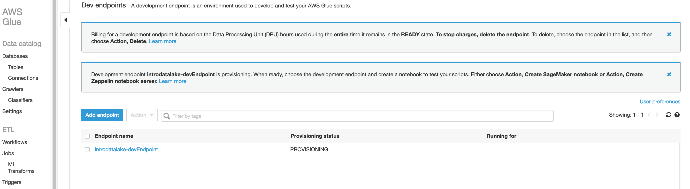

# More Glue - Setting up a Developer Endpoint
In this section, we will create a Glue Developer Endpoint.

A development endpoint is an environment used to develop and test your AWS Glue scripts. This is useful if you need to do advanced data preparation on your data in the data lake that is beyond the rename field, add/drop field type of transformations you have done in the previous lab.  

Often, the data sources, the data formats and transformation requirements are diverse and complex. In that case, a REPL (read-eval-print-loop) approach, where an interactive programming environment such as a Jypiter Notebook running PySpark or Scala is needed for data preparation. 

Data Engineers will find the Developer Endpoint feature for AWS Glue very useful. They can spin up an endpoint when they are ready to build a pipeline. After trying some data manipulations in a REPL fashion, one can have Glue build an EC2 instance to host Jupyter and build a PySpark script to be saved in S3. When they are done, they just tear it all down; the best part is that if they want to go back and modify the script, they can create a new notebook and even collaborate with other Data Engineers on the same pipelines. It’s almost a source code management system for data scripting.

In this lab, you will create a developer endpoint to connect to the Glue service to do some iterative development. 

Here are some resources for Glue Developer Endpoints:
https://docs.aws.amazon.com/glue/latest/dg/dev-endpoint-tutorial-prerequisites.html 
https://docs.aws.amazon.com/glue/latest/dg/dev-endpoint-notebook-server-considerations.html

## Create a Glue Development Endpoint

* In the Glue Console, click on Dev Endpoints under the left hand column

* Then click "add endpoint"

* Enter these values:

  *	Endpoint-name: introdatalake-devEndpoint
  * IAM Role: Select the role Lab-IntroDataLake-Glue

* Expand the monitoring options.  

  * Check the box for Spark UI.  
  * Use the folder icon to browse/select the glue-sparkui-history folder

  

* Click Next

* On the Network page, Choose Skip Networking information

* Click next

* On the Add an SSH public key page, leave the defaults.

* Click next

* Click Finish

At this point, you Developer Endpoint is being provisioned.  It will take about 5 minutes, but don't wait for it to finish.  Move on to the next section.

  

## Congratulations - you have launched a Developer Endpoint
While you wait for your Glue Developer Endpoint to be provisioned, please continue to the [next section](glue3.md).

