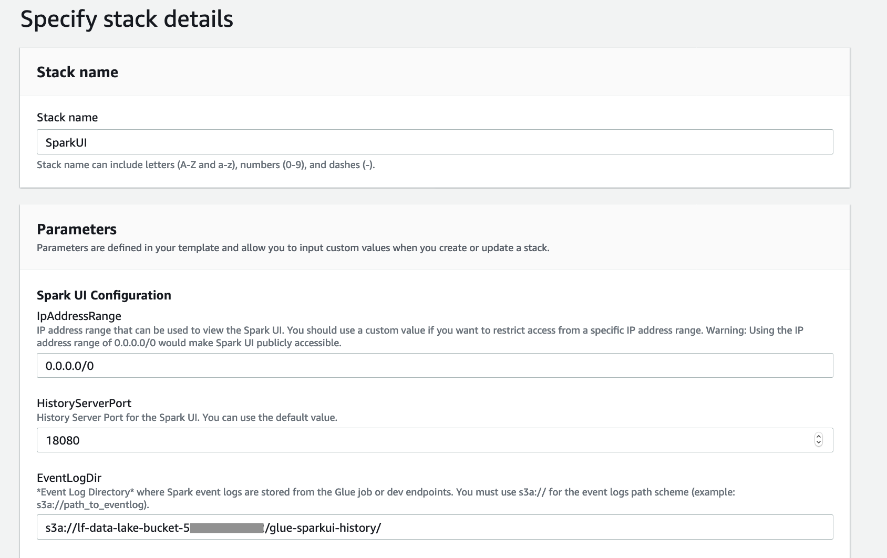
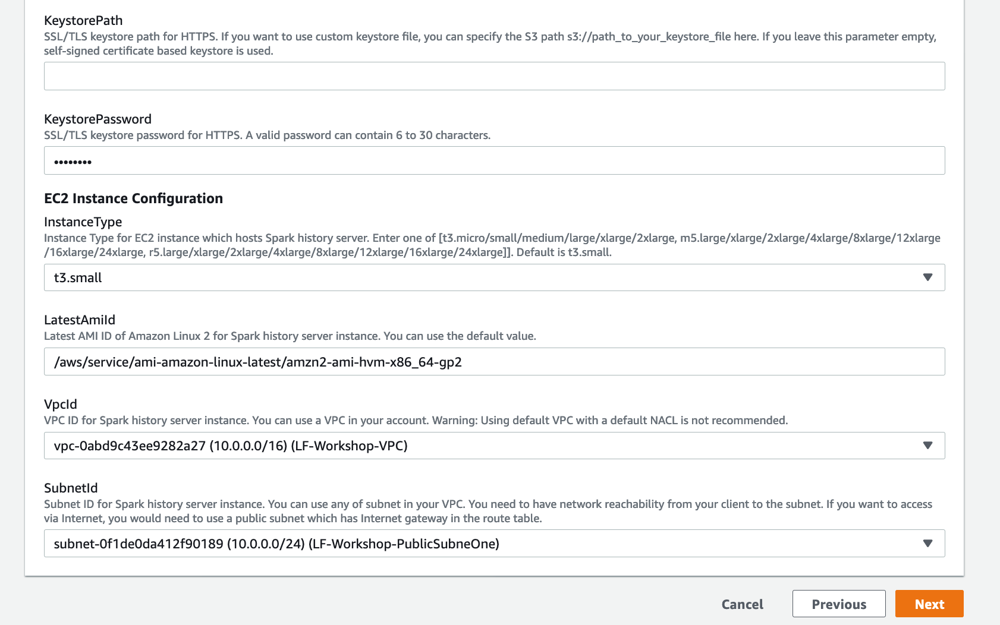

# More Glue - Install a Spark History Server
In this section, we are going to launch a Spark History Server on an EC2 instance.  We are doing this as a way to be able to use the "Spark UI" with our Glue Developer Endpoint.  The Spark History Server process running on EC2 will have access to the SparkUI event logs which are being written to the glue-sparkui-history folder in your S3 lf-data-lake-bucket.  The History Server uses those event logs to be able to run the Spark UI web application.

You can read more about running the Spark UI web application with Glue here: https://docs.aws.amazon.com/glue/latest/dg/monitor-spark-ui-history.html

## Launch a Spark History Server via Cloud Formation

* Right click on this url: [https://console.aws.amazon.com/cloudformation/home?region=us-east-1#/stacks/new?templateURL=https://aws-glue-sparkui-prod-us-east-1.s3.amazonaws.com/public/cfn/sparkui.yaml](https://console.aws.amazon.com/cloudformation/home?region=us-east-1#/stacks/new?templateURL=https://aws-glue-sparkui-prod-us-east-1.s3.amazonaws.com/public/cfn/sparkui.yaml) to launch a Cloud Formation stack that will create a Spark History server running on an EC2 instance.

* For the Stack name, enter: 
```
SparkUI
```

* For the IP Address Range, enter: 
```
0.0.0.0/0
```

* For the EventLogDir, enter
```
s3a://lf-data-lake-bucket-[NUMBER]/glue-sparkui-history/
```

where [NUMBER] is your account number without using hyphens.



* For KeystorePassword, enter at least 6 character such as welcome1

* For VPC, choose the one called LF-Workshop-VPC

* For subnet, choose the one called LF-Workshop-PublicSubneOne



* Click Next.  Click Next.  Acknowledge the IAM checkbox. Click Create stack.

This will launch the Cloud Formation stack and begin provisioning a Spark History server running on EC2.

This will take a few minutes, but you don't need to wait.  Please continue to the next section


## Congratulations - you have launched a SparkUI History Server
While it is provisioning, please continue to the [next section](glue4.md).

