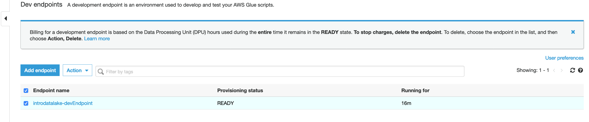
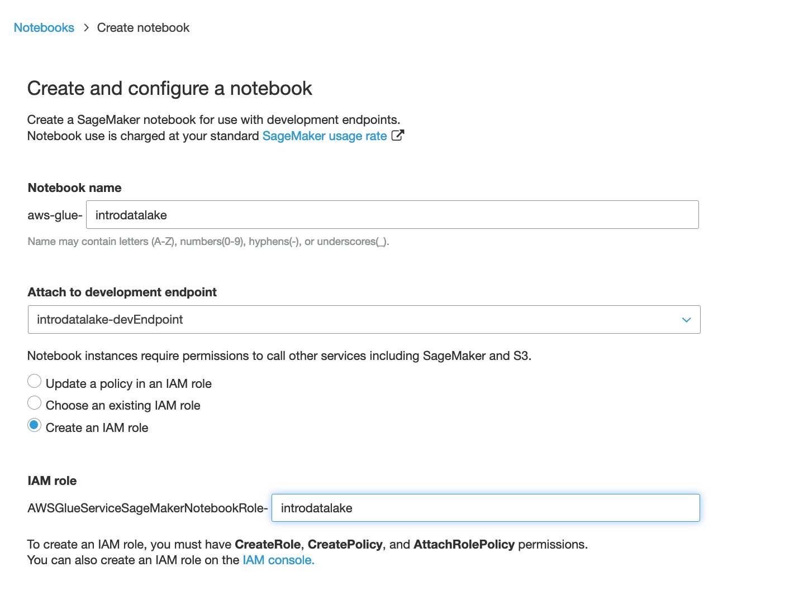
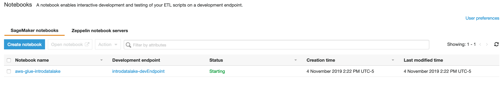

# More Glue - Launch a Sagemaker Notebook
In this section, we are going to launch a Jupyter notebook using Sagemaker to act as an entry point to our Glue Developer Endpoint.

## Launch a Sage Maker Notebook

* Navigate to the Glue Console [but try to keep the CloudFormation tab launching the SparkUI History server open as you will use that tab later]

* Click on Dev Endpoints in the left hand column.  Your endpoint should now be ready.

* Select your Endpoint.  Then click on Action and choose Create Sagemaker Notebook

* Name the notebook: aws-glue-introdatalake-[initials]
Hint: replace [initials] with your initials

* Choose to create an IAM role and name it AWSGlueServiceSageMakerNotebookRole-introdatalake

* Click Create Notebook

After a minute, you should see your notebook starting:

## Congratulations - you have launched a Sagemaker Notebook
While it is starting, please continue to the [next section](glue5.md).

