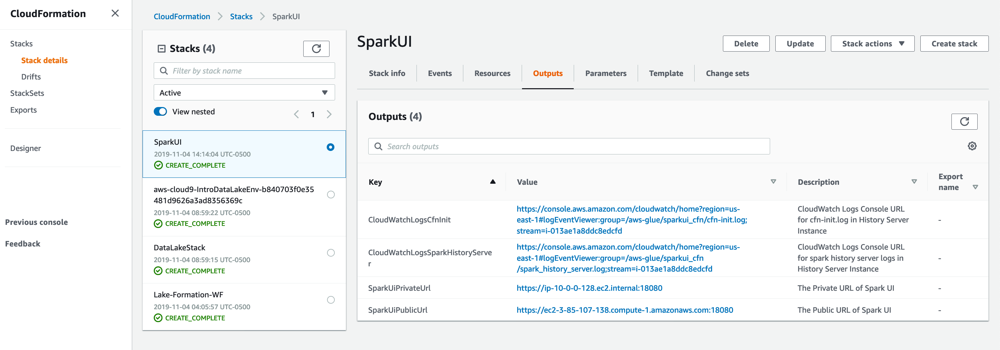
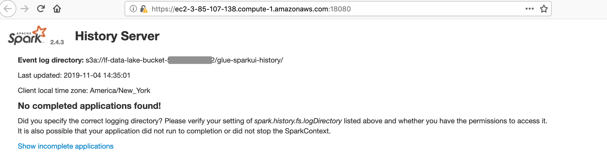
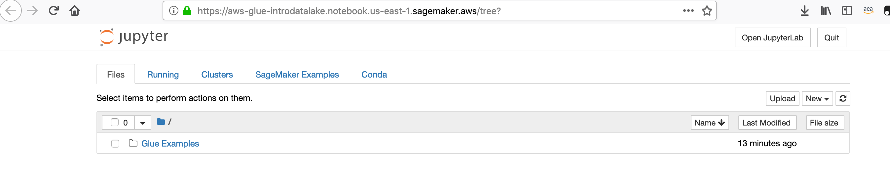

# More Glue - Check on our SparkUI server and Notebook
In this section, we are going to check on our SparkUI History server and our Sagemaker Notebook

## Check on the SparkUI History server

* Go back to the browser tab for the CloudFormation stack for the Spark UI server [you should hopefully have kept the tab open]

* Refresh the page if needed.  The stack is likely completed creating.

* Click on the Outputs tab for the SparkUI stack.

* Use the SparkUiPublicUrl and open that URL in a new browser

HINT: Amazonians may need to log off the corporate network to access this URL.  That is because the website is protected by a self-signed SSL certificate and our internal https proxy does not allow access to self-signed web sites.

* As the SparkUI is using a self-signed SSL certificate, you will need to authorize your browser to trust you to access the site.

Once you authorize your browser, you should see a page like this:

* Leave this page open in your browser

## Check on the Sagemaker Notebook

* Go back to your browser tab where you had launched the Notebook for your Glue Endpoint

* Refresh the page.  The status should now be READY:

* Select the notebook and click Open notebook

## Congratulations - your Notebook and SparkUI are running
Please continue to the [next section](glue6.md).

