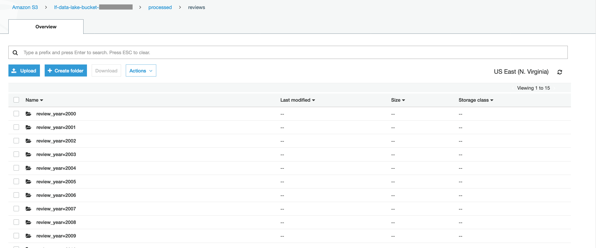

# More Glue - Build/Test our Spark ETL script
In this section, we are going to check on our SparkUI History server and our Sagemaker Notebook


## Create a new Notebook

* In the notebook window, click on the New button and choose "Sparkmagic (PySpark)"


* In the first paragraph, paste this code.

```
import sys
from awsglue.transforms import *
from awsglue.utils import getResolvedOptions
from pyspark.context import SparkContext
from awsglue.context import GlueContext
from awsglue.job import Job

glueContext = GlueContext(SparkContext.getOrCreate())

```


* Run the first paragraph.  Do this by making sure the cursor is in the first paragraph and then clicking the run button.


Initially, you will see a "Starting spark application" message and Jupyter will create a new paragraph below.

If you wait a minute, you'll the first paragraph will finish executing and you'll see output that looks like this:


* To see what is happening at the Spark level, use your SparkUI browser tab.  For example, go to your SparkUI home page and click on the "Show incomplete applications" link. You should see an application that maps to your Notebook session.


* Click on that App ID to see more details.  Nothing much has happened yet, but you can expand the Event timeline to see that a "driver" has been assigned.


## Add more ETL code

* In a browser tab that is different from your Notebook and from the SparkUI, go to the Glue Console

* Click on Jobs under ETL on the left-hand column

* Select the reviews_csv2parquet job

* In the bottom half of the screen, click on the Script tab


We will use this script, but break it up into a few pieces for easier testing.

* Go back to your Notebook

* In the second paragraph, paste this code and run it.

```
## @type: DataSource
## @args: [database = "reviews", table_name = "reviews", transformation_ctx = "datasource0"]
## @return: datasource0
## @inputs: []
datasource0 = glueContext.create_dynamic_frame.from_catalog(database = "reviews", table_name = "reviews", transformation_ctx = "datasource0")
print ("Count:", datasource0.count())

```

When you first click Run, a progress bar will appear.  It will take 3 minutes or so for the paragraph to finish running.  Hint: you can see that the paragraph is running because it has a * in the brackets to the left of the paragraph.


* While waiting, go over to your SparkUI tab and refresh the page.


Once the paragraph is finished, if you refresh the SparkUI tab again, you would see output like this:


* Go back to your notebook


* Paste the following into the 3rd paragraph and run it

```
## @type: ApplyMapping
## @args: [mapping = [("marketplace", "string", "marketplace", "string"), ("customer_id", "long", "customer_id", "long"), ("review_id", "string", "review_id", "string"), ("product_id", "string", "product_id", "string"), ("product_parent", "long", "product_parent", "long"), ("product_title", "string", "product_title", "string"), ("product_category", "string", "product_category", "string"), ("star_rating", "long", "star_rating", "long"), ("helpful_votes", "long", "helpful_votes", "long"), ("total_votes", "long", "total_votes", "long"), ("vine", "string", "vine", "string"), ("verified_purchase", "string", "verified_purchase", "string"), ("review_headline", "string", "review_headline", "string"), ("review_body", "string", "review_body", "string"), ("review_date", "string", "review_date", "string")], transformation_ctx = "applymapping1"]
## @return: applymapping1
## @inputs: [frame = datasource0]
applymapping1 = ApplyMapping.apply(frame = datasource0, mappings = [("marketplace", "string", "marketplace", "string"), ("customer_id", "long", "customer_id", "long"), ("review_id", "string", "review_id", "string"), ("product_id", "string", "product_id", "string"), ("product_parent", "long", "product_parent", "long"), ("product_title", "string", "product_title", "string"), ("product_category", "string", "product_category", "string"), ("star_rating", "long", "star_rating", "long"), ("helpful_votes", "long", "helpful_votes", "long"), ("total_votes", "long", "total_votes", "long"), ("vine", "string", "vine", "string"), ("verified_purchase", "string", "verified_purchase", "string"), ("review_headline", "string", "review_headline", "string"), ("review_body", "string", "review_body", "string"), ("review_date", "string", "review_date", "string")], transformation_ctx = "applymapping1")
## @type: ResolveChoice
## @args: [choice = "make_struct", transformation_ctx = "resolvechoice2"]
## @return: resolvechoice2
## @inputs: [frame = applymapping1]
resolvechoice2 = ResolveChoice.apply(frame = applymapping1, choice = "make_struct", transformation_ctx = "resolvechoice2")
## @type: DropNullFields
## @args: [transformation_ctx = "dropnullfields3"]
## @return: dropnullfields3
## @inputs: [frame = resolvechoice2]
dropnullfields3 = DropNullFields.apply(frame = resolvechoice2, transformation_ctx = "dropnullfields3")

```

This paragraph runs very fast as we have not yet asked Spark to perform any new "actions" yet.

* Paste the following code into the new paragraph and run it:

```
## bring in a few extra imports
from pyspark.sql.functions import concat, to_date, col, lit, udf
from pyspark.sql.types import StringType
from awsglue.dynamicframe import DynamicFrame

## look at the schema before we make changes
dropnullfields3.printSchema()

## define a custom Python function
def setYear(review_date):
    if review_date == None:
       return ""
    else:
       return review_date[0:4]

## convert our Glue DynamicFrame to a Spark DataFrame
addYearDf = dropnullfields3.toDF()

## define a user-defined function
year_udf = udf(setYear, StringType() )

## add a review_year column via our user-defined function
addYearDf = addYearDf.withColumn("review_year", year_udf("review_date"))

## Let's see what the first 5 rows look like
addYearDf.show(5)

## Let's see if we have any bad data
countsByYear = addYearDf.groupBy("review_year").count()
countsByYear.show()

```

This paragraph takes longer to run as it has some actual "actions" to perform, such as .show() and .count().

Notice that at the bottom of the output, there are a few records with bad years.


* In the new paragraph at the bottom of the notebook, paste and run the following code:

```
## filter out rows with invalid year values
addYearDf = addYearDf.filter(addYearDf.review_year.between(2000,2015))

## recheck our values
countsByYear = addYearDf.groupBy("review_year").count()
countsByYear.show()

## convert back to a Glue DynamicFrame
addYear4 = DynamicFrame.fromDF(addYearDf, glueContext, "addYear4")

## print out our new row count
print ("Count: ", addYear4.count())


```

This will take a few minutes to run.  You can explore the SparkUI while you wait.

Once the paragraph is finished, we can see that the data looks good:


* In the new paragraph, paste and BUT DO NOT YET run the following code:

```
## Write the dynamic frame to the target location
## also partition by review_year
## Be sure to replace 000000000000 with your AWS account ID without the hyphens
datasink4 = glueContext.write_dynamic_frame.from_options(frame = addYear4,
                connection_type = "s3", 
                connection_options = {"path": "s3://lf-data-lake-bucket-00000000000/processed/reviews", "partitionKeys": ["review_year"]}, 
                format = "parquet", 
                transformation_ctx = "datasink4")

```

* Change the 00000000000 in the S3 path to your account number minus the hyphens.

* Run the paragraph.

This paragraph will take a few minutes.  Wait for it to finish.


## Check the S3 folder

* In a different tab, navigate to the S3 console

* Click on the lf-data-lake-bucket

* Click on the processed folder

* Click on the review folder




## [OPTIONAL] - Delete the Developer Endpoint
Assuming you are using an AWS-provided temporary AWS account for the lab, then you don't have to clean up.

But if this was your real AWS account, you probably want to delete the Glue Developer Endpoint to free-up resources and stop billing.

You can spin up a new Developer Endpoint the next time you need to interactively build/debug ETL scripts.


## Congratulations - You have built and run a Glue Spark ETL job
Click [here](../README.md) to return to the top menu.

More examples of Glue ETL coding can be found here:
https://github.com/aws-samples/aws-glue-samples

And a very educational Glue ETL FAQ can be found here: https://github.com/aws-samples/aws-glue-samples/blob/master/FAQ_and_How_to.md

And additional Glue resources can be found here: https://aws.amazon.com/glue/resources/


