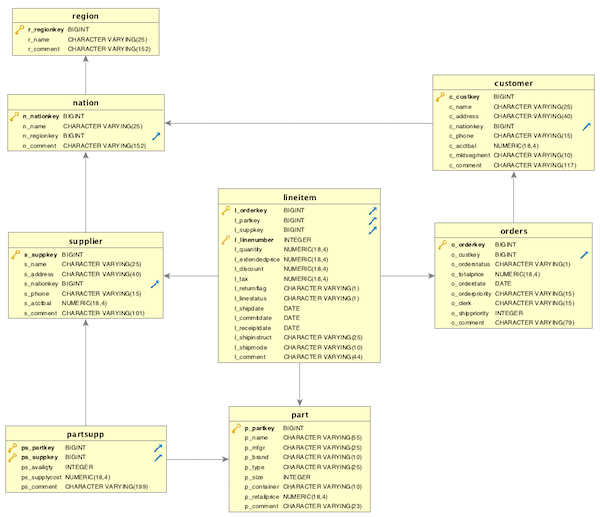
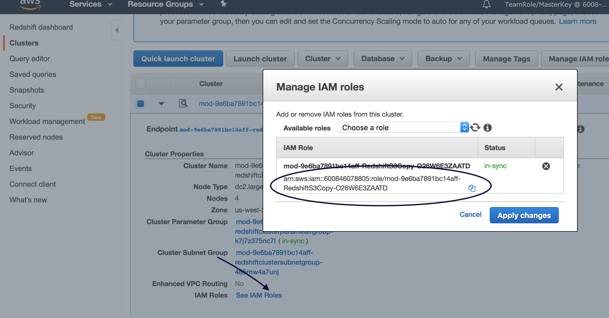
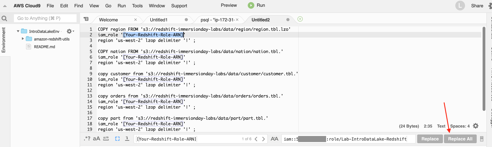
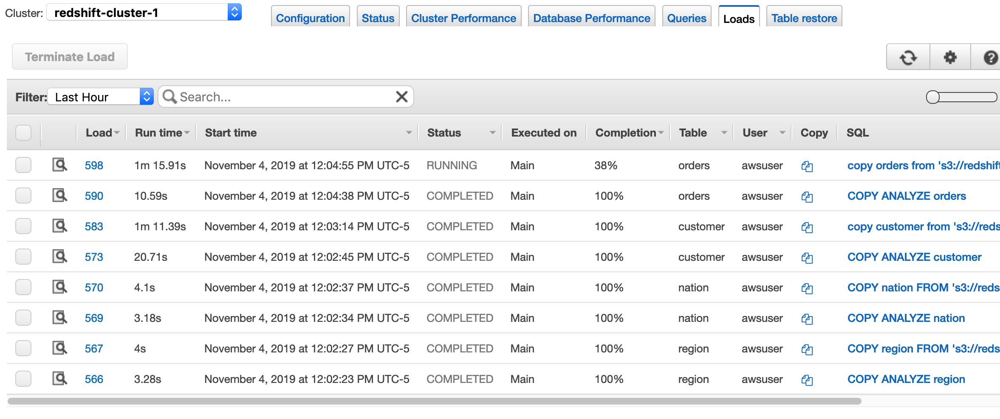
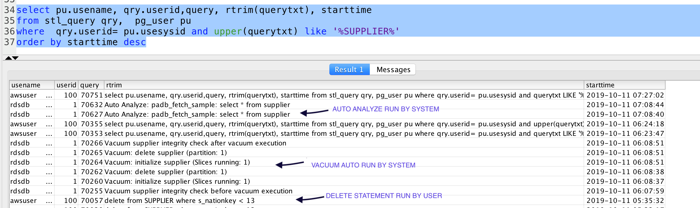
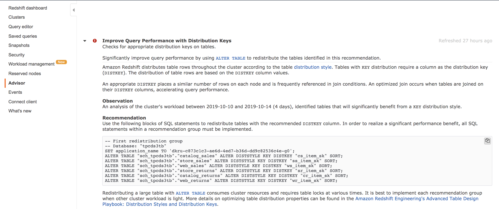

# More Redshift - Data Loading
In this section, you will use a set of six tables based on the TPC Benchmark data model. You create these tables within your Redshift cluster and load these tables with sample data stored in S3.  The focus will be on using auto settings of Redshift cluster.



## Connect to your Redshift cluster using the psql client in Cloud9
Refer to the [previous instructions](../README.md) for instructions.

## Create Tables
Copy the following create table statements into your psql client to create tables in the database.  

```
\timing on

DROP TABLE IF EXISTS supplier;
DROP TABLE IF EXISTS part;
DROP TABLE IF EXISTS orders;
DROP TABLE IF EXISTS customer;
DROP TABLE IF EXISTS nation;
DROP TABLE IF EXISTS region;

CREATE TABLE region (
  R_REGIONKEY bigint NOT NULL PRIMARY KEY,
  R_NAME varchar(25),
  R_COMMENT varchar(152))
;

CREATE TABLE nation (
  N_NATIONKEY bigint NOT NULL PRIMARY KEY,
  N_NAME varchar(25),
  N_REGIONKEY bigint REFERENCES region(R_REGIONKEY),
  N_COMMENT varchar(152))
;

create table customer (
  C_CUSTKEY bigint NOT NULL PRIMARY KEY,
  C_NAME varchar(25),
  C_ADDRESS varchar(40),
  C_NATIONKEY bigint REFERENCES nation(N_NATIONKEY),
  C_PHONE varchar(15),
  C_ACCTBAL decimal(18,4),
  C_MKTSEGMENT varchar(10),
  C_COMMENT varchar(117))
;

create table orders (
  O_ORDERKEY bigint NOT NULL PRIMARY KEY,
  O_CUSTKEY bigint REFERENCES customer(C_CUSTKEY),
  O_ORDERSTATUS varchar(1),
  O_TOTALPRICE decimal(18,4),
  O_ORDERDATE Date,
  O_ORDERPRIORITY varchar(15),
  O_CLERK varchar(15),
  O_SHIPPRIORITY Integer,
  O_COMMENT varchar(79))
sortkey (O_ORDERDATE);

create table part (
  P_PARTKEY bigint NOT NULL PRIMARY KEY,
  P_NAME varchar(55),
  P_MFGR  varchar(25),
  P_BRAND varchar(10),
  P_TYPE varchar(25),
  P_SIZE integer,
  P_CONTAINER varchar(10),
  P_RETAILPRICE decimal(18,4),
  P_COMMENT varchar(23))
;

create table supplier (
  S_SUPPKEY bigint NOT NULL PRIMARY KEY,
  S_NAME varchar(25),
  S_ADDRESS varchar(40),
  S_NATIONKEY bigint REFERENCES nation(n_nationkey),
  S_PHONE varchar(15),
  S_ACCTBAL decimal(18,4),
  S_COMMENT varchar(101))
;                                                         


```

## Loading Data
A COPY command loads large amounts of data much more efficiently than using INSERT statements, and stores the data more effectively as well.  Use a single COPY command to load data for one table from multiple files.  Amazon Redshift then automatically loads the data in parallel.  For your convenience, the sample data you will use is available in a public Amazon S3 bucket.

The default distribution style is AUTO.

With AUTO, Amazon Redshift initially assigns ALL distribution to a small table, then changes the table to EVEN distribution when the table grows larger. The change in distribution occurs in the background, in a few seconds.


## Get Role ARN associated with Redshift cluster
Navigate to AWS Console to get IAM Role ARN assigned to Redshift cluster.

link -> [RedshiftCluster](https://us-east-1.console.aws.amazon.com/redshift/home?region=us-east-1#cluster-list:)

Click on Clusters on left navigation and select cluster name to view details.

Go to "See IAM Roles" and copy Role ARN in a text editor. This ARN has to replace [Your-Redshift-Role-ARN] in copy commands below.

  
##

## Paste the following commands into a text editor, and search/replace the [Your-Redshift-Role-ARN] with the real Role ARN
You can use Cloud9 as a text editor.  Create a new file.  Paste the below commands into the new file editor tab.  Then use Cloud9's Find menu to Replace the [Your-Redshift-Role-ARN] text.

```
COPY region FROM 's3://redshift-immersionday-labs/data/region/region.tbl.lzo'
iam_role '[Your-Redshift-Role-ARN]'
region 'us-west-2' lzop delimiter '|' ;

COPY nation FROM 's3://redshift-immersionday-labs/data/nation/nation.tbl.'
iam_role '[Your-Redshift-Role-ARN]'
region 'us-west-2' lzop delimiter '|' ;

copy customer from 's3://redshift-immersionday-labs/data/customer/customer.tbl.'
iam_role '[Your-Redshift-Role-ARN]'
region 'us-west-2' lzop delimiter '|' ;

copy orders from 's3://redshift-immersionday-labs/data/orders/orders.tbl.'
iam_role '[Your-Redshift-Role-ARN]'
region 'us-west-2' lzop delimiter '|' ;

copy part from 's3://redshift-immersionday-labs/data/part/part.tbl.'
iam_role '[Your-Redshift-Role-ARN]'
region 'us-west-2' lzop delimiter '|' ;

copy supplier from 's3://redshift-immersionday-labs/data/supplier/supplier.json' manifest
iam_role '[Your-Redshift-Role-ARN]'
region 'us-west-2' lzop delimiter '|' ;


```



## Paste the adjusted copy commands into your psql client to run them.
In this lab we are using 2 dc2.large clusters nodes. Our cluster is in the us-east-1 region (Northern Virginia), but our source data is in the us-west-2 region (Oregon) so it may take a few minutes for the load to finish.  The estimated time to load the data is as follows, note you can check timing information on actions in the performance and load tabs on the redshift console:
* REGION (5 rows) - a dozen seconds
* NATION (25 rows) - a dozen seconds
* CUSTOMER (15M rows) – two minutes
* ORDERS - (76M rows) - three minutes
* PART - (20M rows) - two minutes
* SUPPLIER - (1M rows) - thirty seconds

While the loads are running, you can go to the Redshift Console, click on your cluster, and look at the Loads tab for more details:



Feel free to explore the Redshift console as the loads complete.


Note: A few key takeaways from the above COPY statements.
1. COPY for the REGION table points to a specfic file (region.tbl.lzo) while COPY for other tables point to a prefix to multiple files (lineitem.tbl.)
2. COPY for the SUPPLIER table points a manifest file (supplier.json)

## Execute following query to get high level information about tables we just loaded.

````
select * from svv_table_info where schema='public' ;

````
Note: the very first time you query svv_table_info may take a minute as Redshift has to compile a large number of query segments that sit behind the svv_table_info view.  


How about getting count of customers from "Asia" REGION

````
SELECT COUNT(c_custkey)
FROM customer c
INNER JOIN nation n ON c.c_nationkey = n.n_nationkey
INNER JOIN region r ON n.n_regionkey = r.r_regionkey
WHERE r.r_name = 'ASIA';

````

## Troubleshooting Loads
There are two Amazon Redshift system tables that can be helpful in troubleshooting data load issues:
* STL_LOAD_ERRORS
* STL_FILE_SCAN

In addition, you can validate your data without actually loading the table.  Use the NOLOAD option with the COPY command to make sure that your data file will load without any errors before running the actual data load.  Running COPY with the NOLOAD option is much faster than loading the data since it only parses the files.

Let’s try to load the CUSTOMER table with a different data file with mismatched columns.  To copy this data you will need to replace the [Your-Redshift_Role] values in the script below.   
```
COPY customer FROM 's3://redshift-immersionday-labs/data/nation/nation.tbl.'
iam_role '[Your-Redshift-Role-ARN]'
region 'us-west-2' lzop delimiter '|' noload;
```

You will get the following error.
```
ERROR: Load into table 'customer' failed.  Check 'stl_load_errors' system table for details. [SQL State=XX000]
```

Query the STL_LOAD_ERROR system table for details.
```
select * from stl_load_errors;
```

You can also create a view that returns details about load errors.  The following example joins the STL_LOAD_ERRORS table to the STV_TBL_PERM table to match table IDs with actual table names.
```
create view loadview as
(select distinct tbl, trim(name) as table_name, query, starttime,
trim(filename) as input, line_number, colname, err_code,
trim(err_reason) as reason
from stl_load_errors sl, stv_tbl_perm sp
where sl.tbl = sp.id);

-- Query the LOADVIEW view to isolate the problem.
select * from loadview where table_name='customer';
```

## Review auto compression
If you notice create statements, we did not specify any encoding/compression.
The COPY command chooses the compression encoding for each column if the target table is empty. The encoding for each column is determined by Amazon Redshift per below criteria-

* Columns that are defined as sort keys are assigned RAW compression.

* Columns that are defined as BOOLEAN, REAL, or DOUBLE PRECISION data types are assigned RAW compression.

* All other columns are assigned LZO compression.

Execute following query to review encoding column. You would notice compression being applied automatically.
````
select * from pg_table_def where schemaname='public';
````

## Review Auto Analyze and Auto Vacuum

The ANALYZE operation updates the statistical metadata that the query planner uses to choose optimal plans.

Amazon Redshift continuously monitors your database and automatically performs analyze operations in the background. To minimize impact to your system performance, automatic analyze runs during periods when workloads are light.

Amazon Redshift also automatically performs a DELETE ONLY vacuum in the background, so you rarely, if ever, need to run a DELETE ONLY vacuum.

Running below statement will delete over 570 K records from supplier.

````
delete from supplier where s_nationkey < 13;
````

After you run above command, Redshift will run auto analyze and vacuum delete to regenerate statistics and reclaim space. Screenshot below shows delete statement executed by user - "awsuser" and after some time, user -"rdsdb" running analyze and vacuum delete. The user name rdsdb is used internally by Amazon Redshift to perform routine administrative and maintenance tasks



Below query shows last executed queries on cluster for lineitem. The result will likely not show auto analyze and auto vacuum delete soon after. We can come back towards end of lab to run this statement again.
````
select pu.usename, qry.userid,query, rtrim(querytxt), starttime
from stl_query qry,  pg_user pu
where  qry.userid= pu.usesysid and querytxt like '%supplier%'
order by starttime desc;
````

## Redshift Advisor
Amazon Redshift provides customized best practice recommendations with Advisor. This is available via the Amazon Redshift console at no charge. Advisor is like a personal database assistant that generates tailored recommendations related to database operations and cluster configuration based on analyzing your cluster's performance and usage metrics. However, it displays only those recommendations that will have a significant impact for your workload. When Advisor determines that a recommendation has been addressed, it will be removed from your recommendation list.

There has not been enough activity on your cluster yet, so we will not be looking at during the labs today.  We will discuss the Advisor and its recommendations in the following sections and you should monitor Redshift Advisor for your production clusters  frequently.



## Review distribution

Both Customer and Orders tables are  distributed by AUTO (EVEN). You can check distribution using below query

````
select * from svv_table_info where "table" in ('customer','orders') ;
````

But if your query access pattern frequently joins these two tables based on cust_key field, then Advisor will likely recommend to alter the distribution style to KEY and provide SQL for this change. This will co-locate similar number of rows on each node slice.

As Advisor requires enough data to make this recommendation, we will not be able to review Advisor recommendation in this lab, but we will review the performance benefit of co-locating the data for joins.

Below, we will compare the results of EVEN distribution style query, to the same query on new tables using the KEY distribution style.

Run following query on tables with EVEN distribution.

call this first performance test query, Query 1

````
SELECT /* Query 1*/ c_mktsegment, COUNT(o_orderkey) AS orders_count,
AVG(o_totalprice) AS medium_amount,
SUM(o_totalprice) AS orders_revenue
FROM orders o
INNER JOIN customer c ON o.o_custkey = c.c_custkey
GROUP BY c_mktsegment;
````

Let's create separate versions of Customers and Orders. Estimated run time less than 60 secs for each.
````
create table orders_v as select * from orders;
create table customer_v as select * from customer;
````
Now we will assign a “key” distribution style to these new tables using the cust_key. This will immediately redistribute data amongst the nodes and slice. Estimated run time less than 60 secs for each. Estimated run time less than 60 secs for each.

````
alter table orders_v alter diststyle key distkey o_custkey;
alter table customer_v alter diststyle key distkey c_custkey;
````
Running same select query on new set of tables
Call this Query 2
````
SELECT /* Query 2 */ c_mktsegment, COUNT(o_orderkey) AS orders_count,
AVG(o_totalprice) AS medium_amount,
SUM(o_totalprice) AS orders_revenue
FROM orders_v o
INNER JOIN customer_v c ON o.o_custkey = c.c_custkey
GROUP BY c_mktsegment;
````

Analyze the performances of Query 1 and Query 2. Below query gets the last 2 queries ran against the database.
Query 2 with join on key distribution should show improvement over first query.

```
SELECT query, TRIM(querytxt) as SQL, starttime, endtime, DATEDIFF(millisecs, starttime, endtime) AS durationin_milliseconds,DATEDIFF(secs, starttime, endtime) AS durationin_seconds
FROM STL_QUERY
WHERE TRIM(querytxt) like '%customer%' and TRIM(querytxt) like '%orders%'
ORDER BY starttime DESC
LIMIT 2;
```
## Selective Filtering
Redshift takes advantage of zone maps which allows the optimizer to skip reading blocks of data when it knows that the filter criteria will not be matched.  In the case of the orders table, because we have defined a sort key on the o_orderdate, queries leveraging that field as a predicate will return much faster.

1. Execute the following two queries noting the execution time of each.  The first query (Query A) is to ensure the plan is compiled.  The second has a slightly different filter condition to ensure result cache cannot be used. But it can still compile cache.

Query A
```
select /* Query A */count(1), sum(o_totalprice)
FROM orders
WHERE o_orderdate between '1993-07-05' and '1993-07-07';
```
Query B
```
select /* Query B */count(1), sum(o_totalprice)
FROM orders
WHERE o_orderdate between '1993-07-07' and '1993-07-09';
```

2. Execute the following two queries noting the execution time of each.  The first query is to ensure the plan is compiled.  The second has a slightly different filter condition to ensure the result cache cannot be used. You will notice the second query (Query D) takes significantly longer than the second query (Query B) in the previous step even though the number of rows which were aggregated is similar.  This is due to the Query B's ability to take advantage of the Sort Key defined on the table.

Query C
```
select /* Query C */count(1), sum(o_totalprice)
FROM orders
where o_orderkey between 451001 and 829001;
```
Query D
```
select /* Query D */count(1), sum(o_totalprice)
FROM orders
where o_orderkey between 458001 and 835001;
```

## More Redshift - Stored Procedures
Click [here](../storedprocs-functions/StoredProcs.md) to advance to the next section which goes into Stored Procedures with Redshift.
