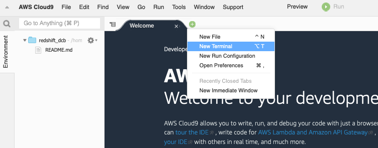
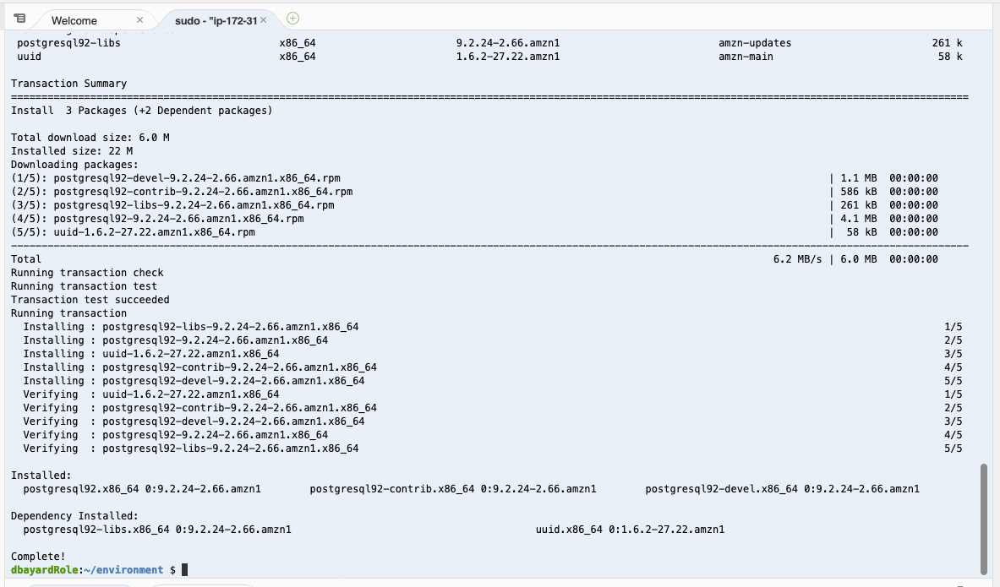
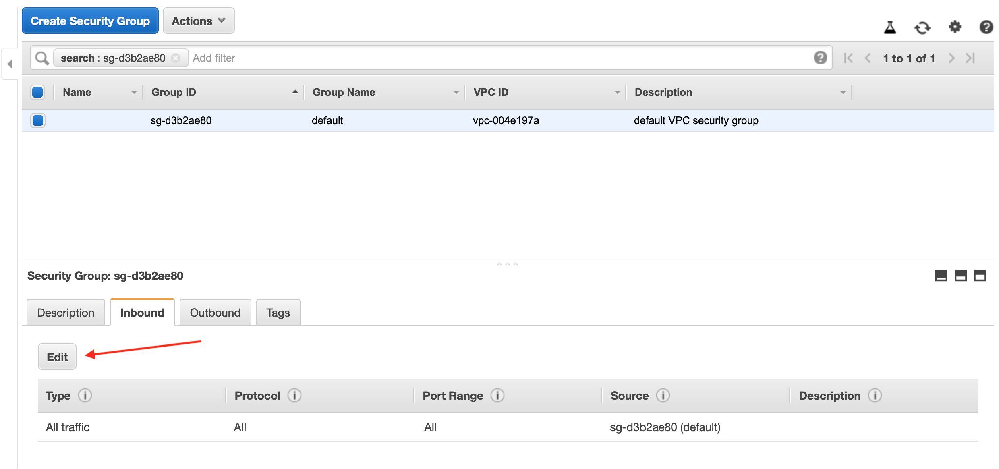
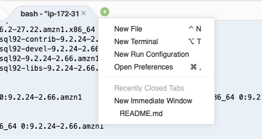

# More Redshift - psql Setup
Previously, you setup a Cloud9 browser development environment.  You will install the psql client tool from the open source postgresql project as a client for Redshift.


You can find psql information [here](https://www.postgresql.org/docs/8.4/app-psql.html).

### Signin to the AWS Console as the Lake Formation Administrator

* Navigate to the AWS Console at https://console.aws.amazon.com/console/home?region=us-east-1

* Check if you are signed-in as the lf-admin user.  If not, sign-out and sign-back in as lf-admin.  By default, the password for lf-admin will be Password1!


## Installing psql

* Open up your Cloud9 environment if not already open


* Click on the + sign to the right of the Welcome Tab and use the pop-up menu to open a new Terminal tab as shown below:



* In the terminal, paste and run the following code to install the psql database client as well as some Amazon Redshift utility scripts.

```
git clone https://github.com/awslabs/amazon-redshift-utils.git
sudo yum -y update
sudo yum -y install postgresql postgresql-devel postgresql-contrib

```

When the code is finished running, you should see output like this:




## Setup network access between Cloud9 and your Redshift cluster 

* While leaving your Cloud9 environment open, navigate to the Redshift Console in a different browser tab.

* Click on Clusters on the left hand column.  Then select your redshift cluster.

* In the bottom half of the screen, locate the VPC Security Group link and click on it.


This will navigate you to the EC2 console for the Security Group used by your Redshift Cluster.

* Select the "Inbound" tab on the bottom half of the page and then click Edit.



* In the pop-up, click "Add Rule".  

* In the new line, use the Type drop-down to choose Redshift

* In the source field, choose Anywhere.


* Click the Save button


## Gather the endpoint hostname of your Redshift cluster

This information can be found via the Redshift console.  

* Navigate to the Redshift console

* Click on Clusters on the left hand column.  Then select your redshift cluster.

* In the bottom half of the screen, select the endpoint and copy it.


## Connect from Cloud9 to Redshift

* Switch back to your open Cloud9 browser tab

* Open up a New File by clicking the + sign to the right of the Terminal tab



* Paste the endpoint in the new file (so you have it handy for later)


* Go back to your bash terminal and paste BUT DONT RUN YET the following code

```
psql -p 5439 -U awsuser -d dev -h ENDPOINT-WITHOUT-:5439
```

You terminal will look like this:


* Delete the part of the command that says "ENDPOINT-WITHOUT-:5439"

* Go to your new file and copy just the hostname part of the endpoint (that is don't copy the :5439 part).


* Go back to your bash terminal and paste the hostname and run the command


Note: If you are not able to connect (the command hangs then eventually times out), you may need to use the Private IP address of the Cloud9 EC2 instance in your Redshift Cluster Security Group inbound rule (as compared to using the Public IP address).  This can happen if your VPC is such that the Cloud9 EC2 subnet is setup to route locally to the Redshift cluster's subnet, rather than via an Internet Gateway.

* Enter the password and have fun.

Note: if you followed the Immersion Day labs and didn't change the default password in the CloudFormation template, then the awsuser password will default to Awsuser123


You can find tips for psql usage [here](http://postgresguide.com/utilities/psql.html)

Or, look for the "Introduction to psql command-line" entry under the "Using SQL" topic [here](http://pg-au.com/training_decks.html).

Here are some example commands you can run inside psql:

```
CREATE TABLE hello_world   (id int, fname varchar(30));
\timing
\l
\dn
\d
\dt hello_world
\cd /home/ec2-user/environment/amazon-redshift-utils/src/AdminScripts/
\i top_queries.sql
\q

```


Note: If your Cloud9 environment goes to sleep (by default after 30 minutes of inactivity), then when you re-launch the Cloud9 environment, it will have a new Public IP address.  As such you may need to repeat the steps in the [Setup network access between Cloud9 and your Redshift cluster](#Setup-network-access-between-Cloud9-and-your-Redshift-cluster) section.

## More Redshift - Data Loading
Click [here](dataload/DataLoad.md) to advance to the next section which goes deeper into data loading into Redshift.
