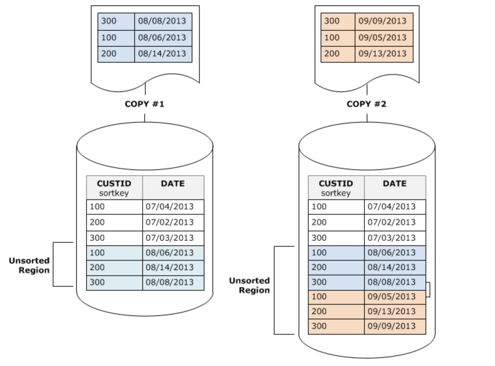

# More Redshift - Stored Procedures and Functions

You can define an Amazon Redshift stored procedure using the PostgreSQL procedural language PL/pgSQL to perform a set of SQL queries and logical operations. The procedure is stored in the database and is available for any user with sufficient privileges to run.

Unlike a user-defined function (UDF), a stored procedure can incorporate data definition language (DDL) and data manipulation language (DML) in addition to SELECT queries. A stored procedure doesn't need to return a value. You can use procedural language, including looping and conditional expressions, to control logical flow.

In this lab, we will create stored procedure to perform deep copy.

A deep copy recreates and repopulates a table by using a bulk insert, which automatically sorts the table. If a table has a large unsorted region, a deep copy is much faster than a vacuum.

You may read more about deep copy options in the [documentation](https://docs.aws.amazon.com/redshift/latest/dg/performing-a-deep-copy.html) at a later time.  In this lab, we will be creating a stored procedure using the option that creates a temporary table and truncates the original table.

## Run the code below to create a Redshift stored procedure called “deep_copy”.

````
CREATE OR REPLACE PROCEDURE deep_copy(source_tab IN varchar(256))
AS $$
BEGIN
  EXECUTE 'create temp table ' ||source_tab||'_temp as select * from '|| source_tab;
  EXECUTE 'truncate '||source_tab;
  EXECUTE 'insert into '|| source_tab || ' (select * from '|| source_tab||'_temp)' ;
  EXECUTE 'drop table '||source_tab||'_temp';
  END;
$$ LANGUAGE plpgsql;


````

## Run the Redshift COPY command on the Orders table to append data. Input data is sorted within single load when it is initially loaded, but since we are inserting additional data, the table is no longer sorted. See COPY#1 in screen print below


````
copy orders from 's3://redshift-immersionday-labs/data/orders/orders.tbl.'
iam_role '[Your-Redshift_Role-ARN]'
region 'us-west-2' lzop delimiter '|' ;


````

## To check for tables with high amounts of unsorted data, execute the following query:

````
SELECT * FROM svv_table_info where unsorted > 10;


````

Note the “unsorted” result for the orders table shows a value higher than 10 indicating this table may be a good candidate for sorting either by using VACUUM, or by using our more efficient and faster deep_copy stored procedure. We can run "Vacuum sort only orders" to resort the data but deep copy can be faster than VACUUM. 

## Execute our stored procedure

````
call deep_copy('orders');


````

While the deep_copy stored procedure is running, you can use the Redshift console's Queries tab to see what is running:


##  User-Defined Functions

You can create a custom user-defined scalar function (UDF) using either a SQL SELECT clause or a Python program. The new function is stored in the database and is available for any user with sufficient privileges to run, in much the same way as you run existing Amazon Redshift functions.

For Python UDFs, in addition to using the standard Python functionality, you can import your own custom Python modules.

A scalar SQL UDF incorporates a SQL SELECT clause that executes when the function is called and returns a single value.

### Creating a Scalar SQL UDF  
The following example creates a SQL UDF that compares two integers and returns the larger value.

````
create or replace function f_sql_greater (float, float)
  returns float
stable
as $$
  select case when $1 > $2 then $1
    else $2
  end
$$ language sql;


````

The following example query joins the customer and orders tables and calls the our new f_sql_greater function to return either the account balance from customer table or the total price from orders, whichever is greater.

````
select c_custkey,c_name,o_orderkey,c_acctbal,o_totalprice,f_sql_greater(c_acctbal,o_totalprice)
from customer c, orders o
where c.c_custkey=o.o_custkey
and c_mktsegment ='BUILDING'
and o_orderpriority='1-URGENT'
and o_orderdate between '1993-07-05' and '1993-07-07' limit 10;


````

### Creating a Scalar Python UDF
Next, we will recreate a same greater-than functionality, but this time using a Scalar Python UDF which incorporates a Python program that executes when the function is called and returns a single value.

The following example creates a Python UDF that compares two integers and returns the larger value.

````
create or replace function f_py_greater (a float, b float)
  returns float
stable
as $$
  if a > b:
    return a
  return b
$$ language plpythonu;


````

````
select c_custkey,c_name,o_orderkey,c_acctbal,o_totalprice,f_py_greater(c_acctbal,o_totalprice)
from customer c, orders o
where c.c_custkey=o.o_custkey
and c_mktsegment ='BUILDING'
and o_orderpriority='1-URGENT'
and o_orderdate between '1993-07-05' and '1993-07-07' limit 10;

````

## Congratulations - You have completed the More Redshift portion of the labs.
Return to the main menu [here](../../README.md)