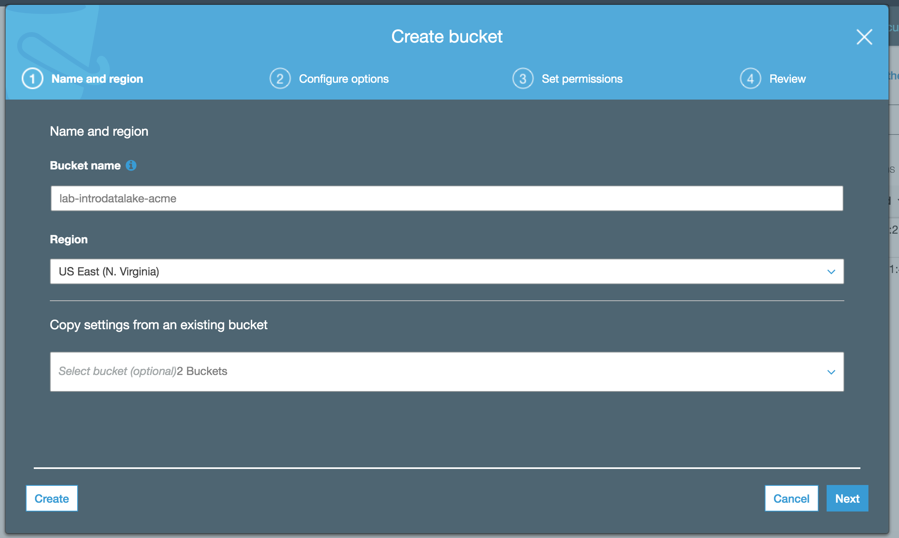
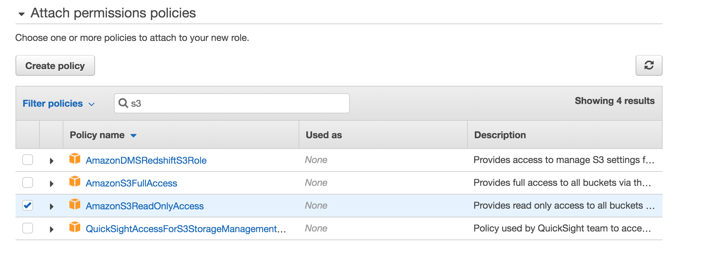
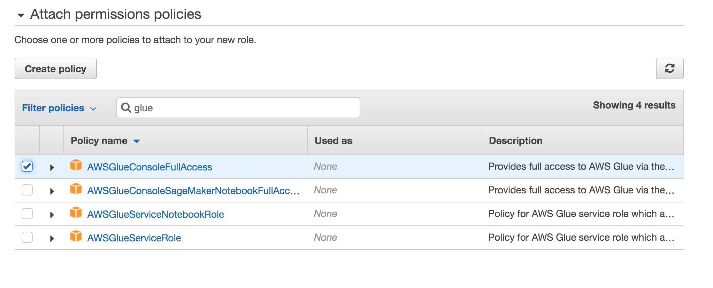
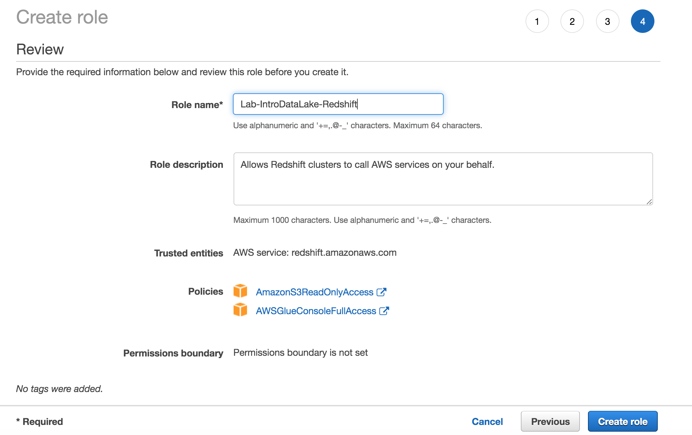
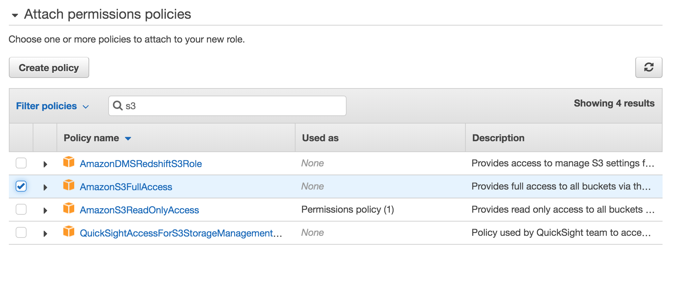
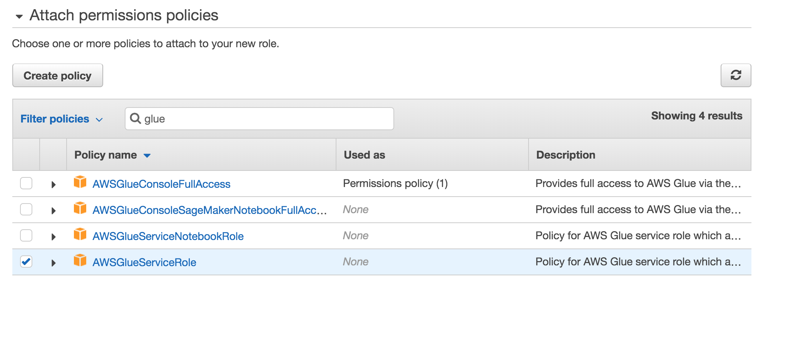
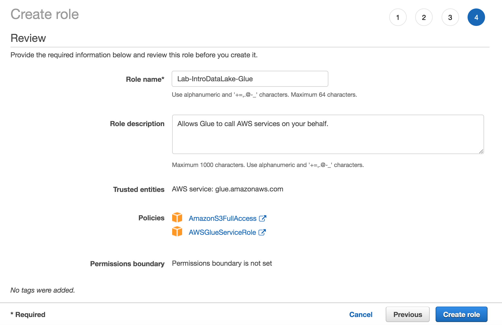

# SETUP - Preparing for the Intro to Data Lake Labs
In this document, you will setup your AWS account to run the Intro to Data Lake labs.

## Contents
* [Before You Begin](#before-you-begin)
* [Creating Users](#creating-users)
* [Account Service Limits](#account-service-limits)
* [Craete a S3 bucket](#create-a-s3-bucket)
* [Create an IAM role for Redshift](#create-an-iam-role-for-redshift)
* [Create an IAM role for Glue](#create-an-iam-role-for-glue)
* [Before You Leave](#before-you-leave)

## Before You Begin
* These labs were built so that multiple users in the same AWS account can run them at the same time.
* These setup instructions describe the steps that should be done once per account (as compared to once per user).
* If you are running this lab in your personal account, simply run these instructions as-is.
* The labs should be able to run in any AWS region, but the public dataset we will use resides in us-east-1, so using us-east-1 should be slightly faster.
* The labs assume that the VPC and subnets to be used already exist.  The typical default VPC and subnets will work fine for this lab.

## Creating Users
* The users will be using S3, Glue, Athena, Redshift, and Cloudwatch and should have at least admin privileges for those services as well as AWS Console access.
* This lab has been tested with users who have the AdministratorAccess policy.
* Alternatively, the lab has also been tested with a user who has these policies attached:
  * AmazonS3FullAccess
  * AWSGlueConsoleFullAccess
  * AmazonAthenaFullAccess
  * AmazonRedshiftFullAccesss

## Account Service Limits
* Each user will create one Glue Crawlers and optionally one Glue ETL job.  Depending on the number of users and the number of existing glue resources already provisioned, you may need to request a service quota increase for Glue.  As a best practice, you should review the # of existing Glue crawlers and Glue ETL jobs in your account, the current limits of these in your account, and the # of expected lab users.  Please do this a few days PRIOR to the labs.
  * The default limit of Glue Crawlers per account is 50
  * The default limit of Glue ETL Jobs per account is 250

## Create a S3 bucket
* The lab instructions expect that all users in an account will share a common S3 bucket and that S3 bucket will be named lab-introdatalake-[customer], where [customer] is replaced with the customer name.
* Please create this S3 bucket and ensure that your users have full access to it.  The S3 bucket does NOT need to be publicly accessible.

## Create an IAM role for Redshift
In this section we will create an IAM role for Redshift that can access S3 and Glue.  For reference, you can learn more in the [Redshift documentation](https://docs.aws.amazon.com/redshift/latest/mgmt/authorizing-redshift-service.html)

* Navigate to the IAM console, click on Roles on the left column, then click on Create role.
* Select "AWS service" as the type of trusted entity.
* Choose "Redshift" as the service that will use this role.
* Choose "Redshift - Customizable" as the use case.
* Click "Next: Permissions"
* In the Filter policies search field, type "s3"
* Click the checkbox in front of AmazonS3ReadOnlyAccess

* Go back to the Filter policies search field and type "glue"
* Click the checkbox in front of AWSGlueConsoleFullAccess

* Click "Next: Tags"
* Click "Next: Review"
* Type "Lab-IntroDataLake-Redshift" for the Role name.
* Click "Create role"

## Create an IAM role for Glue
In this section we will create an IAM role for Glue that can access S3.  For reference, you can learn more in the [Glue documentation](https://docs.aws.amazon.com/glue/latest/dg/create-an-iam-role.html)

* Navigate to the IAM console, click on Roles on the left column, then click on Create role.
* Select "AWS service" as the type of trusted entity.
* Choose "Glue" as the service that will use this role.
* Click "Next: Permissions"
* In the Filter policies search field, type "s3"
* Click the checkbox in front of AmazonS3FullAccess

* Go back to the Filter policies search field and type "glue"
* Click the checkbox in front of AWSGlueServiceRole

* Click "Next: Tags"
* Click "Next: Review"
* Type "Lab-IntroDataLake-Glue" for the Role name.
* Click "Create role"

## Before You Leave
Once all of your user are done with the lab, please follow the cleanup instructions to avoid having to pay for unused resources.
